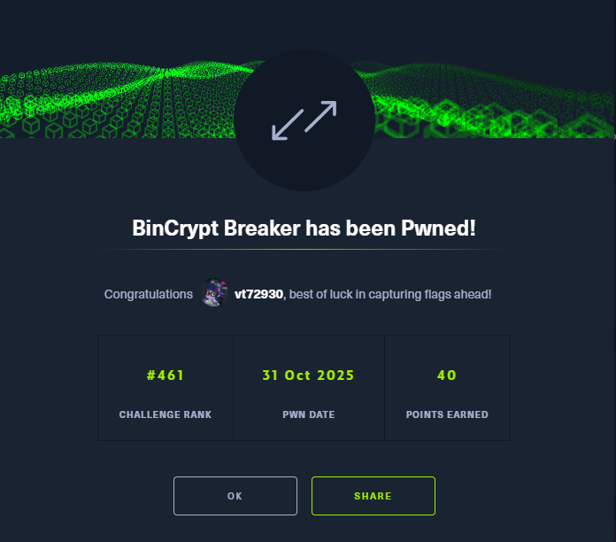

[English](#english) · [Русский](#русский)

---

## English

**Name:** BinCrypt Breaker

**Category:** Reversing

**Difficulty:** Medium

**Link:** https://app.hackthebox.com/challenges/BinCrypt%2520Breaker

### Summary

The challenge description, "Crack the Code, Unlock the File: Dive into a C-based encryption puzzle, reverse-engineer the encrypted binary, and uncover the original executable," along with the challenge name itself, clearly points us in the right direction. We are given two files: a loader (`checker`) and an encrypted binary (`file.bin`). The first step is to reverse the simple XOR encryption used by the loader to decrypt and extract the hidden executable. The second, more complex part, involves reverse-engineering the extracted executable to understand its flag-checking logic. This logic includes multiple layers of transformations (swaps, permutations, and XOR operations) which must be reversed to reconstruct the correct flag.

---

### Part 1: Decrypting the Hidden Executable

We are given two files:
- `checker`: A 16KB ELF 64-bit LSB executable.
- `file.bin`: 15KB of data.

First, let's examine `checker` with IDA Pro. The most interesting functions are `main` and `decrypt`.

**`main` function analysis:**
1.  The program calls `decrypt()`. Based on its name and the fact that its result (`fd`) is an integer, it likely decrypts something and returns a file descriptor to the result.
2.  It then creates a string like `/proc/self/fd/NUMBER`, where `NUMBER` is the file descriptor. This is a standard Linux trick to access an already open file.
3.  The crucial part is the call to `fexecve`. This function executes a program pointed to by a file descriptor. This means the program doesn't save the decrypted file to disk but executes it directly from memory.

**`decrypt` function analysis:**
1.  The function opens `file.bin`.
2.  It creates a temporary file in memory.
3.  It reads `file.bin` byte by byte.
4.  Each byte is XORed with the key `0xAB`. This is the entire "cryptography."
5.  The result of the XOR operation is written to the temporary in-memory file.
6.  Finally, it returns the file descriptor of this in-memory file, which `main` then executes.

To solve this, we can just write a simple Python script to do the same XOR operation for us.

```python
XOR_KEY = 0xAB

try:
    with open('file.bin', 'rb') as encrypted_file:
        encrypted_data = encrypted_file.read()

    decrypted_data = bytearray()
    for byte in encrypted_data:
        decrypted_byte = byte ^ XOR_KEY
        decrypted_data.append(decrypted_byte)

    with open('decrypted_executable', 'wb') as decrypted_file:
        decrypted_file.write(decrypted_data)

    print("File 'file.bin' successfully decrypted to 'decrypted_executable'")
except FileNotFoundError:
    print("File 'file.bin' not found")
```
Running the script:
```
┌──(vt729830㉿vt72983)-[~/6/1/1/1]
└─$ python3 1.py
Файл 'file.bin' успешно расшифрован в 'decrypted_executable'
```
Success (surprisingly, on the first try). Now let's make it executable with `chmod +x decrypted_executable` and run it.
```
┌──(vt729830㉿vt72983)-[~/6/1/1/1]
└─$ ./decrypted_executable
Enter the flag (without `HTB{}`): fds
Wrong flag
```
It asks for a flag. Now we need to reverse this new executable.

---

### Part 2: Reversing the Flag Check

Let's open `decrypted_executable` in IDA Pro and look at its `main` function.

```c
__int64 __fastcall main(int a1, char **a2, char **a3)
{
  char v4[40]; // [rsp+0h] [rbp-30h] BYREF
  unsigned __int64 v5; // [rsp+28h] [rbp-8h]

  v5 = __readfsqword(0x28u); // Stack canary
  
  // 1 - Asks for the flag (without "HTB{}")
  printf("Enter the flag (without `HTB{}`): ");
  __isoc99_scanf("%28s", v4); // Reads up to 28 characters
  
  // 2 - Calls the check function sub_14A1 with the input
  if ( (unsigned int)sub_14A1(v4) )
    puts("Wrong flag"); // If sub_14A1 returns non-zero -> "Wrong flag"
  else
    puts("Correct flag"); // If sub_14A1 returns 0 -> "Correct flag"
    
  return 0;
}
```
We need `sub_14A1` to return `0`. To achieve this, we need to understand the transformations it applies to our input and what it compares it against. The comparison is done against the hardcoded string `"RV{r15]_vcP3o]L_tazmfSTaa3s0"`. We need to reverse all the operations applied to this string.

The function `sub_127D` is responsible for character swapping:
```c
__int64 __fastcall sub_127D(__int64 a1)
{
  sub_11C9(a1, 0, 12);  // swaps characters at indices 0 and 12
  sub_11C9(a1, 14, 26); // swaps characters at indices 14 and 26
  sub_11C9(a1, 4, 8);   // swaps characters at indices 4 and 8
  return sub_11C9(a1, 20, 23); // swaps characters at indices 20 and 23
}
```
This is a simple permutation. To reverse it, we just need to perform the same swaps again, since swapping (a, b) is its own inverse.

The function `sub_12E4` is a complex transformation. This is the hardest part. It performs two types of transformations on a 14-character string:
1.  **Byte Permutation:** In a `while (v3 <= 8)` loop, the same character permutation is applied to the string 8 times. The permutation map is defined by the array `v8`.
2.  **XOR with a key:** After the permutations, characters at specific positions (defined in the array `v7`) are XORed with a key `a2`.

To reconstruct the flag, we need to:
1.  Split the encrypted string into two parts: `part1 = "RV{r15]_vcP3o]"` and `part2 = "L_tazmfSTaa3s0"`.
2.  Apply the XOR with the same key to the same positions.
3.  Find the inverse permutation of the one defined by the `v8` array. If `v8[i] = j`, it means the character from the old position `j` moves to the new position `i`. We need to build the reverse map.
4.  Apply this reverse permutation 8 times to each part.
5.  Concatenate the two processed 14-character parts back together.
6.  Apply the character swaps from `sub_127D` to the resulting 28-character string.
7.  Add `HTB{` to the beginning and `}` to the end.

To do this, a Python script is 100 times better than doing it by hand.

```python
def reverse_sub_12E4(data_str, key):
    data = bytearray(data_str, 'ascii')
    xor_indices = [2, 4, 6, 8, 11, 13]
    for i in xor_indices:
        data[i] ^= key
    perm_map = [9, 12, 2, 10, 4, 1, 6, 3, 8, 5, 7, 11, 0, 13]
    reverse_perm_map = [0] * len(perm_map)
    for i, j in enumerate(perm_map):
        reverse_perm_map[j] = i
    for _ in range(8):
        temp_data = bytearray(len(data))
        for i in range(len(data)):
            temp_data[i] = data[reverse_perm_map[i]]
        data = temp_data
    return data.decode('ascii')
def reverse_sub_127D(data_str):
    data = list(data_str)
    data[20], data[23] = data[23], data[20]
    data[4], data[8] = data[8], data[4]
    data[14], data[26] = data[26], data[14]
    data[0], data[12] = data[12], data[0]
    return "".join(data)
encrypted_flag = "RV{r15]_vcP3o]L_tazmfSTaa3s0"
part1_encrypted = encrypted_flag[:14]
part2_encrypted = encrypted_flag[14:]
part1_shuffled = reverse_sub_12E4(part1_encrypted, 2)
part2_shuffled = reverse_sub_12E4(part2_encrypted, 3)
shuffled_flag = part1_shuffled + part2_shuffled
original_flag_content = reverse_sub_127D(shuffled_flag)
final_flag = f"HTB{{{original_flag_content}}}"
print(f"flag - {final_flag}")
```

And again (surprisingly), it worked perfectly and we got the flag.

```
┌──(vt729830㉿vt72983)-[~/6/1/1/1]
└─$ python3 2.py
Reconstructed flag content: ********************
Full flag: HTB{***********}
```

We submit it to HTB and celebrate ;)

(Though, to be honest, the challenge is much easier than its "Medium" rating suggests).



---

## Русский

[Перейти к английской версии](#english)

**Название:** BinCrypt Breaker

**Категория:** Reversing

**Сложность:** Medium

**Ссылка:** https://app.hackthebox.com/challenges/BinCrypt%2520Breaker

---

## Краткое описание

Нам дали описание задачи: «Crack the Code, Unlock the File: Dive into a C-based encryption puzzle, reverse-engineer the encrypted binary, and uncover the original executable. Can you break the cipher and execute the hidden file?», — что само по себе является подсказкой, куда нам двигаться, как и само название. Нам даны два файла: загрузчик (`checker`) и зашифрованный бинарник (`file.bin`). Первый шаг — отреверсить простое XOR-шифрование, которое использует загрузчик, чтобы расшифровать и извлечь скрытый исполняемый файл. Вторая, более сложная часть, — реверс-инжиниринг извлечённого файла для понимания его логики проверки флага. Эта логика включает несколько уровней преобразований (обмены символов, перестановки и XOR-операции), которые нужно обратить, чтобы восстановить правильный флаг.

---

## Часть 1: Расшифровка скрытого исполняемого файла

Нам даны файлы:
- `checker`: ELF 64-bit LSB pie executable, 16 КБ.
- `file.bin`: data, 15 КБ.

Для начала попробуем изучить сам `checker` через IDA Pro. Самыми интересными будут функции `main` и `decrypt`.

**Анализ функции `main`:**
1.  Программа вызывает функцию `decrypt()`. Судя по названию и тому, что её результат (`fd`) — это целочисленное значение, она что-то расшифровывает и возвращает файловый дескриптор на результат.
2.  Далее создается строка вида `/proc/self/fd/ЧИСЛО`, где `ЧИСЛО` — это тот самый файловый дескриптор. Это стандартный для Linux способ обратиться к уже открытому файлу.
3.  Самое главное — вызов `fexecve`. Эта функция выполняет программу, на которую указывает файловый дескриптор. То есть, программа не сохраняет расшифрованный файл на диск, а запускает его прямо из памяти.

**Анализ функции `decrypt`:**
1.  Функция открывает `file.bin`.
2.  Создает временный файл в оперативной памяти.
3.  Читает `file.bin` по одному байту.
4.  Каждый прочитанный байт она XOR-ит с ключом `0xAB`. Это и есть вся "криптография".
5.  Результат операции XOR записывается в тот самый временный файл в памяти.
6.  В конце функция возвращает файловый дескриптор этого файла, который `main` затем и запускает.

Теперь же для решения этой задачи просто напишем Python-код, который за нас всё сделает.

```python
XOR_KEY = 0xAB
try:
    with open('file.bin', 'rb') as encrypted_file:
        encrypted_data = encrypted_file.read()
    decrypted_data = bytearray()
    for byte in encrypted_data:
        decrypted_byte = byte ^ XOR_KEY
        decrypted_data.append(decrypted_byte)
    with open('decrypted_executable', 'wb') as decrypted_file:
        decrypted_file.write(decrypted_data)
    print("Файл 'file.bin' успешно расшифрован в 'decrypted_executable'")
except FileNotFoundError:
    print("Файл 'file.bin' не найден")
```
И успех (возможно):
```
┌──(vt729830㉿vt72983)-[~/6/1/1/1]
└─$ python3 1.py
Файл 'file.bin' успешно расшифрован в 'decrypted_executable'
```
(На удивление, с первой попытки удачно). Теперь проверим, для начала выдав права на исполнение `chmod +x decrypted_executable` и выполнив его.
```
┌──(vt729830㉿vt72983)-[~/6/1/1/1]
└─$ ./decrypted_executable
Enter the flag (without `HTB{}`): fds
Wrong flag
```
Он нас просит флаг. Теперь изучим его через IDA Pro тоже.

---

## Часть 2: Реверс-инжиниринг проверки флага

Исследуем `main` в `decrypted_executable`.

```c
__int64 __fastcall main(int a1, char **a2, char **a3)
{
  char v4[40]; // [rsp+0h] [rbp-30h] BYREF
  unsigned __int64 v5; // [rsp+28h] [rbp-8h]

  v5 = __readfsqword(0x28u); // Stack canary
  
  // 1 - Программа просит ввести флаг (без "HTB{}")
  printf("Enter the flag (without `HTB{}`): ");
  __isoc99_scanf("%28s", v4); // Читает до 28 символов
  
  // 2 - Вызывает функцию проверки sub_14A1 с введенной строкой
  if ( (unsigned int)sub_14A1(v4) )
    puts("Wrong flag"); // Если sub_14A1 вернула не 0 -> "неправильный флаг"
  else
    puts("Correct flag"); // Если sub_14A1 вернула 0 -> "правильный флаг"
    
  return 0;
}
```

Нам нужно, чтобы `sub_14A1` вернула 0. Для этого нужно понять, какие преобразования она делает с нашим вводом и с чем его сравнивает. А сравнивает она со строкой `"RV{r15]_vcP3o]L_tazmfSTaa3s0"`. Нужно провести все эти операции в обратном порядке.

Функция `sub_127D` отвечает за перестановку символов:
```c
__int64 __fastcall sub_127D(__int64 a1)
{
  sub_11C9(a1, 0, 12);  // меняет символы с индексами 0 и 12
  sub_11C9(a1, 14, 26); // меняет символы с индексами 14 и 26
  sub_11C9(a1, 4, 8);   // меняет символы с индексами 4 и 8
  return sub_11C9(a1, 20, 23); // меняет символы с индексами 20 и 23
}
```
Это простая перестановка. Для обратной операции нужно просто сделать те же самые перестановки еще раз, так как обмен (a, b) обратен сам себе.

А вот функция `sub_12E4` — это сложное преобразование. Она делает два типа преобразований над 14-символьной строкой:
1.  **Перестановка байт по шаблону:** В цикле `while (v3 <= 8)` 8 раз подряд происходит одна и та же перестановка символов. Шаблон задан массивом `v8`.
2.  **XOR с ключом:** После перестановок, символы на определенных позициях (заданных в массиве `v7`) XOR-ятся с ключом `a2`.

Для обратной сборки флага нужно:
1.  Разделить строку на обе части: `part1 = "RV{r15]_vcP3o]"` и `part2 = "L_tazmfSTaa3s0"`.
2.  Применить XOR с тем же ключом к тем же позициям.
3.  Найти обратную перестановку к той, что задана в массиве `v8`.
4.  Применить эту обратную перестановку 8 раз.
5.  Соединить обратно две обработанные 14-символьные части.
6.  Применить те же самые обмены символов к получившейся 28-символьной строке.
7.  Добавить `HTB{` в начало и `}` в конец.

Для этого напишем Python-код, который это все сделает идеальнее нас в 100 раз.

```python
def reverse_sub_12E4(data_str, key):
    data = bytearray(data_str, 'ascii')
    xor_indices = [2, 4, 6, 8, 11, 13]
    for i in xor_indices:
        data[i] ^= key
    perm_map = [9, 12, 2, 10, 4, 1, 6, 3, 8, 5, 7, 11, 0, 13]
    reverse_perm_map = [0] * len(perm_map)
    for i, j in enumerate(perm_map):
        reverse_perm_map[j] = i
    for _ in range(8):
        temp_data = bytearray(len(data))
        for i in range(len(data)):
            temp_data[i] = data[reverse_perm_map[i]]
        data = temp_data
    return data.decode('ascii')
def reverse_sub_127D(data_str):
    data = list(data_str)
    data[20], data[23] = data[23], data[20]
    data[4], data[8] = data[8], data[4]
    data[14], data[26] = data[26], data[14]
    data[0], data[12] = data[12], data[0]
    return "".join(data)
encrypted_flag = "RV{r15]_vcP3o]L_tazmfSTaa3s0"
part1_encrypted = encrypted_flag[:14]
part2_encrypted = encrypted_flag[14:]
part1_shuffled = reverse_sub_12E4(part1_encrypted, 2)
part2_shuffled = reverse_sub_12E4(part2_encrypted, 3)
shuffled_flag = part1_shuffled + part2_shuffled
original_flag_content = reverse_sub_127D(shuffled_flag)
final_flag = f"HTB{{{original_flag_content}}}"
print(f"флаг - {final_flag}")
```

И снова (на удивление) вышло удачно, и мы получили флаг.
```
┌──(vt729830㉿vt72983)-[~/6/1/1/1]
└─$ python3 2.py
Восстановленное содержимое флага: ********************
Полный флаг: HTB{***********}
```
Вводим его на HTB и радуемся ;)

(Хотя, если говорить честно, задание намного легче, чем заявленный средний уровень).


