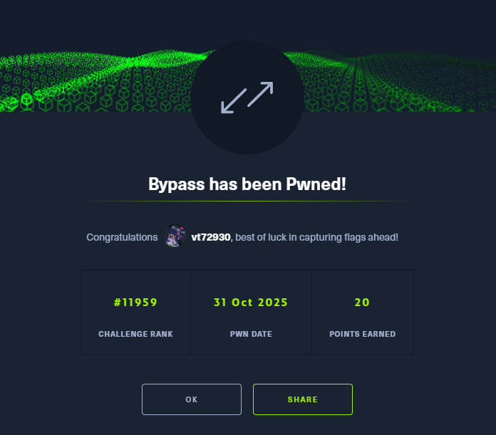

[English](#english) · [Русский](#русский)

---

## English

**Name:** Bypass
**Category:** Reversing
**Difficulty:** Easy
**Link:** https://app.hackthebox.com/challenges/Bypass

### Summary

The challenge description says, "The Client is in full control. Bypass the authentication and read the key to get the Flag." This immediately gives us a hint on what to do. We are given a .NET executable with client-side authentication. The solution involves a journey through failed patching attempts in IDA Pro, before switching to the much more suitable `dnSpy`. Using `dnSpy`, we can extract an encrypted resource, decrypt it with a Python script to find the password, and then perform a simple IL patch to bypass the first impossible check and finally get the flag.

---

### Recon (how I inspected the format)

I was given a 9KB `.exe` file. The first thing I did was throw it into IDA Pro to study it and bypass the client-side check. What immediately stood out was that it's a Microsoft .NET assembly. The function names were also a sight to behold:

```
__.cctor	seg000	00000000	00000006			R	.	.	.	.	.	.	.	.	.
_0__0	seg000	00000020	0000002A			R	.	.	.	.	.	.	.	.	.
_0__1	seg000	00000050	00000029			R	.	.	.	.	.	.	.	.	.
...
```

My initial theory was that this was the encryption logic and how it's assembled for the check.

However, further analysis showed that the program obfuscates all its strings (prompts, errors, password, and flag). They are encrypted and placed in an embedded resource named "0". At runtime, the program decrypts this resource using AES (`RijndaelManaged` in the code) and reads the strings.

The logic has a two-stage check:
1.  The first check is impossible to pass honestly (this is the "Bypass").
2.  The second check requires the correct password.

The key method, `'0'::'1'`, always returns `false` no matter what you enter, because the IL code literally hardcodes `ldc.i4.0` (load constant 0) before returning.

---

### Strategy

My strategy evolved through trial and error, but the final plan was:
1.  Try to patch the binary with IDA Pro to bypass the checks.
2.  After failing miserably, switch to a more appropriate tool, `dnSpy`.
3.  In `dnSpy`, extract the encrypted resource.
4.  Write a Python script to decrypt the resource and get the password.
5.  Patch the IL code in `dnSpy` to bypass the first check.
6.  Run the patched executable, enter the password, and get the flag.

---

### Script and Patching Evolution (how I iterated and fixed bugs)

This is where the fun begins.

**Attempt 1: Patching bytes in IDA Pro**

My first idea was to patch the `brfalse.s loc_36` instruction that handles the failed check. I hit F2, chose to patch bytes, and saw this:


`2C 0A 00 28 04 00 00 06 00 00 2B 13 00 7E 08 00`

I changed it to a `nop` instruction:

`00 00 00 28 04 00 00 06 00 00 2B 13 00 7E 08 00`


Then I moved to the second check, found `brfalse.s loc_C1`, and did the same thing.


From: `2C 1E 00 7E 0D 00 00 04 7E 03 00 00 04 7E 0E 00`

To: `00 00 00 7E 0D 00 00 04 7E 03 00 00 04 7E 0E 00`


I saved the modification and... `Unhandled exception: System.InvalidProgramException: JIT compiler encountered an internal limitation.` Okay, that didn't work.

**Attempt 2: More IDA patching**

Maybe a different patch would work. I targeted the comparison logic:


Hex view: `06 07 28 04 00 00 0A 0C 08 2C 1E 00 7E 0D 00 00`

My patch: `17 08 09 00 00 00 00 00 00 2C 1E 00 7E 0D 00 00`


The result... was nothing.

**Attempt 3: Okay, one last try with IDA**

Let's try replacing the branch with `pop` (byte `26`) to remove the check's result from the stack, and `nop` (byte `00`) to fill the space.
I changed the first byte of `brfalse.s` from `2C` to `26` (pop) and the second byte (the offset) to `00` (nop).

Result:
```
Enter a username: f
Enter a password: f

Unhandled exception: System.InvalidProgramException: Common Language Runtime detected an invalid program.
   at 0.2()
   at 0.0()
```
Failure again.

**The Turning Point: Giving up on IDA**

At this point, I was too LAZY to keep working with IDA Pro, so I decided to make my life 1000 times easier and use `dnSpy`, which is a much better tool for this.

In `dnSpy`, the code was clean and readable. I immediately found the resource "0" and saved it as `resource.bin`. Now to decrypt it. I used this Python script:

```python
from Crypto.Cipher import AES
def read_net_string(data, offset):
    length, len_bytes = 0, 0
    shift = 0
    while True:
        byte = data[offset + len_bytes]
        length |= (byte & 0x7F) << shift
        len_bytes += 1
        if (byte & 0x80) == 0:
            break
        shift += 7
    str_start = offset + len_bytes
    return data[str_start:str_start + length].decode('utf-8'), str_start + length

with open("resource.bin", "rb") as f:
    encrypted_data = f.read()

key = encrypted_data[0:32]
iv = encrypted_data[32:48]
ciphertext = encrypted_data[48:]
cipher = AES.new(key, AES.MODE_CBC, iv)
decrypted_padded = cipher.decrypt(ciphertext)
padding_len = decrypted_padded[-1]
decrypted = decrypted_padded[:-padding_len]

strings = []
offset = 0
while offset < len(decrypted):
    s, offset = read_net_string(decrypted, offset)
    strings.append(s)

password = strings[3]
print(f"password: {password}")
```
And it worked!
```
┌──(vt729830㉿vt72983)-[~/6/1/1/1]
└─$ python3 1.py
password: ThisIsAReallyReallySecureKeyButYouCanReadItFromSourceSoItSucks
```

**Final Patching in dnSpy**

Now to patch the first check. The decompiled code was beautiful:
```csharp
public static void 0()
{
	bool flag = 0.1(); // This always returns false
	bool flag2 = flag;
	if (flag2)
	{
		0.2();
	}
	else
	{
		Console.WriteLine(5.0);
		0.0();
	}
}
```
I tried to just edit the C# code, changing `bool flag = 0.1();` to `bool flag = true;`. But... another failure)) It threw a million compiler errors.

So, I went to edit the IL ("Edit IL Instructions..."). I found the `brfalse.s` instruction and just changed it to `pop`. I compiled, saved, and ran it.
```
Enter a username: ThisIsAReallyReallySecureKeyButYouCanReadItFromSourceSoItSucks
Enter a password: ThisIsAReallyReallySecureKeyButYouCanReadItFromSourceSoItSucks
Please Enter the secret Key:
```
The output... was very... very informative...? It just exited. I probably did something wrong.
My guess was that it printed the flag and immediately closed. I was right. Running it from a Windows `cmd` terminal was the key.

---

### Result and proofs

Running the final patched executable from `cmd` and providing the password I found:

```
C:\Users\vt72983\Downloads\Bypass>Bypass.exe
Enter a username: ThisIsAReallyReallySecureKeyButYouCanReadItFromSourceSoItSucks
Enter a password: ThisIsAReallyReallySecureKeyButYouCanReadItFromSourceSoItSucks
Please Enter the secret Key: ThisIsAReallyReallySecureKeyButYouCanReadItFromSourceSoItSucks
Nice here is the Flag:HTB{**********}
```

And with that, I got another easy-peasy flag.



---

## Русский

[Перейти к английской версии](#english)

**Название:** Bypass
**Категория:** Reversing
**Сложность:** Easy
**Ссылка:** https://app.hackthebox.com/challenges/Bypass

---

## Краткое описание

Описание челенджа гласит: «The Client is in full control. Bypass the authentication and read the key to get the Flag.» Это сразу же дает нам подсказку, куда двигаться. Нам дан .NET-файл с аутентификацией на стороне клиента. Решение — это целое путешествие через неудачные попытки патчинга в IDA Pro, после чего я переключился на более подходящий инструмент `dnSpy`. С его помощью удалось извлечь зашифрованный ресурс, расшифровать его с помощью скрипта на Python, чтобы найти пароль, а затем сделать простой патч IL-кода, чтобы обойти первую невыполнимую проверку и наконец-то получить флаг.

---

## Разведка (как я смотрел формат)

Нам дан `.exe` файл на 9 кб. Первое, что я сделал — закинул его в IDA Pro, чтобы изучить изнутри и обойти проверку. Сразу в глаза бросилось, что это Microsoft .NET assembly. Названия функций тоже порадовали:

```
__.cctor	seg000	00000000	00000006			R	.	.	.	.	.	.	.	.	.
_0__0	seg000	00000020	0000002A			R	.	.	.	.	.	.	.	.	.
_0__1	seg000	00000050	00000029			R	.	.	.	.	.	.	.	.	.
...
```

Моя теория была, что это и есть шифрование и то, как оно собирается для проверки.

Но при последующем анализе я выяснил, что происходит обфускация строк. Все строки (приглашения к вводу, ошибки, пароль и флаг) зашифрованы и помещены во внедрённый ресурс с именем "0". При запуске программа расшифровывает этот ресурс с помощью AES (`RijndaelManaged` в коде).

Логика состоит из двухэтапной проверки:
1.  Первая проверка, которую невозможно пройти честным путем (это и есть "Bypass").
2.  Вторая проверка, где нужно ввести правильный пароль.

Ключевой метод `'0'::'1'` всегда возвращает `false` вне зависимости от ввода, потому что в IL-коде жёстко прописана инструкция `ldc.i4.0` (загрузить константу 0) перед возвратом.

---

## Стратегия

Моя стратегия развивалась методом проб и ошибок, но финальный план был таким:
1.  Попытаться пропатчить бинарник с помощью IDA Pro, чтобы обойти проверки.
2.  После эпичного провала переключиться на более подходящий инструмент — `dnSpy`.
3.  В `dnSpy` извлечь зашифрованный ресурс.
4.  Написать скрипт на Python, чтобы расшифровать ресурс и получить пароль.
5.  Пропатчить IL-код в `dnSpy` для обхода первой проверки.
6.  Запустить пропатченный файл, ввести пароль и забрать флаг.

---

## Эволюция скриптов и патчинга (как я думал и исправлял ошибки)

А вот тут начинается самое интересное.

**Попытка 1: Патчинг байтов в IDA Pro**

Моя первая идея — пропатчить инструкцию `brfalse.s loc_36`, которая отвечает за проваленную проверку. Я нажал F2, выбрал патч по байтам и увидел это:


`2C 0A 00 28 04 00 00 06 00 00 2B 13 00 7E 08 00`

Я поменял её на инструкцию `nop`:

`00 00 00 28 04 00 00 06 00 00 2B 13 00 7E 08 00`


Затем перешёл ко второй проверке, нашёл `brfalse.s loc_C1` и сделал то же самое.

Было: `2C 1E 00 7E 0D 00 00 04 7E 03 00 00 04 7E 0E 00`

Стало: `00 00 00 7E 0D 00 00 04 7E 03 00 00 04 7E 0E 00`

Сохранил модификацию и... `Необработанное исключение: System.InvalidProgramException: Компилятор JIT обнаружил внутреннее ограничение.` Ладно, не сработало.

**Попытка 2: Ещё немного патчинга в IDA**

Может, другой патч сработает? Я нацелился на логику сравнения:

В hex: `06 07 28 04 00 00 0A 0C 08 2C 1E 00 7E 0D 00 00`

Мой патч: `17 08 09 00 00 00 00 00 00 2C 1E 00 7E 0D 00 00`

В результате... Ничего.

**Попытка 3: Ладно, последняя попытка с IDA**

Попробуем заменить условный переход на `pop` (байт `26`), чтобы снять результат проверки со стека, и `nop` (байт `00`), чтобы заполнить место.
Первый байт `brfalse.s` (`2C`) я поменял на `26` (pop), а второй (смещение) на `00` (nop).

Результат:
```
Enter a username: ф
Enter a password: ф

Необработанное исключение: System.InvalidProgramException: Среда выполнения Common Language Runtime обнаружила недопустимую программу.
   в 0.2()
   в 0.0()
```
Опять неудача.

**Переломный момент: прощай, IDA**

В этот момент мне стало ЛЭНЪ дальше работать с этим IDA Pro, поэтому я решил упростить себе жизнь в 1000 раз и использовать `dnSpy`, который подходит для этого намного лучше.

В `dnSpy` код был чистым и понятным. Я сразу нашёл ресурс "0" и сохранил его как `resource.bin`. Теперь надо расшифровать. Использовал вот такой скрипт на Python:

```python
from Crypto.Cipher import AES
def read_net_string(data, offset):
    length, len_bytes = 0, 0
    shift = 0
    while True:
        byte = data[offset + len_bytes]
        length |= (byte & 0x7F) << shift
        len_bytes += 1
        if (byte & 0x80) == 0:
            break
        shift += 7
    str_start = offset + len_bytes
    return data[str_start:str_start + length].decode('utf-8'), str_start + length

with open("resource.bin", "rb") as f:
    encrypted_data = f.read()

key = encrypted_data[0:32]
iv = encrypted_data[32:48]
ciphertext = encrypted_data[48:]
cipher = AES.new(key, AES.MODE_CBC, iv)
decrypted_padded = cipher.decrypt(ciphertext)
padding_len = decrypted_padded[-1]
decrypted = decrypted_padded[:-padding_len]

strings = []
offset = 0
while offset < len(decrypted):
    s, offset = read_net_string(decrypted, offset)
    strings.append(s)

password = strings[3]
print(f"password: {password}")
```
И он сработал!
```
┌──(vt729830㉿vt72983)-[~/6/1/1/1]
└─$ python3 1.py
password: ThisIsAReallyReallySecureKeyButYouCanReadItFromSourceSoItSucks
```

**Финальный патчинг в dnSpy**

Теперь патчим первую проверку. Декомпилированный код был прекрасен:
```csharp
public static void 0()
{
	bool flag = 0.1(); // Это всегда возвращает false
	bool flag2 = flag;
	if (flag2)
	{
		0.2();
	}
	else
	{
		Console.WriteLine(5.0);
		0.0();
	}
}
```
Я попытался просто отредактировать C#-код, поменяв `bool flag = 0.1();` на `bool flag = true;`. Но... снова неудача)) Он выдал миллион ошибок компиляции.

Поэтому я пошёл редактировать IL-код («Edit IL Instructions...»). Нашёл инструкцию `brfalse.s` и просто поменял её на `pop`. Скомпилировал, сохранил и запустил.
```
Enter a username: ThisIsAReallyReallySecureKeyButYouCanReadItFromSourceSoItSucks
Enter a password: ThisIsAReallyReallySecureKeyButYouCanReadItFromSourceSoItSucks
Please Enter the secret Key:
```
И вывод... Очень... Очень информативен...? Он просто закрылся. Вероятно, я что-то сделал не так.
Моя догадка была в том, что он выводит флаг и моментально закрывается. Я был прав. Запуск через `cmd` в Windows решил проблему.

---

## Результат

Запускаю финальный пропатченный `.exe` из `cmd` и ввожу найденный пароль:

```
C:\Users\vt72983\Downloads\Bypass>Bypass.exe
Enter a username: ThisIsAReallyReallySecureKeyButYouCanReadItFromSourceSoItSucks
Enter a password: ThisIsAReallyReallySecureKeyButYouCanReadItFromSourceSoItSucks
Please Enter the secret Key: ThisIsAReallyReallySecureKeyButYouCanReadItFromSourceSoItSucks
Nice here is the Flag:HTB{**********}
```

И вот так я получил ещё один изичный флаг.


