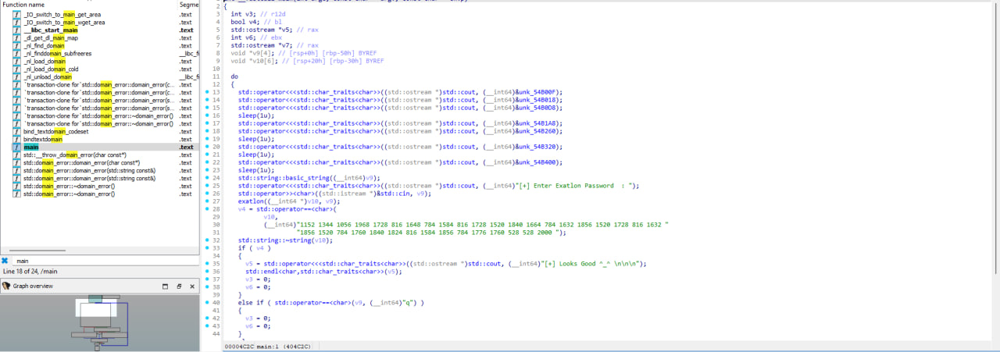
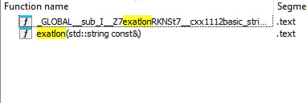

# HTB Write-up: Exatlon

Link - https://app.hackthebox.com/challenges/Exatlon

[English](#english) · [Русский](#русский)

---

## English

**Category:** Reversing
**Difficulty:** Easy

### Summary

The challenge provides a 64-bit ELF executable that asks for a password. The binary is packed with UPX. After unpacking, static analysis reveals a simple validation algorithm: the program iterates through each character of the user's input, multiplies its ASCII value by 16, converts the result to a string, and concatenates it with a space. The final generated string is then compared against a hardcoded string of numbers. The goal is to reverse this algorithm to reconstruct the correct password.

---

### Recon (Initial Analysis & Unpacking)

First, I downloaded the file and identified it as a 64-bit ELF executable. Running it shows a password prompt.

Opening the initial binary in IDA Pro with Hex-Rays revealed complex, obfuscated code with very few recognizable strings. This strongly suggested that the binary was packed or protected. Key functions like `sub_4918E5` (the unpacker stub) used system calls like `sys_mmap` and `sys_mprotect` to allocate memory and change its permissions to `PROT_READ | PROT_EXEC`, a classic packer technique. The logic would then jump to this newly executable memory region.

To confirm this, I used `strace` to monitor its system calls:

```bash
┌──(vt729830㉿vt72983)-[~/999]
└─$ strace ./a
execve("./a", ["./a"], 0x7ffe16589bc0 /* 36 vars */) = 0
open("/proc/self/exe", O_RDONLY)        = 3
mmap(NULL, 598379, PROT_READ|PROT_WRITE, MAP_PRIVATE|MAP_ANONYMOUS, -1, 0) = 0x700650669000
...
mprotect(0x7006506fa000, 4459, PROT_READ|PROT_EXEC) = 0
...
mprotect(0x401000, 1349217, PROT_READ|PROT_EXEC) = 0
...
write(1, "[+] Enter Exatlon Password  : ", 30) = 30
read(0, "j\n", 1024)                    = 2
write(1, "[-] ;(\n", 7)                 = 7
```

The `mprotect` calls confirmed that the program was allocating memory, writing data to it, and then making it executable. This is the unpacker at work. The second `mprotect` call is particularly interesting, as it marks a large region at `0x401000` as executable—this is our unpacked code.

---

### Strategy: From Dynamic Dumping to Simple Unpacking

My initial plan was to dump the unpacked code from memory. I launched the program in `gdb`, set a breakpoint after the unpacking routine, and ran it. From another terminal, I could then use `dd` to dump the memory region identified by `strace`.

```bash
# In one terminal, run the program to get its PID
$ ./a
# In another terminal
$ ps aux | grep ./a
# Dump the memory
$ dd if=/proc/<PID>/mem of=unpacked.bin bs=1 skip=4198400 count=1349217
```
*(Note: `skip` address is `0x401000` in decimal)*

While this method works, it's complex. A much simpler idea came to mind: what if it's a common packer? I tried the Ultimate Packer for eXecutables (UPX), and it worked perfectly.

```bash
┌──(vt729830㉿vt72983)-[~/999]
└─$ upx -d a
                       Ultimate Packer for eXecutables
                          Copyright (C) 1996 - 2024
UPX 4.2.4       Markus Oberhumer, Laszlo Molnar & John Reiser    May 9th 2024

        File size         Ratio      Format      Name
   --------------------   ------   -----------   -----------
   2210504 <-    709524   32.10%   linux/amd64   a

Unpacked 1 file.
```

This gave me a clean, unpacked binary, which was much easier to analyze.

---

### Core Logic Analysis

I opened the new, unpacked binary in IDA Pro. Now, the `main` function was clearly visible and easy to decompile.



The logic is straightforward:
1.  It prints a banner.
2.  It prompts for a password and reads the user's input into a string (`v9`).
3.  It calls a function `exatlon` which takes the user's input and returns a new string (`v10`).
4.  It compares this new string (`v10`) with a hardcoded string of numbers: `"1152 1344 1056 1968 ... 2000 "`.
5.  If they match, it prints `[+] Looks Good ^_^`; otherwise, it prints `[-] ;(`.

The entire challenge now boils down to understanding what the `exatlon` function does.



Looking at the decompiled code for `exatlon`:
```cpp
__int64 *__fastcall exatlon(__int64 *a1, _QWORD *a2)
{
  // ... boilerplate string initialization ...
  while ( ... ) // Loop over each character of the input string a2
  {
    v14 = *(_BYTE *) ... ; // v14 gets the current character
    std::to_string((std::__cxx11 *)v13, 16 * v14, ...); // Convert (char * 16) to string
    std::operator+<char>(v12, v13, " "); // Append a space
    std::string::operator+=(a1, (__int64)v12); // Append to the result string
    // ...
  }
  return a1;
}
```
The algorithm is incredibly simple: **For each character in the input, it multiplies its ASCII value by 16 and appends the resulting number followed by a space to the output string.**

For example, if the input is "A" (ASCII 65), the function calculates `65 * 16 = 1040` and the resulting string would be `"1040 "`.

---

### Final Script (Reversing the Algorithm)

To find the password, we just need to reverse this process. We take the target string of numbers, split it, and for each number, we divide it by 16. The result is the ASCII code of the original character.

Here is a Python script to do that:

```python
# The target string from the binary
target_numbers_str = "1152 1344 1056 1968 1728 816 1648 784 1584 816 1728 1520 1840 1664 784 1632 1856 1520 1728 816 1632 1856 1520 784 1760 1840 1824 816 1584 1856 784 1776 1760 528 528 2000"

# Split the string into a list of numbers
target_numbers = [int(n) for n in target_numbers_str.split()]

password = ""

# Reverse the algorithm
for number in target_numbers:
    # ASCII_code = number / 16
    original_char_code = number // 16
    password += chr(original_char_code)

print("The password is:")
print(password)
```

---

### Result and Proof

Running the script reveals the password, which is the flag for the challenge.


---

## Русский

[Go to English version](#english)

**Категория:** Reversing
**Сложность:** Easy

### Краткое описание

В этом задании нам дан 64-битный ELF-файл, который запрашивает пароль. Бинарный файл упакован с помощью UPX. После распаковки статический анализ показывает простой алгоритм проверки: программа проходит по каждому символу введенного пароля, умножает его ASCII-код на 16, преобразует результат в строку и добавляет пробел. Полученная строка сравнивается с зашитой в коде строкой чисел. Наша задача — обратить этот алгоритм и найти исходный пароль.

---

### Разведка (Первоначальный анализ и распаковка)

Сначала я скачал файл и определил его как 64-битный исполняемый файл ELF. При запуске он отображает красивый баннер и просит ввести пароль.

Открытие исходного файла в IDA Pro (Hex-Rays) показало запутанный код и почти полное отсутствие осмысленных строк. Это явный признак того, что файл упакован. Анализ показал, что функция-заглушка распаковщика (`sub_4918E5`) использует системные вызовы `mmap` и `mprotect` для выделения памяти и установки прав на ее исполнение (`PROT_READ | PROT_EXEC`). Это классическая техника упаковщиков.

Чтобы подтвердить это, я использовал `strace` для отслеживания системных вызовов:

```bash
┌──(vt729830㉿vt72983)-[~/999]
└─$ strace ./a
execve("./a", ["./a"], 0x7ffe16589bc0 /* 36 vars */) = 0
open("/proc/self/exe", O_RDONLY)        = 3
mmap(NULL, 598379, PROT_READ|PROT_WRITE, MAP_PRIVATE|MAP_ANONYMOUS, -1, 0) = 0x700650669000
...
# Вот ключевой момент: память становится исполняемой
mprotect(0x401000, 1349217, PROT_READ|PROT_EXEC) = 0
...
write(1, "[+] Enter Exatlon Password  : ", 30) = 30
read(0, "j\n", 1024)                    = 2
write(1, "[-] ;(\n", 7)                 = 7
```
Вызовы `mprotect` подтвердили мои подозрения. Программа выделяет память, записывает в нее данные (распакованный код), а затем делает ее исполняемой. Адрес `0x401000` — это начало нашего настоящего, чистого кода.

---

### Стратегия: От динамического дампа к простой распаковке

Мой первоначальный план был сложным: сдампить распакованный код из памяти. Для этого я запустил программу в `gdb`, поставил брейкпоинт после выполнения кода распаковщика и из другого терминала с помощью `dd` вытащил нужный участок памяти.

```bash
# В одном терминале запускаем программу и получаем ее PID
$ ./a
# В другом терминале
$ ps aux | grep ./a
# Дампим память по адресу 0x401000 (в десятичной системе 4198400)
$ dd if=/proc/<PID>/mem of=unpacked.bin bs=1 skip=4198400 count=1349217
```

Этот метод рабочий, но трудоемкий. Появилась более простая мысль: а что, если это стандартный упаковщик? Я попробовал UPX (Ultimate Packer for eXecutables), и он сработал идеально.

```bash
┌──(vt729830㉿vt72983)-[~/999]
└─$ upx -d a
                       Ultimate Packer for eXecutables
                          Copyright (C) 1996 - 2024
UPX 4.2.4       Markus Oberhumer, Laszlo Molnar & John Reiser    May 9th 2024

        File size         Ratio      Format      Name
   --------------------   ------   -----------   -----------
   2210504 <-    709524   32.10%   linux/amd64   a

Unpacked 1 file.
```
Это дало мне чистый, распакованный бинарник, который гораздо проще анализировать.

---

### Анализ основной логики

Я открыл новый, распакованный файл в IDA Pro. Теперь функция `main` стала читаемой и легко декомпилировалась.


Логика работы программы оказалась очень простой:
1.  Выводится баннер.
2.  Запрашивается пароль и читается в строку `v9`.
3.  Вызывается функция `exatlon`, которая принимает ввод пользователя (`v9`) и возвращает новую строку (`v10`).
4.  Эта новая строка `v10` сравнивается с захардкоженной строкой чисел: `"1152 1344 1056 1968 ... 2000 "`.
5.  Если строки совпадают, выводится `[+] Looks Good ^_^`, иначе — `[-] ;(`.

Вся задача свелась к пониманию того, что делает функция `exatlon`.


Анализ кода `exatlon` показал:
```cpp
__int64 *__fastcall exatlon(__int64 *a1, _QWORD *a2)
{
  // ... инициализация строк ...
  while ( ... ) // Цикл по каждому символу входной строки a2
  {
    v14 = *(_BYTE *) ... ; // v14 получает текущий символ
    std::to_string((std::__cxx11 *)v13, 16 * v14, ...); // Преобразование (ASCII_код * 16) в строку
    std::operator+<char>(v12, v13, " "); // Добавление пробела
    std::string::operator+=(a1, (__int64)v12); // Добавление к итоговой строке
    // ...
  }
  return a1;
}
```
Алгоритм до смешного прост: **программа берет каждый символ введенного пароля, умножает его ASCII-код на 16, и добавляет полученное число и пробел к итоговой строке.**

Например, для ввода "A" (ASCII 65), функция вычислит `65 * 16 = 1040` и результатом будет строка `"1040 "`.

---

### Итоговый скрипт (Обратный алгоритм)

Чтобы найти пароль, нам нужно просто обратить этот процесс. Мы берем целевую строку чисел, разделяем ее, и для каждого числа выполняем деление на 16. Результат — это ASCII-код исходного символа.

Вот скрипт на Python, который делает это:

```python
# Целевая строка из бинарного файла
target_numbers_str = "1152 1344 1056 1968 1728 816 1648 784 1584 816 1728 1520 1840 1664 784 1632 1856 1520 1728 816 1632 1856 1520 784 1760 1840 1824 816 1584 1856 784 1776 1760 528 528 2000"

# Превращаем строку в список чисел
target_numbers = [int(n) for n in target_numbers_str.split()]

password = ""

# Обращаем алгоритм
for number in target_numbers:
    # ASCII_код = число / 16
    original_char_code = number // 16
    password += chr(original_char_code)

print("Найденный пароль:")
print(password)
```

---

### Результат и доказательства

Запуск скрипта немедленно выдает пароль, который и является флагом.


