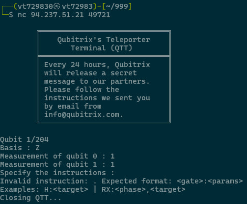

# HTB Write-up: Flagportation

Link - https://app.hackthebox.com/challenges/Flagportation

[English](#english) · [Русский](#русский)

---

## English

**Category:** Quantum
**Difficulty:** Very Easy

### Summary

The server implements a simplified quantum teleportation protocol: it encodes bit pairs (`00`, `01`, `10`, `11`) into a 3-qubit state, measures the first two qubits and prints the measurement results and the basis (`Z` or `X`) used to encode the original bits. Your job is to send instructions (which gates to apply to the third qubit) and choose the measurement basis for the third qubit. From the returned measurement you can reconstruct the original two-bit pair.

The solution is mainly automating the interaction and applying the teleportation corrections: you should apply the operator (X^{m_1} Z^{m_0}) to the receiver qubit (where (m_0) is the measurement of qubit 0 and (m_1) is the measurement of qubit 1). The server doesn't accept an empty instruction string, so for the no-correction case we use a no-op trick (for example, `Z:2;Z:2`, which results in the identity).

---

### Recon (how I inspected the format)

I used `nc`/`netcat` to connect and inspected the server output. Example output:

```
┌──(vt729830㉿vt72983)-[~/999]
└─$ nc 94.237.51.21 49721

        ╔═════════════════════════════╗
        ║    Qubitrix's Teleporter    ║
        ║       Terminal (QTT)        ║
        ╠═════════════════════════════╣
        ║ Every 24 hours, Qubitrix    ║
        ║ will release a secret       ║
        ║ message to our partners.    ║
        ║ Please follow the           ║
        ║ instructions we sent you    ║
        ║ by email from               ║
        ║ info@qubitrix.com.          ║
        ╚═════════════════════════════╝

Qubit 1/204
Basis : Z
Measurement of qubit 0 : 1
Measurement of qubit 1 : 1
Specify the instructions :
Invalid instruction: . Expected format: <gate>:<params>
Examples: H:<target> | RX:<phase>,<target>
Closing QTT...
```

Make a screenshot of your `nc` session and include it in the repository (example: `Flagportation/image.png`).



---

### Strategy

1. Split the flag into 2-bit chunks. The server already does that on its side, we need to reconstruct the same pairs from the messages.
2. For each round the server gives the `basis` (Z or X) and measurement outcomes `m0` and `m1`.
3. Send instructions that implement the correction operator (X^{m_1} Z^{m_0}) on qubit 2. Because the server applies gates sequentially as `state = gate * state`, sending `Z:2` then `X:2` results in the operator `X * Z`, which matches the correction for `m0=1,m1=1`.
4. Send the same basis (`Z` or `X`) for the measurement of qubit 2 and read the result. The recovered pair is `(first_bit, second_bit)` where `first_bit = 0` for `Z`, `1` for `X`, and `second_bit` is the measurement result of qubit 2.
5. Concatenate pairs, convert to bytes and you get the flag.

---

### Script evolution (how I iterated and fixed bugs)

**2.py — first attempt**

* Initial `pwntools` client. Problems:

  * fragile parsing (`recvuntil`/`recvline` brittle ordering),
  * possible wrong gate order in some branches.

**3.py — added reconstruction**

* Collect `reconstructed_bit_pairs` and parse the final measurement. Convert binary string to bytes:

```py
binary_string = ''.join(reconstructed_bit_pairs)
n = int(binary_string, 2)
flag_bytes = n.to_bytes((n.bit_length() + 7) // 8, 'big')
flag = flag_bytes.decode()
```

**4.py — final, robust version**

* Improved parsing (use `recvuntil(b"Basis : ")` and robust `recvline` parsing), ensured corrections follow (X^{m_1}Z^{m_0}) with correct ordering, and safe decoding.

Final correction logic used:

* `m0=0, m1=0` → `Z:2;Z:2` (identity)
* `m0=1, m1=0` → `Z:2`
* `m0=0, m1=1` → `X:2`
* `m0=1, m1=1` → `Z:2;X:2`

---

### Final script (short)

```py
from pwn import *

HOST = "1.1.1.1"
PORT = 0000

conn = remote(HOST, PORT)
reconstructed_bit_pairs = []

def recv_line_stripped():
    return conn.recvline().decode(errors='ignore').strip()

try:
    while True:
        conn.recvuntil(b"Basis : ")
        basis = recv_line_stripped()

        m0_line = recv_line_stripped()
        m1_line = recv_line_stripped()
        m0 = int(m0_line.split()[-1])
        m1 = int(m1_line.split()[-1])

        if m0 == 0 and m1 == 0:
            instructions = "Z:2;Z:2"
        elif m0 == 1 and m1 == 0:
            instructions = "Z:2"
        elif m0 == 0 and m1 == 1:
            instructions = "X:2"
        elif m0 == 1 and m1 == 1:
            instructions = "Z:2;X:2"
        else:
            instructions = "Z:2;Z:2"

        conn.sendlineafter(b"Specify the instructions : ", instructions.encode())
        conn.sendlineafter(b"Specify the measurement basis : ", basis.encode())

        res_line = recv_line_stripped()
        final_measurement = int(res_line.split()[-1])

        first_bit = '0' if basis == 'Z' else '1'
        reconstructed_bit_pairs.append(first_bit + str(final_measurement))

except EOFError:
    binary_string = ''.join(reconstructed_bit_pairs)
    if binary_string:
        n = int(binary_string, 2)
        flag_bytes = n.to_bytes((n.bit_length() + 7) // 8, 'big')
        try:
            flag = flag_bytes.decode()
        except:
            flag = flag_bytes
        print('FLAG:', flag)
finally:
    conn.close()
```

---

### Result and proofs

After fixing parsing and gate order, the script reconstructed all bit pairs and produced the flag. Include screenshots as proof (place them into the repo next to `README.md`):


---

## Русский

[Перейти к английской версии](#english)

**Категория:** Quantum
**Сложность:** Very Easy

---

## Краткое описание

Сервер реализует упрощённый протокол квантовой телепортации: он кодирует пары битов (`00`, `01`, `10`, `11`) в трёхкубитное состояние, измеряет первые два кубита и отправляет вам результаты измерений плюс базис, в котором исходные биты были закодированы (`Z` или `X`). Ваша задача — отправить инструкции (какие гейты применить к третьему кубиту) и выбрать базис для измерения третьего кубита, после чего сервер вернёт вам результат — из этих данных восстанавливается исходная пара бит.

Решение сводится к автоматизации обмена и к пониманию поправок телепортации: нужно применить оператор (X^{m_1} Z^{m_0}) к приёмному кубиту (где (m_0) — результат измерения кубита 0, (m_1) — результат измерения кубита 1). Кроме того, сервер не принимает пустую строку инструкций, поэтому для случая без поправок используем трюк (например, `Z:2;Z:2`, т.е. действие, эквивалентное единичному оператору).

---

## Разведка (как я смотрел формат)

Я подключился к серверу через `nc`/`netcat` и посмотрел вывод. Сервер печатает строки вида:

```
┌──(vt729830㉿vt72983)-[~/999]
└─$ nc 94.237.51.21 49721

        ╔═════════════════════════════╗
        ║    Qubitrix's Teleporter    ║
        ║       Terminal (QTT)        ║
        ╠═════════════════════════════╣
        ║ Every 24 hours, Qubitrix    ║
        ║ will release a secret       ║
        ║ message to our partners.    ║
        ║ Please follow the           ║
        ║ instructions we sent you    ║
        ║ by email from               ║
        ║ info@qubitrix.com.          ║
        ╚═════════════════════════════╝

Qubit 1/204
Basis : Z
Measurement of qubit 0 : 1
Measurement of qubit 1 : 1
Specify the instructions :
Invalid instruction: . Expected format: <gate>:<params>
Examples: H:<target> | RX:<phase>,<target>
Closing QTT...
```

Также полезно сделать скриншот/сохранить вывод — в моём write-up я ссылюсь на `Flagportation/image.png` (скрин с `nc`).


---

## Стратегия

1. Разбить флаг на пары бит (файл `flag.txt` на сервере уже преобразован сервером; нам важно собрать пары, которые он отправляет по сети).
2. Для каждого раунда сервер сообщает `basis` (Z или X), результаты `m0` и `m1`.
3. Нужно отправить инструкции, реализующие оператор (X^{m_1} Z^{m_0}) на третьем кубите. Поскольку сервер последовательно умножает матрицу гейта на состояние (`state = gate * state`), если мы отправим сначала `Z:2`, затем `X:2`, итоговый оператор будет `X * Z` — что и нужно при `m0=1,m1=1`.
4. Затем отправить тот же базис (`Z` или `X`) для измерения третьего кубита и прочитать результат — эта пара битов восстанавливается как `(first_bit, second_bit)` где `first_bit = 0` для `Z`, `1` для `X`, а `second_bit` равен значению финального измерения.
5. Собрать все пары, конкатенировать и преобразовать в байты — получим флаг.

---

## Эволюция скриптов (как я думал и исправлял ошибки)

### `2.py` — первая попытка

* Я посмотрел вывод через `nc` и написал простой клиент на `pwntools`. В `2.py` я пытался отправлять поправки, но:

  * делал неустойчивый парсинг (хрупко завязан на `recvuntil` / `recvline` последовательностях);
  * в отдельных ветках логики возможен неверный порядок гейтов.

Фрагмент (из `2.py`):

```py
# ... читаю basis, m0, m1 ...
if m1 == 0 and m0 == 0:
    instructions = "Z:2;Z:2"
elif m1 == 0 and m0 == 1:
    instructions = "X:2"
elif m1 == 1 and m0 == 0:
    instructions = "Z:2"
elif m1 == 1 and m0 == 1:
    instructions = "Z:2;X:2"
```

> Замечание: в `2.py` порядок `Z:2;X:2` в ветке `m1==1,m0==1` — это правильный вариант (сначала Z, затем X), потому что сервер применяет гейт на состояние по очереди.

### `3.py` — добавил восстановление пар бит и декодирование

* Я улучшил кодировку вывода и начал собирать пары бит в список `reconstructed_bit_pairs`. Также стал дожидаться строки с финальным измерением и добавлять пару `first_bit + second_bit` в массив.

Важное изменение: добавил превращение бинарной строки в байты:

```py
binary_string = ''.join(reconstructed_bit_pairs)
n = int(binary_string, 2)
flag_bytes = n.to_bytes((n.bit_length() + 7) // 8, 'big')
flag = flag_bytes.decode()
```

### `4.py` — финальная версия (парсинг и устойчивость)

* Переписал чтение строк так, чтобы парсинг был более устойчивым (`recvuntil("Basis : ")` + аккуратное чтение следующих строк).
* Убедился, что во всех четырёх случаях поправки соответствуют (X^{m_1}Z^{m_0}) (и особенно обратил внимание на порядок — сначала `Z` если m0=1, затем `X` если m1=1).
* Добавил безопасное декодирование флага (проверка на пустую строку, try/except для `.decode()`).

Вот итоговая логика поправок, которую я использовал (и рекомендую использовать):

* `m0=0, m1=0` → `Z:2;Z:2` (id)
* `m0=1, m1=0` → `Z:2`
* `m0=0, m1=1` → `X:2`
* `m0=1, m1=1` → `Z:2;X:2`

---

## Итоговый скрипт (коротко)

Ниже — урезанная и надёжная версия клиента (суть уже в `4.py`). Этот скрипт корректно парсит вывод сервера, применяет поправки в правильном порядке и собирает пары бит.

```py
from pwn import *

HOST = "1.1.1.1"
PORT = 0000

conn = remote(HOST, PORT)
reconstructed_bit_pairs = []

def recv_line_stripped():
    return conn.recvline().decode(errors='ignore').strip()

try:
    while True:
        # читаем до 'Basis : ' и получаем сам базис
        conn.recvuntil(b"Basis : ")
        basis = recv_line_stripped()

        m0_line = recv_line_stripped()
        m1_line = recv_line_stripped()
        m0 = int(m0_line.split()[-1])
        m1 = int(m1_line.split()[-1])

        # коррекции: хотим X^{m1} Z^{m0}
        if m0 == 0 and m1 == 0:
            instructions = "Z:2;Z:2"
        elif m0 == 1 and m1 == 0:
            instructions = "Z:2"
        elif m0 == 0 and m1 == 1:
            instructions = "X:2"
        elif m0 == 1 and m1 == 1:
            instructions = "Z:2;X:2"
        else:
            instructions = "Z:2;Z:2"

        conn.sendlineafter(b"Specify the instructions : ", instructions.encode())
        conn.sendlineafter(b"Specify the measurement basis : ", basis.encode())

        res_line = recv_line_stripped()
        final_measurement = int(res_line.split()[-1])

        first_bit = '0' if basis == 'Z' else '1'
        reconstructed_bit_pairs.append(first_bit + str(final_measurement))

except EOFError:
    # собираем флаг
    binary_string = ''.join(reconstructed_bit_pairs)
    if binary_string:
        n = int(binary_string, 2)
        flag_bytes = n.to_bytes((n.bit_length() + 7) // 8, 'big')
        try:
            flag = flag_bytes.decode()
        except:
            flag = flag_bytes
        print('FLAG:', flag)
finally:
    conn.close()
```

---

## Результат

После финального исправления парсинга и порядка поправок скрипт собрал все пары бит, я конвертировал их в байты и получил флаг. В отчёте я приложил `Flagportation/photo2.jpg` — скриншот с подтверждением получения флага и отправки на HTB.


---

## Замечания / отладка

* Обратите внимание на порядок гейтов — это критично. Сервер применяет гейты в том порядке, в котором они приходят (каждый гейт умножается на текущее состояние слева). Чтобы получить итоговый оператор (X^{m_1}Z^{m_0}) с последовательным применением, отправляйте сначала `Z` (если m0=1), затем `X` (если m1=1).


