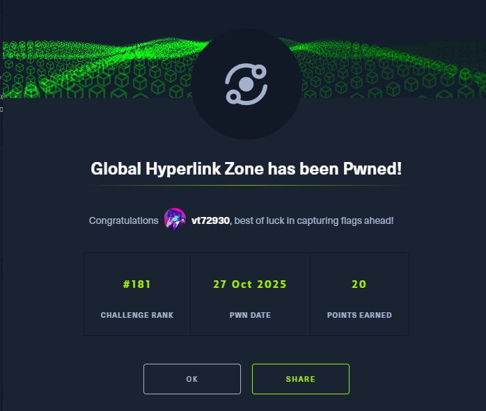

# HTB Write-up: Global Hyperlink Zone

[English](#english) · [Русский](#русский)

Link - https://app.hackthebox.com/challenges/Global%2520Hyperlink%2520Zone
---

## English

**Category:** Quantum
**Difficulty:** Very Easy

### Summary

The challenge provides a Python script for a server that expects a specific sequence of quantum gates. The goal is to build a quantum circuit that satisfies a set of conditions defined in a validation function within the script. The solution involves creating a specific entangled state across five qubits.

---

### Recon (Analyzing the code)

After downloading the file, `server.py`, it's immediately clear how to solve this. The whole logic is in the `validate` function:

```python
def validate(shares):
    # 1 - No uniformity
    if any(set(share) in ({0}, {255}) for share in shares):
        return False

    # 2 - Correlation and anti-correlation
    if (
        shares[0] == shares[1] and
        shares[1] == shares[3] and
        shares[2] == shares[4] and
        shares[4] != shares[0]
    ):
        return True

    return False
```

Here, `shares` is a list of 5 byte arrays. `shares[0]` contains the 256 measurement outcomes for qubit 0, `shares[1]` for qubit 1, and so on.

**Breaking down the logic:**

1.  **`if any(set(share) in ({0}, {255}) for share in shares): return False`**
    *   This checks if any qubit always measured `0` (byte `0`) or always measured `1` (byte `255`). This is forbidden.
    *   **In simple terms:** Every qubit needs to be in a superposition. The easiest way to achieve this is with a Hadamard (H) gate.

2.  **`shares[0] == shares[1] and shares[1] == shares[3]`**
    *   The measurement outcomes for qubits 0, 1, and 3 must be **identical** across all 256 shots.
    *   **How to achieve this:** They must be entangled. If qubit 0 is measured as 0, qubits 1 and 3 must also be 0. This is a classic Greenberger–Horne–Zeilinger (GHZ) state.

3.  **`shares[2] == shares[4]`**
    *   Measurement outcomes for qubits 2 and 4 must also be **identical**.
    *   **How to achieve this:** Entangle them to create a Bell state.

4.  **`shares[4] != shares[0]`**
    *   The results for the (2, 4) group must be the **opposite** of the (0, 1, 3) group.
    *   **How to achieve this:** The two groups must be anti-correlated. If qubit 0 is 0, qubit 4 must be 1.

---

### Strategy

Based on the analysis, the plan is straightforward:

1.  **Pick a "control" qubit.** Let's use qubit 0.
2.  **Create superposition (Condition 1).** Apply a Hadamard gate to the control qubit.
    *   `H:0`
3.  **Make qubits 1 and 3 identical to qubit 0 (Condition 2).** Use CNOT (CX) gates with qubit 0 as the control.
    *   `CX:0,1`
    *   `CX:0,3`
4.  **Make qubits 2 and 4 the opposite of qubit 0 (Conditions 3 & 4).**
    *   First, entangle them with qubit 0 so they follow it:
        *   `CX:0,2`
        *   `CX:0,4`
    *   Now all 5 qubits are correlated. To make the (2, 4) group opposite, just flip their states with a Pauli-X (NOT) gate.
        *   `X:2`
        *   `X:4`

---

### Solution

Combining all steps into a single, semicolon-separated string gives us the final payload:

```
H:0;CX:0,1;CX:0,3;CX:0,2;CX:0,4;X:2;X:4
```

This sequence creates a superposition of two states: `|00101>` and `|11010>`, which perfectly satisfies all the conditions.

---

### Execution

All that's left is to connect via `nc` and send the string.

```
┌──(user㉿hostname)-[~]
└─$ nc 1.1.1.1 0000

                 _             _       _      _
                /\ \          / /\    / /\  /\ \
               /  \ \        / / /   / / / /  \ \
              / /\ \_\      / /_/   / / /_/ /\ \ \
             / / /\/_/     / /\ \__/ / /___/ /\ \ \
            / / / ______  / /\ \___\/ /\___\/ / / /
           / / / /\_____\/ / /\/___/ /       / / /
          / / /  \/____ / / /   / / /       / / /    _
         / / /_____/ / / / /   / / /        \ \ \__/\_\
        / / /______\/ / / /   / / /          \ \___\/ /
        \/___________/\/_/    \/_/            \/___/_/


Welcome to the Global Hyperlink Zone! The first quantum internet prototype by Qubitrix.
Please send the instructions to initialize the hyperlink.
Specify the instructions : H:0;CX:0,1;CX:0,3;CX:0,2;CX:0,4;X:2;X:4
Hyperlink initialized successfully! Connection ID: HTB{...flag...}
```

And that's the challenge solved.



---
---

## Русский

[Go to English version](#english)

**Категория:** Quantum
**Сложность:** Very Easy

### Краткое описание

В челлендже нам дают Python-скрипт сервера, который ожидает определённую последовательность квантовых гейтов. Цель — построить схему, которая удовлетворяет условиям в функции валидации. Решение заключается в создании специфического запутанного состояния на пяти кубитах.

---

### Разведка (анализ кода)

Скачал файл `server.py`, и решение стало очевидным с первого взгляда. Вся логика находится в одной функции — `validate`:

```python
def validate(shares):
    # 1 - проверка на однообразие
    if any(set(share) in ({0}, {255}) for share in shares):
        return False

    # 2 - проверка на совпадение и различие
    if (
        shares[0] == shares[1] and
        shares[1] == shares[3] and
        shares[2] == shares[4] and
        shares[4] != shares[0]
    ):
        return True

    return False
```

`shares` — это список из 5 массивов байтов. `shares[0]` хранит 256 результатов измерений для кубита 0, `shares[1]` — для кубита 1, и так далее.

**Разбираем логику по частям:**

1.  **`if any(set(share) in ({0}, {255}) for share in shares): return False`**
    *   Проверка, что ни один из кубитов не выдал при измерении всегда `0` (байт `0`) или всегда `1` (байт `255`). Такое запрещено.
    *   **Простыми словами:** Каждый кубит должен быть в суперпозиции. Самый лёгкий способ — применить гейт Адамара (H).

2.  **`shares[0] == shares[1] and shares[1] == shares[3]`**
    *   Результаты измерений кубитов 0, 1 и 3 должны быть **идентичными** во всех 256 запусках.
    *   **Как этого добиться:** Их нужно запутать (entangle). Если кубит 0 измерился как 0, то и 1, и 3 тоже должны. Это классическое состояние Гринбергера — Хорна — Цайлингера (GHZ).

3.  **`shares[2] == shares[4]`**
    *   Результаты измерений кубитов 2 и 4 также должны быть **идентичными**.
    *   **Как этого добиться:** Их тоже нужно запутать, создав состояние Белла.

4.  **`shares[4] != shares[0]`**
    *   Результаты группы (2, 4) должны быть **противоположными** результатам группы (0, 1, 3).
    *   **Как этого добиться:** Две группы должны быть анти-коррелированы. Если кубит 0 — это 0, то кубит 4 должен быть 1.

---

### Стратегия

Из анализа кода вырисовывается простой план:

1.  **Выбираем "главный" кубит.** Пусть будет кубит 0. Он будет управлять всеми.
2.  **Создаём суперпозицию (Условие 1).** Применяем гейт Адамара к главному кубиту.
    *   `H:0`
3.  **Делаем кубиты 1 и 3 такими же, как кубит 0 (Условие 2).** Используем гейт CNOT (CX), где кубит 0 — управляющий.
    *   `CX:0,1`
    *   `CX:0,3`
4.  **Делаем кубиты 2 и 4 противоположными кубиту 0 (Условия 3 и 4).**
    *   Сначала запутываем их с кубитом 0, чтобы они его повторяли:
        *   `CX:0,2`
        *   `CX:0,4`
    *   Теперь все 5 кубитов измеряются одинаково. Чтобы сделать группу (2, 4) противоположной, просто инвертируем их состояние гейтом Паули-X (NOT).
        *   `X:2`
        *   `X:4`

---

### Решение

Собираем все шаги в одну строку с разделителем `;` и получаем готовый пейлоад:

```
H:0;CX:0,1;CX:0,3;CX:0,2;CX:0,4;X:2;X:4
```

Эта последовательность создаёт суперпозицию двух состояний: `|00101>` и `|11010>`, что идеально удовлетворяет всем условиям задачи.

---

### Исполнение

Осталось подключиться через `nc` и отправить нашу строку.

```
┌──(user㉿hostname)-[~]
└─$ nc 1.1.1.1 0000

                 _             _       _      _
                /\ \          / /\    / /\  /\ \
               /  \ \        / / /   / / / /  \ \
              / /\ \_\      / /_/   / / /_/ /\ \ \
             / / /\/_/     / /\ \__/ / /___/ /\ \ \
            / / / ______  / /\ \___\/ /\___\/ / / /
           / / / /\_____\/ / /\/___/ /       / / /
          / / /  \/____ / / /   / / /       / / /    _
         / / /_____/ / / / /   / / /        \ \ \__/\_\
        / / /______\/ / / /   / / /          \ \___\/ /
        \/___________/\/_/    \/_/            \/___/_/


Welcome to the Global Hyperlink Zone! The first quantum internet prototype by Qubitrix.
Please send the instructions to initialize the hyperlink.
Specify the instructions : H:0;CX:0,1;CX:0,3;CX:0,2;CX:0,4;X:2;X:4
Hyperlink initialized successfully! Connection ID: HTB{...флаг...}
```

Вот и решена задачка.


