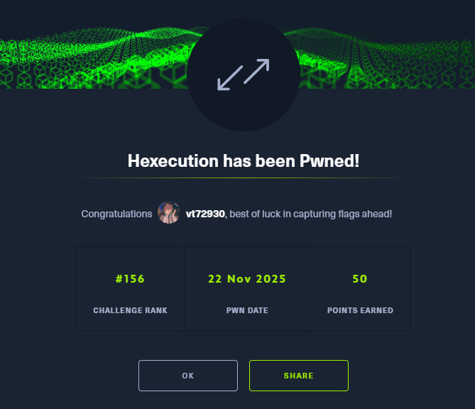

[English](#english) · [Русский](#русский)

---

## English

**Name -** Hexecution

**Category -** Reversing

**Difficulty -** Hard

**Link -** https://app.hackthebox.com/challenges/Hexecution

### Summary

The challenge provides a custom "recipe" and a "cook" binary. The description says: "My friend is always tampering with low-level things. So created something different, and going to challenge him. Before challenge him, can you try it and see if it works or not?"
We are dealing with a custom architecture/VM. We have `recipe.asm` (5kb) and `cook` (15kb). The solution involves static analysis of the custom assembly to understand a character shuffling algorithm, extracting the target comparison string, and reversing the shuffle to get the flag.

---

### Recon (how I inspected the format)

I started by looking at the `recipe.asm` file. The code is written in a made-up assembly language. I mapped the instructions to standard concepts:

*   `AES256 <hex>` — This is **not** encryption. It's just printing a character (**Print char**).
*   `BOIL <REG>, <VAL>` — Set the value of a register or memory pointer (**MOV**).
*   `SPELL` — Read input (**Read Input**).
*   `QUICKMAFFS` — Math operation or index setting.
*   `GOODBYE` / `WINDOW` — Reading and writing to memory (**Load / Store**).
*   `LADDER` — Comparison or jump (**Check / Jump**).

**Stage 1: The Greeting**
At the beginning, there is a block of `AES256` instructions that prints the prompt:
`Enter the flag: ` (Codes `0x45`, `0x6e`... `0x20`).

**Stage 2: The "Encrypted" String**
Starting at address `0x40`, a key string is loaded into memory. This is what our input will be compared against.
We see `BOIL CARBO, 0x40` followed by a list of `AES256`: `0x35 0x6d 0x61 0x4e 0x63 ...`

Converting these hex values to ASCII gives us:
**`5maNcI4__U10_de5L13_Mn4U0u4trfn_`**

This is **not the flag**, but rather what the flag looks like after being processed (or the key used for verification).

---

### Strategy

The most interesting part is the block with `GOODBYE` and `WINDOW` (lines 60 to 160). The code processes the user input in 4-byte blocks and shuffles them.

**The Shuffle Logic:**
1.  `GOODBYE VEGETABLE` (Loads byte 0)
2.  `GOODBYE FRUIT` (Loads byte 1)
3.  `GOODBYE MEAT` (Loads byte 2)
4.  `GOODBYE DAIRY` (Loads byte 3)

Then it writes them back (`WINDOW`) in a different order:
1.  `WINDOW MEAT` (byte 2) is written to pos 0.
2.  `WINDOW FRUIT` (byte 1) is written to pos 1.
3.  `WINDOW DAIRY` (byte 3) is written to pos 2.
4.  `WINDOW VEGETABLE` (byte 0) is written to pos 3.

**Shuffle Pattern:** `[0, 1, 2, 3]` becomes `[2, 1, 3, 0]`.

Finally, a long list of `LADDER` instructions checks the input characters at specific indices. By mapping the indices from the `LADDER` commands (0x14, 0x19, 0x1e...) to the sequence of characters in the "encrypted" string, we can reconstruct the **shuffled flag**.

The check sequence follows the order of the key string `5maNcI...`:
*   1st key char (`5`) is checked against index `0x14` (input index 0).
*   2nd key char (`m`) is checked against index `0x19` (input index 5).
*   And so on.

To get the flag, we need two steps:
1.  **Reconstruct the Shuffled Input**: Place the key characters into the positions dictated by the `LADDER` indices.
2.  **Unshuffle**: Apply the reverse permutation to every 4-byte block.

---

### Execution

**Step 1: Index Mapping**
Key: `5maNcI4__U10_de5L13_Mn4U0u4trfn_`

Using indices from `QUICKMAFFS` (subtracting 0x14 base offset):
*   `0x14` (idx 0) = '5'
*   `0x19` (idx 5) = 'm'
*   `0x1e` (idx 10)= 'a'
*   `0x23` (idx 15)= 'N'
*   ...

Reconstructing the string *as it appears in memory after shuffling*:
`5U1c_mI0_4a5_deNLu4M01ntr43_Ufn_`

**Step 2: Reverse Shuffling**
We take this string and unshuffle every 4 characters.
The forward swap was: `Pos 0 <- 2`, `1 <- 1`, `2 <- 3`, `3 <- 0`.
Therefore, to restore (Original -> Source):
*   Orig[0] = Shuffled[3]
*   Orig[1] = Shuffled[1]
*   Orig[2] = Shuffled[0]
*   Orig[3] = Shuffled[2]

Processing the blocks:
1.  `5U1c` -> `c` `U` `5` `1` -> **`cU51`**
2.  `_mI0` -> `0` `m` `_` `I` -> **`0m_I`**
3.  `_4a5` -> `5` `4` `_` `a` -> **`54_a`**
4.  `_deN` -> `N` `d` `_` `e` -> **`Nd_e`**
5.  `Lu4M` -> `M` `u` `L` `4` -> **`MuL4`**
6.  `01nt` -> `t` `1` `0` `n` -> **`t10n`**
7.  `r43_` -> `_` `4` `r` `3` -> **`_4r3`**
8.  `Ufn_` -> `_` `f` `U` `n` -> **`_fUn`**

**Assembly:**
`cU510m_I54_aNd_eMuL4t10n_4r3_fUn`

This reads as "Custom ISA and Emulation are Fun".

### Result and proofs

I didn't even open my beloved IDA Pro T_T.

`HTB{cU510m_I54_aNd_eMuL4t10n_4r3_fUn}` easy?...

---

## Русский

[Перейти к английской версии](#english)

**Название -** Hexecution

**Категория -** Reversing

**Сложность -** Hard

**Ссылка -** https://app.hackthebox.com/challenges/Hexecution

---

## Краткое описание

Нам дали описание: «Мой друг вечно копается в низкоуровневых вещах. Поэтому я создал кое-что необычное и собираюсь бросить ему вызов. Перед этим, можешь попробовать сам и проверить, работает оно или нет?»
И так нас просят проверить. Окей у нас есть файл `recipe.asm` на 5 кб и также `cook` на 15 кб. Это задача на статический анализ кастомной архитектуры. Решение кроется в понимании алгоритма перемешивания байтов, восстановлении строки сравнения и обратной перестановке символов.

---

## Разведка (как я смотрел формат)

Глянем asm файл с начала. Код написан на выдуманном ассемблере. Я сопоставил инструкции с понятными аналогами:

*   `AES256 <hex>` — на самом деле это не шифрование, а просто вывод символа (**Print char**).
*   `BOIL <REG>, <VAL>` — установить значение регистра или указателя памяти (**MOV**).
*   `SPELL` — чтение ввода (**Read Input**).
*   `QUICKMAFFS` — математическая операция или установка индекса.
*   `GOODBYE` / `WINDOW` — чтение и запись в память (**Load / Store**).
*   `LADDER` — похоже на сравнение или переход (**Check / Jump**).

**Этап 1: Приветствие**
В начале файла идет блок `AES256`, который выводит текст приглашения:
`Enter the flag: ` (Коды `0x45`, `0x6e`... `0x20`).

**Этап 2: "Зашифрованная" строка**
Далее, начиная с адреса `0x40`, в память загружается строка-ключ (с которой будет сравниваться наш ввод).
Команды: `BOIL CARBO, 0x40` и список `AES256`:
`0x35 0x6d 0x61 0x4e 0x63 ...`

Если перевести эти hex-значения в ASCII, получим строку:
**`5maNcI4__U10_de5L13_Mn4U0u4trfn_`**

Это **не сам флаг**, а то, во что превращается флаг после перемешивания (или ключ для проверки).

---

## Стратегия

Самая интересная часть — это блок с `GOODBYE` и `WINDOW` (строки с 60 по 160).
Код берет введенные пользователем символы блоками по 4 байта и меняет их местами.

Смотрим логику:
1.  `GOODBYE VEGETABLE` (грузит байт 0)
2.  `GOODBYE FRUIT` (грузит байт 1)
3.  `GOODBYE MEAT` (грузит байт 2)
4.  `GOODBYE DAIRY` (грузит байт 3)

А потом записывает их обратно (`WINDOW`), но в другом порядке:
1.  `WINDOW MEAT` (байт 2) пишется на место 0.
2.  `WINDOW FRUIT` (байт 1) пишется на место 1.
3.  `WINDOW DAIRY` (байт 3) пишется на место 2.
4.  `WINDOW VEGETABLE` (байт 0) пишется на место 3.

**Паттерн перемешивания:** `[0, 1, 2, 3]` -> `[2, 1, 3, 0]`.

В конце идет длинный список команд `LADDER`. Они проверяют символы ввода по определенным индексам. Если сопоставить индексы из команд `LADDER` (0x14, 0x19, 0x1e...) с последовательностью символов в "зашифрованной" строке, мы сможем восстановить **перемешанный флаг**.

Последовательность проверки в коде идет по порядку символов строки-ключа `5maNcI...`.
*   Первый символ ключа (`5`) проверяется по индексу `0x14` (это 0-й символ ввода).
*   Второй символ ключа (`m`) проверяется по индексу `0x19` (это 5-й символ ввода).
*   И так далее.

Чтобы получить флаг, нам нужно сделать два обратных действия:
1.  **Восстановить перемешанный ввод (Shuffled Input)**, расставив символы строки-ключа по индексам, указанным в блоке `LADDER`.
2.  **Размешать блоки (Unshuffle)**, применив обратную перестановку к каждыми 4 байтам.

---

## Исполнение (Execution)

**Шаг 1: Расстановка по индексам**
Ключ: `5maNcI4__U10_de5L13_Mn4U0u4trfn_`

Берем индексы из команд `QUICKMAFFS` перед `LADDER` (вычитаем 0x14, так как это начало буфера):
*   `0x14` (idx 0) = '5'
*   `0x19` (idx 5) = 'm'
*   `0x1e` (idx 10)= 'a'
*   `0x23` (idx 15)= 'N'
*   ... и так далее.

В итоге мы собираем строку, которая должна получиться **после** перемешивания:
`5U1c_mI0_4a5_deNLu4M01ntr43_Ufn_`

**Шаг 2: Обратное перемешивание**
Теперь берем эту строку и меняем каждые 4 символа обратно.
Прямая замена была: `Позиция 0 <- 2`, `1 <- 1`, `2 <- 3`, `3 <- 0`.
Значит, чтобы вернуть как было (Original -> Source):
*   Orig[0] = Shuffled[3]
*   Orig[1] = Shuffled[1]
*   Orig[2] = Shuffled[0]
*   Orig[3] = Shuffled[2]

Разбиваем на блоки и восстанавливаем:

1.  `5U1c` -> `c` `U` `5` `1` -> **`cU51`**
2.  `_mI0` -> `0` `m` `_` `I` -> **`0m_I`**
3.  `_4a5` -> `5` `4` `_` `a` -> **`54_a`**
4.  `_deN` -> `N` `d` `_` `e` -> **`Nd_e`**
5.  `Lu4M` -> `M` `u` `L` `4` -> **`MuL4`**
6.  `01nt` -> `t` `1` `0` `n` -> **`t10n`**
7.  `r43_` -> `_` `4` `r` `3` -> **`_4r3`**
8.  `Ufn_` -> `_` `f` `U` `n` -> **`_fUn`**

Соединяем блоки:
`cU510m_I54_aNd_eMuL4t10n_4r3_fUn`

Читается как Leet-speak фраза: *"Custom ISA and Emulation are Fun"* ("Кастомная архитектура и эмуляция — это весело").

## Результат

Я даже ida pro свою любимую не открывал T_T.

И получаем флаг... `HTB{cU510m_I54_aNd_eMuL4t10n_4r3_fUn}` легко?...

