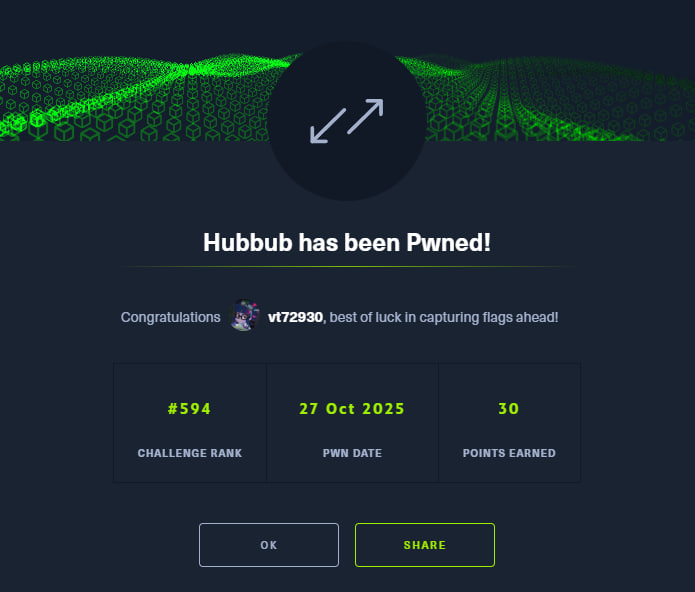

# HTB Write-up: Hubbub

Link - https://app.hackthebox.com/challenges/Hubbub

[English](#english) · [Русский](#русский)

---

## English

**Category:** Reversing
**Difficulty:** Easy

### Summary

The challenge provides a 35KB ELF file for an Atmel AVR microcontroller. Decompilation is not possible, so the analysis must be done at the assembly level. The firmware does not wait for any user input; instead, it executes a long, predefined sequence of operations that toggle a pin with specific delays. This behavior strongly suggests a message encoded in Morse code, where short and long delays represent dots and dashes, and longer delays represent pauses between letters and words. The goal is to reverse-engineer this sequence, extract the timing of the delays, decode the resulting Morse code, and obtain the flag.

---

### Recon (how I inspected the format)

I opened the `Hubbub` file in IDA Pro, which correctly identified it as an ELF file for the Atmel AVR architecture. A list of potential microcontrollers was presented, including ATmega128, ATmega16, etc.

However, attempting to decompile the code using Hex-Rays (F5) resulted in the message: `Sorry, the current file is not decompilable`. This meant I had to analyze the AVR assembly code manually.

The first point of interest was the `main` function. A quick look at the function graph showed a complex web of calls. Many functions like `main`, `main_0`, and `delay_0` seemed to revolve around a central `delay` function, which itself called `micros`. This structure confirmed that the program's logic is heavily based on timing and delays.

---

### Strategy

The core logic is clear: the firmware plays a "song" or blinks a light in a pattern. This is Morse code. The strategy to decode it is:

1.  Analyze the assembly code starting from the `main` function (address `0x2F4`).
2.  Identify the code blocks responsible for generating delays. This involves tracking `call` instructions to delay-related functions.
3.  Determine how the delay duration is passed to these functions. In AVR, this is typically done via a set of registers (e.g., `r22`-`r25` for a 32-bit value).
4.  Establish a mapping between specific delay values and Morse code elements:
    *   Short delay (`~300ms`) -> Dot (`.`)
    *   Longer delay (`~600ms`) -> Dash (`-`)
    *   Even longer delay (`~1000ms`) -> Pause between letters (`|`)
    *   Longest delay (`~2000ms`) -> Pause between words (` `)
5.  Write an IDA Python script to automate the process. The script must:
    *   Iterate through instructions from `main` to the end of the sequence.
    *   Simulate the state of the relevant registers (`r22`, `r23`, `r24`, `r25`).
    *   When a `call` to a delay function is found, use the current register state to determine the delay value and translate it to the corresponding Morse character.
6.  Assemble the sequence and use a standard Morse code table to decode the final message.

---

### Script evolution (how I iterated and fixed bugs)

This part was a journey of trial and error, as my initial assumptions about the compiler's behavior were wrong.

**1.py — First attempt (Naive Backtracking)**

My first assumption was that every `call delay` would be preceded by `ldi r22, ...` and `ldi r23, ...` instructions to set up the delay value. My script worked by finding a `call delay` and then looking *backwards* for these `ldi` instructions.

**Problem:** This failed spectacularly. The compiler is smart. If a register like `r22` already holds the correct value from a previous operation, it won't generate a redundant `ldi` instruction. My script would fail to find the setup instructions, grab stale data, and produce garbage output like `?I? H H?H??`.

**2.py — Second attempt (Forward State Tracking)**

I realized my backward-looking approach was flawed. The correct way is to simulate the CPU's state. So, I rewrote the script to:

1.  Create variables to hold the current state of `current_r22` and `current_r23`.
2.  Iterate forward through the code from `main`.
3.  When an `ldi r2X, Y` instruction is found, update the corresponding state variable.
4.  When a `call delay` is found, use the **currently stored** values of `current_r22` and `current_r23`.

**Problem:** The output was still garbage. I quickly realized that the AVR-GCC compiler passes `unsigned long` (a 32-bit value) to functions using **four registers**: `r25:r24:r23:r22`. My script was only tracking the lower 16 bits, ignoring `r24` and `r25` completely.

**3.py — Third attempt (Full 32-bit Register State)**

I updated the script to simulate the state of all four registers (`r22`, `r23`, `r24`, `r25`) to correctly reconstruct the 32-bit delay value.

**Problem:** Still garbage! At this point, I understood that a fundamental assumption about the *logic* was wrong, not just the implementation. After more careful inspection, I found the critical missing piece.

**4.py & 5.py — The Breakthrough (Two Different Delay Functions)**

My fatal flaw was assuming a single function was responsible for all delays. The firmware actually uses **two different call targets** for two different purposes:

*   **`call 0x98` (`digital_pin_to_port_PGM+7`)**: This is used for the actual signals. The delay value passed here determines if it's a **dot (`.`)** or a **dash (`-`)**.
*   **`call 0x1B5` (`delay`)**: This is used for **pauses**. The delay value passed here determines if it's a pause between letters (`|`) or a pause between words (` `).

My final script (`5.py`) implemented this correct logic:

*   Iterate through the code, tracking the state of all four registers.
*   If a `call 0x98` is encountered, check the delay value: `0x12C` (300) is a dot, `0x258` (600) is a dash.
*   If a `call 0x1B5` is encountered, check the delay value: `0x3E8` (1000) is a letter separator, `0x7D0` (2000) is a word separator.

This finally worked.

---

### Final script (short)

```python
import idc
import ida_ua
import ida_idp


MORSE_TO_TEXT = {
    '.-': 'A', '-...': 'B', '-.-.': 'C', '-..': 'D', '.': 'E', '..-.': 'F',
    '--.': 'G', '....': 'H', '..': 'I', '.---': 'J', '-.-': 'K', '.-..': 'L',
    '--': 'M', '-.': 'N', '---': 'O', '.--.': 'P', '--.-': 'Q', '.-.': 'R',
    '...': 'S', '-': 'T', '..-': 'U', '...-': 'V', '.--': 'W', '-..-': 'X',
    '-.--': 'Y', '--..': 'Z', '-----': '0', '.----': '1', '..---': '2',
    '...--': '3', '....-': '4', '.....': '5', '-....': '6', '--...': '7',
    '---..': '8', '----.': '9', '.-.-.': '.'
}

addr_main = idc.get_name_ea_simple("main")
addr_end = 0x993 
addr_delay_long = idc.get_name_ea_simple("delay")
addr_delay_short = 0x98 
if addr_main == idc.BADADDR or addr_delay_long == idc.BADADDR:
    print("[!] not find required addresses.")
else:
    print("--- Hubbub Morse Solver by vt729830---")
    morse_sequence = []
    ea = addr_main
    state = {'r22': 0, 'r23': 0, 'r24': 0, 'r25': 0}
    while ea < addr_end and ea != idc.BADADDR:
        if idc.print_insn_mnem(ea) == "ldi":
            reg = idc.print_operand(ea, 0)
            if reg in state:
                state[reg] = idc.get_operand_value(ea, 1)
        insn = ida_ua.insn_t()
        ida_ua.decode_insn(insn, ea)
        if ida_idp.is_call_insn(insn):
            target_addr = insn.Op1.addr
            delay_val = (state['r25'] << 24) | (state['r24'] << 16) | (state['r23'] << 8) | state['r22']
            if target_addr == addr_delay_short:
                if delay_val == 0x12C: morse_sequence.append('.')
                elif delay_val == 0x258: morse_sequence.append('-')
            elif target_addr == addr_delay_long:
                if delay_val == 0x3E8: morse_sequence.append('|')
                elif delay_val == 0x7D0: morse_sequence.append(' ')
        ea = idc.next_head(ea)
    morse_string = "".join(morse_sequence).strip()
    print(f"[+] Morse: {morse_string}")
    decoded_message = []
    for word in morse_string.split(' '):
        decoded_word = ""
        for letter in filter(None, word.strip().split('|')):
            char = MORSE_TO_TEXT.get(letter, '?')
            decoded_word += char
        decoded_message.append(decoded_word)
    final_text = " ".join(decoded_message)
    print(f"[+] FLAG:  {final_text}")
```

---

### Result and proofs

Running the final IDA Python script produced the correct Morse sequence and decoded it into the flag.

**IDA Pro Output:**
```
--- Hubbub Morse Solver by vt729830---
[+] Morse: ....|-|-... .- -.|---|..|...|-.-- -...|..-|--..|--..|.|.-. -.-.|---|--|--|.-|-.|-..|... .-|-|-|.|-.|-|..|---|-.
[+] FLAG:  HTB A NOISY BUZZER COMMANDS ATTENTION
```

That's the problem solved ;)



---
## Русский

[Перейти к английской версии](#english)

**Категория:** Reversing
**Сложность:** Easy

---

## Краткое описание

В задании дан ELF-файл размером 35 КБ, предназначенный для микроконтроллера Atmel AVR. Декомпиляция невозможна, поэтому анализ приходится проводить на уровне ассемблерного кода. Прошивка не ожидает ввода от пользователя, а вместо этого выполняет длинную, заранее определенную последовательность операций, которая переключает состояние вывода (пина) с определёнными задержками. Такое поведение намекает на сообщение, закодированное азбукой Морзе, где короткие и длинные задержки соответствуют точкам и тире, а более длительные — паузам между буквами и словами. Задача состоит в том, чтобы реверс-инжинирить эту последовательность, извлечь временные интервалы, декодировать полученный код Морзе и найти флаг.

---

## Разведка (как я смотрел формат)

Я открыл файл `Hubbub` в IDA Pro, которая корректно определила его как ELF-файл для архитектуры Atmel AVR. Был предложен список возможных микроконтроллеров, включая ATmega128, ATmega16 и другие.

Однако попытка декомпилировать код с помощью Hex-Rays (F5) провалилась с сообщением: `Sorry, the current file is not decompilable`. Это означало, что придётся анализировать ассемблерный код AVR вручную.

Первым делом я изучил функцию `main`. Быстрый взгляд на граф вызовов показал сложную структуру. Многие функции, такие как `main`, `main_0`, `delay_0`, были завязаны на центральную функцию `delay`, которая, в свою очередь, вызывала `micros`. Эта структура подтвердила, что логика программы сильно зависит от таймингов и задержек.

---

## Стратегия

Основная логика ясна: прошивка "играет мелодию" или "мигает лампочкой" по заданному шаблону. Это азбука Морзе. Стратегия по её расшифровке следующая:

1.  Проанализировать ассемблерный код, начиная с функции `main` (адрес `0x2F4`).
2.  Найти блоки кода, отвечающие за генерацию задержек. Это включает отслеживание инструкций `call` к функциям, связанным с задержками.
3.  Определить, как длительность задержки передаётся в эти функции. В AVR это обычно делается через набор регистров (например, `r22`-`r25` для 32-битного значения).
4.  Установить соответствие между конкретными значениями задержек и элементами кода Морзе:
    *   Короткая задержка (`~300мс`) -> Точка (`.`)
    *   Более длинная задержка (`~600мс`) -> Тире (`-`)
    *   Ещё более длинная (`~1000мс`) -> Пауза между буквами (`|`)
    *   Самая длинная (`~2000мс`) -> Пауза между словами (` `)
5.  Написать скрипт для IDA Python для автоматизации процесса. Скрипт должен:
    *   Проходить по инструкциям от `main` до конца последовательности.
    *   Симулировать состояние релевантных регистров (`r22`, `r23`, `r24`, `r25`).
    *   При обнаружении `call` к функции задержки использовать текущее состояние регистров для определения значения задержки и преобразования его в символ Морзе.
6.  Собрать последовательность и использовать стандартную таблицу для декодирования сообщения.

---

## Эволюция скриптов (как я думал и исправлял ошибки)

Этот путь был полон проб и ошибок, так как мои первоначальные предположения о поведении компилятора оказались неверными.

### `1.py` — Первая попытка (Наивный поиск назад)

Моё первое предположение: перед каждым вызовом `call delay` должны стоять инструкции `ldi r22, ...` и `ldi r23, ...` для установки значения задержки. Мой скрипт искал `call delay`, а затем просматривал код *назад* в поисках этих `ldi`.

**Проблема:** Это с треском провалилось. Компилятор умён. Если регистр, например `r22`, уже содержит нужное значение от предыдущей операции, он не будет генерировать лишнюю инструкцию `ldi`. Мой скрипт не находил нужные инструкции, брал устаревшие данные и выдавал на выходе мусор вроде `?I? H H?H??`.

### `2.py` — Вторая попытка (Отслеживание состояния вперёд)

Я понял, что мой подход с поиском назад был ошибочным. Правильный способ — симулировать состояние процессора. Я переписал скрипт так, чтобы он:

1.  Создавал переменные для хранения текущего состояния `current_r22` и `current_r23`.
2.  Проходил по коду вперёд, начиная с `main`.
3.  При обнаружении `ldi r2X, Y` обновлял соответствующую переменную состояния.
4.  При обнаружении `call delay` использовал **текущие сохранённые** значения `current_r22` и `current_r23`.

**Проблема:** Результат всё ещё был мусором. Я быстро понял, что компилятор AVR-GCC передаёт `unsigned long` (32-битное значение) в функции, используя **четыре регистра**: `r25:r24:r23:r22`. Мой скрипт отслеживал только младшие 16 бит, полностью игнорируя `r24` и `r25`.

### `3.py` — Третья попытка (Полное 32-битное состояние регистров)

Я обновил скрипт, чтобы он симулировал состояние всех четырёх регистров (`r22`, `r23`, `r24`, `r25`) и корректно восстанавливал 32-битное значение задержки.

**Проблема:** Всё равно мусор! В этот момент я осознал, что ошибка была в фундаментальном понимании *логики* прошивки, а не только в реализации. После более внимательного изучения я нашёл критически важную деталь.

### `4.py` и `5.py` — Прорыв (Две разные функции задержки)

Моя главнейшей ошибкой заключалась в том, что я считал, что за все задержки отвечает одна-единственная функция. На самом деле прошивка использует **два разных адреса вызова** для двух разных целей:

*   **`call 0x98` (`digital_pin_to_port_PGM+7`)**: Используется для самих сигналов. Переданное сюда значение задержки определяет, будет ли это **точка (`.`)** или **тире (`-`)**.
*   **`call 0x1B5` (`delay`)**: Используется для **пауз**. Переданное сюда значение определяет, будет ли это пауза между буквами (`|`) или между словами (` `).

Мой финальный скрипт (`5.py`) реализовал эту правильную логику:

*   Проходить по коду, отслеживая состояние всех четырёх регистров.
*   Если встречается `call 0x98`, проверить значение задержки: `0x12C` (300) — это точка, `0x258` (600) — тире.
*   Если встречается `call 0x1B5`, проверить значение задержки: `0x3E8` (1000) — разделитель букв, `0x7D0` (2000) — разделитель слов.

Это наконец сработало.

---

## Итоговый скрипт (коротко)

```python
import idc
import ida_ua
import ida_idp

MORSE_TO_TEXT = {
    '.-': 'A', '-...': 'B', '-.-.': 'C', '-..': 'D', '.': 'E', '..-.': 'F',
    '--.': 'G', '....': 'H', '..': 'I', '.---': 'J', '-.-': 'K', '.-..': 'L',
    '--': 'M', '-.': 'N', '---': 'O', '.--.': 'P', '--.-': 'Q', '.-.': 'R',
    '...': 'S', '-': 'T', '..-': 'U', '...-': 'V', '.--': 'W', '-..-': 'X',
    '-.--': 'Y', '--..': 'Z', '-----': '0', '.----': '1', '..---': '2',
    '...--': '3', '....-': '4', '.....': '5', '-....': '6', '--...': '7',
    '---..': '8', '----.': '9', '.-.-.': '.'
}
addr_main = idc.get_name_ea_simple("main")
addr_end = 0x993 
addr_delay_long = idc.get_name_ea_simple("delay")
addr_delay_short = 0x98
if addr_main == idc.BADADDR or addr_delay_long == idc.BADADDR:
    print("[!] не удалось найти требуемые адреса.")
else:
    print("--- Hubbub Morse Solver от vt729830---")
    morse_sequence = []
    ea = addr_main
    state = {'r22': 0, 'r23': 0, 'r24': 0, 'r25': 0}
    while ea < addr_end and ea != idc.BADADDR:
        if idc.print_insn_mnem(ea) == "ldi":
            reg = idc.print_operand(ea, 0)
            if reg in state:
                state[reg] = idc.get_operand_value(ea, 1)
        insn = ida_ua.insn_t()
        ida_ua.decode_insn(insn, ea)
        if ida_idp.is_call_insn(insn):
            target_addr = insn.Op1.addr
            delay_val = (state['r25'] << 24) | (state['r24'] << 16) | (state['r23'] << 8) | state['r22']
            if target_addr == addr_delay_short:
                if delay_val == 0x12C: morse_sequence.append('.')
                elif delay_val == 0x258: morse_sequence.append('-')
            elif target_addr == addr_delay_long:
                if delay_val == 0x3E8: morse_sequence.append('|')
                elif delay_val == 0x7D0: morse_sequence.append(' ')
        ea = idc.next_head(ea)
    morse_string = "".join(morse_sequence).strip()
    print(f"[+] Morse: {morse_string}")
    decoded_message = []
    for word in morse_string.split(' '):
        decoded_word = ""
        for letter in filter(None, word.strip().split('|')):
            char = MORSE_TO_TEXT.get(letter, '?')
            decoded_word += char
        decoded_message.append(decoded_word)
    final_text = " ".join(decoded_message)
    print(f"[+] FLAG:  {final_text}")
```

---

## Результат

Запуск финального скрипта в IDA Python успешно извлёк и декодировал последовательность Морзе, раскрыв флаг.

**Вывод в IDA Pro:**
```
--- Hubbub Morse Solver от vt729830---
[+] Morse: ....|-|-... .- -.|---|..|...|-.-- -...|..-|--..|--..|.|.-. -.-.|---|--|--|.-|-.|-..|... .-|-|-|.|-.|-|..|---|-.
[+] FLAG:  HTB A NOISY BUZZER COMMANDS ATTENTION
```

Вот и задачка решена ;)


