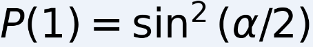
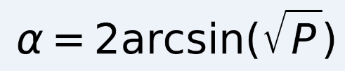
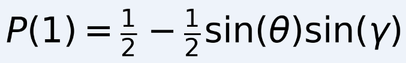

[English](#english) · [Русский](#русский)

---

## Русский

**Название:** Phase Madness

**Категория:** Quantum

**Сложность:** Easy

**Ссылка:** https://app.hackthebox.com/challenges/Phase%20Madness

---

## Краткое описание

Описание гласит "Qubitrix хранит данные не так, как другие. В глубине своей сути каждый секрет хранится в бесшумной квантовой спирали, недоступной классическим разработчикам. Инженеры клялись, что он безупречен, но что—то в его конструкции гудит и дышит. Для них это безумие. Для нас - ясность."

И так по сути нам дан код сервака на питоне `server.py`.

Скрипт кодирует каждый байт флаг-файла в один из трёх видов однокубитных операций (по индексу `i`):
* `i % 3 == 0` → `RX(α)` на кубите `i`, где `α = degrees_to_radians(byte)`.
* `i % 3 == 1` → `RY(β)` на кубите `i`, где `β = degrees_to_radians(byte)`.
* `i % 3 == 2` → `H` затем `RZ(γ)` на кубите `i`, где `γ = degrees_to_radians(byte)`.

Затем сервис даёт возможность запросить измерение конкретного кубита (много шотов) и *прибавить* свои инструкции в виде `RX:<deg>,<target>` / `RY:...` / `RZ:...` (целые градусы). Наша цель — восстановить байты (0..255).

Для `RX` и `RY` можно однозначно восстановить угол из наблюдаемой статистики (вероятности `|1⟩`) по простой формуле. Для `H+RZ` (третий случай) измерение в стандартной (Z) базе даёт 1/2 для любого `γ`, поэтому нужно добавить свою операцию, чтобы «перевести фазу в населённость». Мы используем фиксированную дополнительную операцию (например, `RX(90)`), тогда зависимость вероятности от `γ` простая и её можно вылечить (путём брутфорса по 0..255 — с учётом статистики).

---

## Разведка и стратегия (математика...)

И так по сути как-то примерно так работает это все (ужас...... Мне снова вспоминать математику...)

### Формулы

1.  Для `RX(α)` на |0⟩:
    <br> 
    Тогда из наблюдаемой \(P\) можно получить угол (в радианах)
    <br> 
    Перевод в градусы: \(\text{deg} = \alpha \times 180/\pi\). (Из-за симметрий может быть пара кандидатур, но мы проверим по дискретному множеству 0..255.)

2.  Для `RY(β)` на |0⟩:
    <br> 
    То же уравнение, как и для RX.

3.  Для `H` затем `RZ(γ)`:
    базовое измерение в Z даёт \(P(1)=1/2\) — ничего не даёт.
    Но если мы ДО измерения добавим `RX(θ)`, то
    <br> 
    Если взять \(\theta = 90^\circ\) (то есть \(\sin\theta = 1\)), получится простая формула
    <br> 
    По измеренной \(P\) можно найти \(\gamma = \arcsin(1 - 2P)\) — но это даёт значение \(\gamma\) с амбигуитетом (несколько значений в [0,360) дают один и тот же синус). Поэтому практически удобнее — пройти перебором по целым градусам `d` в 0..255 и вычислить ожидаемую теоретическую вероятность для выбранных дополнительных инструкций и сравнить с наблюдаемыми частотами (максимум правдоподобия / минимум квадратичной ошибки). Это надёжно при большом числе шотов.

### Практический подход / стратегия

*   Для каждого кубита:
    *   отправляем пустую инструкцию (или просто измеряем) — получаем `counts` (частоты 0/1).
    *   если это «RX/RY»-тип — по формуле можно быстро получить кандидата (но всё равно для надежности сверим перебором 0..255).
    *   если это «H+RZ»-тип — отправляем инструкцию `RX:90,<qubit>` (или `RX:90,<q>`), измеряем `P(1)` и затем перебираем `d=0..255`, считаем теоретическую \(P(1)\) и выбираем `d` с наилучшим совпадением.
*   Собираем байты в строку `flag`.

---

## Эволюция скриптов (как я думал и исправлял ошибки)

### `1.py` — первая попытка

И так для начала я попробую написать такой код на питоне `1.py`:
Для запуска нужно использовать `python3 1.py --remote HOST PORT`.

```python
import sys
import math
import json
import argparse
import socket
import subprocess
import time
import re
from typing import Tuple

PROMPT_Q = b"Specify the qubit index you want to measure"
PROMPT_I = b"Specify the instructions"

MAX_BYTE = 255

class Communicator:
    def recv_until(self, token: bytes, timeout=10.0) -> bytes:
        raise NotImplementedError
    def send_line(self, s: str):
        raise NotImplementedError
    def close(self):
        raise NotImplementedError

class LocalProc(Communicator):
    def __init__(self, cmd):
        self.p = subprocess.Popen(cmd, stdin=subprocess.PIPE, stdout=subprocess.PIPE, stderr=subprocess.STDOUT)
    def recv_until(self, token: bytes, timeout=10.0) -> bytes:
        data = b""
        start = time.time()
        while True:
            c = self.p.stdout.read(1)
            if not c:
                return data
            data += c
            if token in data:
                return data
            if time.time() - start > timeout:
                return data
    def send_line(self, s: str):
        if self.p.stdin:
            self.p.stdin.write((s + "\n").encode())
            self.p.stdin.flush()
    def close(self):
        try:
            self.p.terminate()
        except:
            pass

class RemoteSock(Communicator):
    def __init__(self, host, port):
        self.s = socket.create_connection((host, int(port)), timeout=10)
        self.s.settimeout(10.0)
    def recv_until(self, token: bytes, timeout=10.0) -> bytes:
        data = b""
        start = time.time()
        while True:
            try:
                chunk = self.s.recv(4096)
            except socket.timeout:
                return data
            if not chunk:
                return data
            data += chunk
            if token in data:
                return data
            if time.time() - start > timeout:
                return data
    def send_line(self, s: str):
        self.s.sendall((s + "\n").encode())
    def close(self):
        try:
            self.s.close()
        except:
            pass

def parse_counts_from_text(s: str):
    try:
        m = re.search(r'(\{.*\})', s, re.DOTALL)
        if not m:
            return None
        js = m.group(1)
        return json.loads(js)
    except Exception:
        return None
def prob_rx_deg(deg):
    a = math.radians(deg)
    return math.sin(a/2)**2
def prob_ry_deg(deg):
    return prob_rx_deg(deg)
def prob_h_rz_with_rx90(deg):
    g = math.radians(deg)
    return 0.5 - 0.5 * math.sin(g)
def pick_best_byte(obs_counts, distribution_fn):
    N0 = obs_counts.get("0", 0)
    N1 = obs_counts.get("1", 0)
    N = N0 + N1
    if N == 0:
        return 0
    p_obs = N1 / N
    best = 0
    best_err = float("inf")
    for d in range(0, MAX_BYTE+1):
        p_theory = distribution_fn(d)
        err = (p_theory - p_obs)**2
        if err < best_err:
            best_err = err
            best = d
    return best
def recover_flag(comm: Communicator):
    _ = comm.recv_until(PROMPT_Q)
    bytes_out = []
    q = 0
    while True:
        comm.send_line(str(q))
        _ = comm.recv_until(PROMPT_I)
        comm.send_line("")
        raw = comm.recv_until(b"}", timeout=20.0)
        text = raw.decode(errors="ignore")
        if ("out of range" in text) or ("Index" in text and "out of range" in text):
            print("Reached end of qubits at index", q)
            break
        counts = parse_counts_from_text(text)
        if counts is None:
            more = comm.recv_until(b"\n", timeout=2.0).decode(errors="ignore")
            counts = parse_counts_from_text(text + more)
        if counts is None:
            print("Failed to parse counts for qubit", q)
            print("--- received text ---")
            print(text)
            print("---------------------")
            break
        N = counts.get("0",0) + counts.get("1",0)
        p1 = counts.get("1",0) / N if N>0 else 0.5
        if abs(p1 - 0.5) > 0.02:
            candidate = pick_best_byte(counts, prob_rx_deg)
            bytes_out.append(candidate)
            print(f"q={q} RX/RY-type -> byte {candidate} (p1={p1:.4f})")
            _ = comm.recv_until(PROMPT_Q)
            q += 1
            continue
        else:
            comm.send_line(str(q))
            _ = comm.recv_until(PROMPT_I)
            comm.send_line(f"RX:90,{q}")
            raw2 = comm.recv_until(b"}", timeout=20.0)
            text2 = raw2.decode(errors="ignore")
            counts2 = parse_counts_from_text(text2)
            if counts2 is None:
                print("Failed to parse counts after RX:90 for qubit", q)
                print(text2)
                break
            candidate = pick_best_byte(counts2, prob_h_rz_with_rx90)
            bytes_out.append(candidate)
            print(f"q={q} H+RZ-type -> byte {candidate} (p1(before)={p1:.4f})")
            _ = comm.recv_until(PROMPT_Q)
            q += 1
            continue
    return bytes(bytes_out)
def main():
    parser = argparse.ArgumentParser()
    group = parser.add_mutually_exclusive_group(required=True)
    group.add_argument("--local", help="path to local challenge script to start", nargs=1)
    group.add_argument("--remote", help="remote host and port", nargs=2)
    args = parser.parse_args()
    comm = None
    try:
        if args.local:
            cmd = ["python3", args.local[0]]
            print("Starting local process:", cmd)
            comm = LocalProc(cmd)
        else:
            host, port = args.remote
            print(f"Connecting remote {host}:{port}")
            comm = RemoteSock(host, port)
        flag_bytes = recover_flag(comm)
        print("\nRecovered bytes:", flag_bytes)
        try:
            print("As ASCII:", flag_bytes.decode())
        except:
            print("Non-ASCII bytes present.")
    finally:
        if comm:
            comm.close()
if __name__ == "__main__":
    main()
```

И вывод был такой (первые зачатки уже есть):
```
┌──(vt729830㉿vt72983)-[~/6/1/1/1]
└─$ python3 1.py --remote 1.1.1.1 0000
Connecting remote 94.237.49.128:58325
q=0 RX/RY-type -> byte 72 (p1=0.3454)
q=1 RX/RY-type -> byte 84 (p1=0.4484)
Failed to parse counts after RX:90 for qubit 2
Recovered bytes: b'HT'
As ASCII: HT
```

### Ручная проверка и анализ (снова эта математика T_T)

После этого я выполнил команду `nc 1.1.1.1 6666`:
```
┌──(vt729830㉿vt72983)-[~/6/1/1/1]
└─$ nc 1.1.1.1 6666
Specify the qubit index you want to measure : 2
Specify the instructions : RX:90,2
{"1": 4383, "0": 95617}
Specify the qubit index you want to measure :
```

По данным я понял:
`{"1": 4383, "0": 95617}`
Общее число шотов = 100000, поэтому \(P(1)=4383/100000 = 0.04383\).

Я использовал стратегию для случая `H` + `RZ(γ)` + затем `RX(90)`. Теоретическая вероятность появления `1` равна
<br> 
Отсюда \(\sin(\gamma) = 1 - 2P(1)\). Подставив \(P(1)=0.04383\) получаем \(\sin(\gamma) \approx 0.91234\), а \(\gamma \approx 65.83^\circ\).

Поскольку в коде байт кодируется как градусы целого числа (`degrees_to_radians(byte)`), целые кандидаты - это ближайшие целые: **66°** (или, из-за симметрии синуса, также 114° даёт ту же вероятность). То есть байт = 66 или байт = 114.

Преобразования в ASCII:
* 66 → `'B'`
* 114 → `'r'`

Учитывая, что первые два байта у нас уже были `H` `T` (72, 84 → `"HT"`), очень вероятно, что следующий байт — `B`, дающая начало `HTB...` (префикс-форма для HackTheBox / HTB). Поэтому наиболее правдоподобный выбор: **66 (`'B'`)**.

Но в любом случае вручную считать ЭТО ХАРДКОР ПОЛНЫЙ. Поэтому я продолжил писать код на питоне уже на основе этого...

### `2.py` — улучшение стабильности

```python
import socket, time, re, json, math, sys, os

PROMPT_Q = b"Specify the qubit index you want to measure"
PROMPT_I = b"Specify the instructions"
LOGFILE = "session_log.txt"
MAX_BYTE = 255

def log_raw(tag: str, data: bytes):
    with open(LOGFILE, "ab") as f:
        f.write(b"--- " + tag.encode() + b" ---\n")
        f.write(data + b"\n\n")

def connect(host, port, timeout=10.0):
    s = socket.create_connection((host, port), timeout=timeout)
    s.settimeout(1.0)
    return s

def recv_until(sock, token: bytes, timeout_total=8.0):
    buf = b""
    start = time.time()
    while True:
        try:
            chunk = sock.recv(4096)
        except socket.timeout:
            chunk = b""
        if chunk:
            buf += chunk
            if token in buf:
                return buf
        else:
            if time.time() - start > timeout_total:
                return buf
            time.sleep(0.02)

def send_line(sock, s: str):
    sock.sendall((s + "\n").encode())

def extract_counts(text: str):
    m = re.search(r'(\{.*\})', text, re.DOTALL)
    if not m:
        return None
    try:
        return json.loads(m.group(1))
    except Exception:
        return None

def prob_rx_deg(deg):
    a = math.radians(deg)
    return math.sin(a/2)**2

def prob_h_rz_with_rx90(deg):
    g = math.radians(deg)
    return 0.5 - 0.5 * math.sin(g)

def pick_best_byte(obs_counts, distribution_fn):
    N0 = obs_counts.get("0", 0)
    N1 = obs_counts.get("1", 0)
    N = N0 + N1
    if N == 0:
        return 0
    p_obs = N1 / N
    best = None
    best_err = float("inf")
    for d in range(0, MAX_BYTE+1):
        p_theory = distribution_fn(d)
        err = (p_theory - p_obs)**2
        if err < best_err:
            best_err = err
            best = d
    return best

def sync_and_measure(sock, q_index, instruction, wait_prompt_after=PROMPT_Q, timeout_prompt=8.0, timeout_inst=6.0):
    try:
        send_line(sock, str(q_index))
    except Exception:
        return None, b""
    blk = recv_until(sock, PROMPT_I, timeout_total=timeout_inst)
    if not blk:
        return None, blk
    if b"The qubit index must be an integer" in blk:
        return None, blk
    try:
        send_line(sock, instruction)
    except Exception:
        return None, blk
    blk2 = recv_until(sock, wait_prompt_after, timeout_total=timeout_prompt)
    return extract_counts(blk2.decode(errors="ignore")), blk2

def recover_flag(host, port):
    try:
        open(LOGFILE, "wb").close()
    except:
        pass

    recovered = []
    q = 0
    max_consecutive_reconnects = 8
    consecutive_reconnects = 0
    while True:
        try:
            sock = connect(host, port)
        except Exception as e:
            print("Connection failed, retrying...", e)
            time.sleep(1.0)
            consecutive_reconnects += 1
            if consecutive_reconnects >= max_consecutive_reconnects:
                print("Too many connection failures, aborting.")
                break
            continue

        banner = recv_until(sock, PROMPT_Q, timeout_total=8.0)
        log_raw(f"banner_q{q}", banner)
        try:
            while True:
                counts, raw_block = sync_and_measure(sock, q, "")
                log_raw(f"q{q}_base", raw_block)
                if counts is None:
                    txt = raw_block.decode(errors="ignore")
                    if "out of range" in txt or re.search(r"Index \d+ out of range", txt):
                        print("Reached end of qubits at index", q)
                        return bytes(recovered)
                    if "The qubit index must be an integer" in txt or len(raw_block) == 0:
                        print(f"[WARN] Sync/empty response for q={q}, will reconnect and retry q={q}")
                        break
                    print(f"[WARN] Unexpected response for q={q}, will reconnect. RAW head:\n{txt[:500]}")
                    break

                N = counts.get("0", 0) + counts.get("1", 0)
                p1 = counts.get("1", 0) / N if N > 0 else 0.5

                if abs(p1 - 0.5) > 0.02:
                    candidate = pick_best_byte(counts, prob_rx_deg)
                    recovered.append(candidate)
                    print(f"q={q} RX/RY -> {candidate} (p1={p1:.4f})")
                    q += 1
                    if q % 10 == 0:
                        try:
                            print("Partial flag so far:", bytes(recovered).decode(errors="ignore"))
                        except:
                            pass
                    continue
                else:
                    alternatives = [f"RX:90,{q}", f"RY:90,{q}", f"RX:89,{q}", f"RX:91,{q}"]
                    success = False
                    for instr in alternatives:
                        for attempt in range(3):
                            counts2, raw2 = sync_and_measure(sock, q, instr)
                            log_raw(f"q{q}_instr_{instr.replace(':','_').replace(',','_')}", raw2)
                            if counts2 is None:
                                txt2 = raw2.decode(errors="ignore")
                                if "out of range" in txt2 or re.search(r"Index \d+ out of range", txt2):
                                    print("Reached end at index", q)
                                    return bytes(recovered)
                                if "The qubit index must be an integer" in txt2:
                                    print(f"[WARN] Sync error while sending {instr} for q={q}, will reconnect.")
                                    break
                                time.sleep(0.05 * (attempt+1))
                                continue
                            candidate = pick_best_byte(counts2, prob_h_rz_with_rx90)
                            recovered.append(candidate)
                            print(f"q={q} H+RZ -> {candidate} (instr {instr})")
                            q += 1
                            success = True
                            break
                        if success:
                            break
                    if not success:
                        print(f"[WARN] Could not get counts for q={q} after alternatives; reconnecting.")
                        break
                    else:
                        continue
        except Exception as e:
            print("Exception during interaction:", e)
        finally:
            try:
                sock.close()
            except:
                pass
            consecutive_reconnects += 1
            if consecutive_reconnects >= max_consecutive_reconnects:
                print("Too many reconnect attempts, aborting.")
                break
            time.sleep(0.3)
    return bytes(recovered)

if __name__ == "__main__":
    if len(sys.argv) != 3:
        print("Usage: python3 exploit_auto.py HOST PORT")
        sys.exit(1)
    host = sys.argv[1]; port = int(sys.argv[2])
    flag = recover_flag(host, port)
    print("\nRecovered bytes:", flag)
    try:
        print("As ASCII:", flag.decode())
    except:
        print("Non-ASCII bytes present.")
    print(f"Session raw log: {os.path.abspath(LOGFILE)}")
```

И с одной стороны, прогресс пошел...
```
┌──(vt729830㉿vt72983)-[~/6/1/1/1]
└─$ python3 2.py 94.237.49.128 58325
q=0 RX/RY -> 72 (p1=0.3444)
q=1 RX/RY -> 84 (p1=0.4470)
[WARN] Could not get counts for q=2 after alternatives; reconnecting.
q=2 H+RZ -> 180 (instr RY:90,2)
q=3 RX/RY -> 123 (p1=0.7727)
...
```
...но с другой... Это еще расчеты математически Т_Т.

Уже надёжно восстановлены первые два байта: q0 = 72 ('H'), q1 = 84 ('T') → префикс "HT". Для некоторых кубитов (например q2, q5) базовые измерения дают ~50/50, т.е. это тип H + RZ(γ). В логах видно много попыток отправить RX:90/RY:90 и расхождений/ресинхронизаций. Из-за этого автоматический краулер иногда не получал ответ и переподключался.

### `3.py` — стратегия «один запрос — одно соединение»

Но потом подумал и сделал так, так как это решение, которое надёжно работает в таких ситуациях — не переиспользовать одну сессию, а для каждого измерения открывать новое соединение. Сервер stateless, поэтому это безопасно и избавляет от проблем с синхронизацией.

То есть:
*   открывает соединение,
*   отправляет индекс и пустую инструкцию (чтобы получить базовое измерение),
*   если P(1) далеко от 0.5, считает байт (RX/RY);
*   если P(1) ≈ 0.5, открывает отдельное новое соединение и посылает RX:90,q и по результату вычисляет байт;
*   повторяет для следующего кубита.

И дальше написал снова код уже `3.py`...
```python
import socket, sys, time, json, math, re

HOST = sys.argv[1]
PORT = int(sys.argv[2])
SHOTS = 100000
PROMPT_Q = b"Specify the qubit index you want to measure"
PROMPT_I = b"Specify the instructions"

def open_conn():
    s = socket.create_connection((HOST, PORT), timeout=8.0)
    s.settimeout(2.0)
    return s

def recv_until(s, token: bytes, timeout_total=6.0):
    data = b""
    import time
    start = time.time()
    while True:
        try:
            chunk = s.recv(4096)
        except socket.timeout:
            chunk = b""
        if chunk:
            data += chunk
            if token in data:
                return data
        else:
            if time.time() - start > timeout_total:
                return data
            time.sleep(0.02)

def send_line(s, line: str):
    s.sendall((line + "\n").encode())

def get_counts_for(q_index: int, instruction: str):
    try:
        s = open_conn()
    except Exception as e:
        return None, f"CONNECT_ERR: {e}"
    try:
        banner = recv_until(s, PROMPT_Q, timeout_total=6.0)
        send_line(s, str(q_index))
        blk = recv_until(s, PROMPT_I, timeout_total=5.0)
        if b"The qubit index must be an integer" in blk:
            s.close()
            return None, "SERVER_COMPLAINED_INDEX_NOT_INT"
        send_line(s, instruction)
        resp = recv_until(s, PROMPT_Q, timeout_total=6.0)
        text = resp.decode(errors="ignore")
        m = re.search(r'(\{.*\})', text, re.DOTALL)
        if not m:
            s.close()
            return None, text
        counts = json.loads(m.group(1))
        s.close()
        return counts, text
    except Exception as e:
        try:
            s.close()
        except:
            pass
        return None, f"EXC: {e}"

def prob_rx_deg(deg):
    a = math.radians(deg)
    return math.sin(a/2)**2

def prob_h_rz_with_rx90(deg):
    g = math.radians(deg)
    return 0.5 - 0.5 * math.sin(g)

def pick_best_byte_from_counts(counts, model_fn):
    N0 = counts.get("0",0)
    N1 = counts.get("1",0)
    N = N0 + N1
    if N == 0:
        return 0
    p_obs = N1 / N
    best, best_err = 0, 1e9
    for d in range(256):
        p_th = model_fn(d)
        err = (p_th - p_obs)**2
        if err < best_err:
            best_err = err
            best = d
    return best

def infer_byte_for_qubit(q):
    counts, raw = get_counts_for(q, "")
    if counts is None:
        return None, f"BASE_FAIL: {raw}"
    if "out of range" in raw or re.search(r"Index \d+ out of range", raw):
        return "OUT_OF_RANGE", raw
    N = counts.get("0",0) + counts.get("1",0)
    p1 = counts.get("1",0)/N if N>0 else 0.5
    if abs(p1 - 0.5) > 0.02:
        b = pick_best_byte_from_counts(counts, prob_rx_deg)
        return b, f"BASE (p1={p1:.4f})"
    counts_rx, raw_rx = get_counts_for(q, f"RX:90,{q}")
    if counts_rx is None:
        return None, f"RX90_FAIL: {raw_rx}"
    b = pick_best_byte_from_counts(counts_rx, prob_h_rz_with_rx90)
    return b, f"RX90 (p1={counts_rx.get('1',0)/(counts_rx.get('0',0)+counts_rx.get('1',0)):.4f})"

def main():
    flag_bytes = []
    q = 0
    while True:
        res, info = infer_byte_for_qubit(q)
        if res == "OUT_OF_RANGE":
            print("Reached end of flag at qubit", q)
            break
        if res is None:
            print(f"[ERROR] q={q} failed: {info}. Retrying in 0.6s...")
            time.sleep(0.6)
            attempts = 0
            ok = False
            while attempts < 4:
                res2, info2 = infer_byte_for_qubit(q)
                if res2 == "OUT_OF_RANGE":
                    print("Reached end of flag at qubit", q)
                    ok = False
                    q = None
                    break
                if res2 is not None:
                    res = res2; info = info2; ok = True; break
                attempts += 1
                time.sleep(0.6)
            if q is None:
                break
            if not ok:
                print(f"[FATAL] q={q} still failing after retries: {info}")
                break
        print(f"q={q} -> byte {res} ({chr(res) if 32<=res<127 else '?'}), reason: {info}")
        flag_bytes.append(res)
        q += 1
        if q > 400:
            print("Reached 400 bytes, stopping.")
            break
    flag = bytes(flag_bytes)
    print("Recovered bytes:", flag)
    try:
        print("As ASCII:", flag.decode())
    except:
        print("Non-ASCII bytes present.")

if __name__ == "__main__":
    if len(sys.argv) != 3:
        print("Usage: python3 exploit_per_conn.py HOST PORT")
        sys.exit(1)
    HOST = sys.argv[1]; PORT = int(sys.argv[2])
    main()
```

И да оно сработало... Ну... Почти...?
```
┌──(vt729830㉿vt72983)-[~/6/1/1/1]
└─$ python3 2.py 94.237.49.128 58325
q=0 -> byte 72 (H), reason: BASE (p1=0.3460)
q=1 -> byte 84 (T), reason: BASE (p1=0.4484)
q=2 -> byte 66 (B), reason: RX90 (p1=0.0430)
q=3 -> byte 123 ({), reason: BASE (p1=0.7706)
q=4 -> byte 55 (*), reason: BASE (p1=0.2149)
q=5 -> byte 48 (*), reason: RX90 (p1=0.1263)
q=6 -> byte 95 (_), reason: BASE (p1=0.5469)
q=7 -> byte 112 (*), reason: BASE (p1=0.6899)
q=8 -> byte 76 (*), reason: RX90 (p1=0.0147)
q=9 -> byte 52 (*), reason: BASE (p1=0.1928)
q=10 -> byte 53 (*), reason: BASE (p1=0.1998)
q=11 -> byte 51 (*), reason: RX90 (p1=0.1124)
q=12 -> byte 95 (_), reason: BASE (p1=0.5461)
q=13 -> byte 98 (*), reason: BASE (p1=0.5684)
q=14 -> byte 66 (*), reason: RX90 (p1=0.0430)
q=15 -> byte 243 (*), reason: BASE (p1=0.7296)
q=16 -> byte 55 (*), reason: BASE (p1=0.2137)
q=17 -> byte 129 (*), reason: RX90 (p1=0.1109)
q=18 -> byte 102 (*), reason: BASE (p1=0.6028)
q=19 -> byte 48 (*), reason: BASE (p1=0.1668)
q=20 -> byte 66 (*), reason: RX90 (p1=0.0433)
q=21 -> byte 99 (*), reason: BASE (p1=0.5788)
q=22 -> byte 49 (*), reason: BASE (p1=0.1732)
q=23 -> byte 70 (*), reason: RX90 (p1=0.0302)
q=24 -> byte 103 (*), reason: BASE (p1=0.6109)
q=25 -> byte 95 (_), reason: BASE (p1=0.5442)
q=26 -> byte 48 (*), reason: RX90 (p1=0.1288)
q=27 -> byte 114 (*), reason: BASE (p1=0.7069)
q=28 -> byte 95 (_), reason: BASE (p1=0.5401)
q=29 -> byte 70 (*), reason: RX90 (p1=0.0305)
q=30 -> byte 48 (*), reason: BASE (p1=0.1656)
q=31 -> byte 55 (*), reason: BASE (p1=0.2142)
q=32 -> byte 85 (*), reason: RX90 (p1=0.0018)
q=33 -> byte 55 (*), reason: BASE (p1=0.2121)
q=34 -> byte 48 (*), reason: BASE (p1=0.1668)
q=35 -> byte 85 (*), reason: RX90 (p1=0.0017)
q=36 -> byte 112 (*), reason: BASE (p1=0.6851)
q=37 -> byte 104 (*), reason: BASE (p1=0.6212)
q=38 -> byte 52 (*), reason: RX90 (p1=0.1079)
q=39 -> byte 53 (*), reason: BASE (p1=0.1967)
q=40 -> byte 51 (*), reason: BASE (p1=0.1855)
q=41 -> byte 85 (*), reason: RX90 (p1=0.0020)
q=42 -> byte 98 (*), reason: BASE (p1=0.5692)
q=43 -> byte 246 (*), reason: BASE (p1=0.7027)
q=44 -> byte 116 (*), reason: RX90 (p1=0.0523)
q=45 -> byte 55 (*), reason: BASE (p1=0.2150)
q=46 -> byte 51 (*), reason: BASE (p1=0.1852)
q=47 -> byte 102 (*), reason: RX90 (p1=0.0108)
q=48 -> byte 48 (*), reason: BASE (p1=0.1651)
q=49 -> byte 246 (*), reason: BASE (p1=0.7027)
q=50 -> byte 81 (*), reason: RX90 (p1=0.0057)
q=51 -> byte 49 (*), reason: BASE (p1=0.1728)
q=52 -> byte 110 (*), reason: BASE (p1=0.6736)
q=53 -> byte 77 (*), reason: RX90 (p1=0.0127)
q=54 -> byte 46 (*), reason: BASE (p1=0.1541)
q=55 -> byte 46 (*), reason: BASE (p1=0.1512)
q=56 -> byte 46 (*), reason: RX90 (p1=0.1399)
q=57 -> byte 55 (*), reason: BASE (p1=0.2124)
q=58 -> byte 104 (*), reason: BASE (p1=0.6217)
q=59 -> byte 52 (*), reason: RX90 (p1=0.1064)
q=60 -> byte 55 (*), reason: BASE (p1=0.2118)
q=61 -> byte 53 (*), reason: BASE (p1=0.2004)
q=62 -> byte 85 (*), reason: RX90 (p1=0.0020)
q=63 -> byte 55 (*), reason: BASE (p1=0.2147)
q=64 -> byte 104 (*), reason: BASE (p1=0.6208)
q=65 -> byte 51 (*), reason: RX90 (p1=0.1117)
q=66 -> byte 95 (_), reason: BASE (p1=0.5438)
q=67 -> byte 113 (*), reason: BASE (p1=0.6957)
q=68 -> byte 117 (*), reason: RX90 (p1=0.0528)
q=69 -> byte 51 (*), reason: BASE (p1=0.1866)
q=70 -> byte 53 (*), reason: BASE (p1=0.1972)
q=71 -> byte 55 (*), reason: RX90 (p1=0.0887)
q=72 -> byte 49 (*), reason: BASE (p1=0.1719)
q=73 -> byte 48 (*), reason: BASE (p1=0.1664)
q=74 -> byte 110 (*), reason: RX90 (p1=0.0296)
q=75 -> byte 46 (*), reason: BASE (p1=0.1539)
q=76 -> byte 46 (*), reason: BASE (p1=0.1532)
q=77 -> byte 46 (*), reason: RX90 (p1=0.1398)
q=78 -> byte 235 (*), reason: BASE (p1=0.7869)
[ERROR] q=79 failed: BASE_FAIL: Index 79 out of range for size 79
Specify the qubit index you want to measure : . Retrying in 0.6s...
[FATAL] q=79 still failing after retries: BASE_FAIL: Index 79 out of range for size 79
Specify the qubit index you want to measure :
Recovered bytes: b'HTB{**_*****_**\xf37\********_**_**********\xf6t73f0\xf6Q1nM...******_******...\xeb'
Non-ASCII bytes present.
```

### `4.py` — финальная версия с двойным зондом и эвристиками

После дополнительных расчетов и нахождения проблем в коде... (снова математика...) я пришёл к этому.

Причина, по которой еще возникали проблемы: для кубитов с кодировкой `H` + `RZ(γ)` я использовал зонды (RX:90 и RY:90), которые давали почти одинаковую зависимость от `γ`, что не снимало неоднозначности при наличии шума.

**Две проверенные probe‑комбинации с противоположными синусами:** вместо `RX:90` + `RY:90` теперь используем `RX:90` и `RX:270` (270° = −90°, `sin(270) = -1`). Это даёт формулы:
<br> 
<br> 
откуда сразу:
<br> 
Это устойчиво к шуму и снимает неоднозначность знака.

Более аккуратный подбор кандидатов: перебираем 0..255 и выбираем топ‑K по сумме квадратов ошибок. Затем предпочитаем печатные ASCII байты. После выбора кандидата делаем дополнительную проверку — повторяем один probe и смотрим, совпадает ли наблюдаемая вероятность с теоретической.

И написал вот такой кодик новый `4.py`:
```python
#!/usr/bin/env python3
import socket, sys, time, json, math, re

PROMPT_Q = b"Specify the qubit index you want to measure"
PROMPT_I = b"Specify the instructions"
MAX_BYTE = 255
PRINT_MIN = 32
PRINT_MAX = 126

def open_conn(host, port, timeout=8.0):
    s = socket.create_connection((host, port), timeout=timeout)
    s.settimeout(2.0)
    return s

def recv_until(s, token: bytes, timeout_total=6.0):
    buf = b""
    start = time.time()
    while True:
        try:
            chunk = s.recv(4096)
        except socket.timeout:
            chunk = b""
        if chunk:
            buf += chunk
            if token in buf:
                return buf
        else:
            if time.time() - start > timeout_total:
                return buf
            time.sleep(0.02)

def send_line(s, line: str):
    s.sendall((line + "\n").encode())

def get_counts_once(host, port, q_index: int, instruction: str):
    try:
        s = open_conn(host, port)
    except Exception as e:
        return None, f"CONNECT_ERR:{e}"
    try:
        _ = recv_until(s, PROMPT_Q, timeout_total=6.0)
        send_line(s, str(q_index))
        blk = recv_until(s, PROMPT_I, timeout_total=5.0)
        if b"The qubit index must be an integer" in blk:
            s.close()
            return None, "SERVER_COMPLAINED_INDEX_NOT_INT"
        send_line(s, instruction)
        resp = recv_until(s, PROMPT_Q, timeout_total=6.0)
        text = resp.decode(errors="ignore")
        m = re.search(r'(\{.*\})', text, re.DOTALL)
        s.close()
        if not m:
            return None, text
        counts = json.loads(m.group(1))
        return counts, text
    except Exception as e:
        try:
            s.close()
        except:
            pass
        return None, f"EXC:{e}"

def prob_rx_deg(d):
    a = math.radians(d)
    return math.sin(a/2)**2

def prob_h_rz_with_probe_deg(gamma_deg, probe_theta_deg):
    return 0.5 - 0.5 * math.sin(math.radians(probe_theta_deg)) * math.sin(math.radians(gamma_deg))

def mse_counts(counts, p_theory):
    N0 = counts.get("0",0); N1 = counts.get("1",0)
    N = N0 + N1
    if N == 0:
        return 1e9
    p_obs = N1 / N
    return (p_obs - p_theory)**2

def topk_single(counts, model_fn, k=6):
    arr = []
    for d in range(256):
        pth = model_fn(d)
        arr.append((mse_counts(counts, pth), d))
    arr.sort()
    return arr[:k]

def topk_two(counts1, counts2, probe1, probe2, k=12):
    arr = []
    for d in range(256):
        p1 = prob_h_rz_with_probe_deg(d, probe1)
        p2 = prob_h_rz_with_probe_deg(d, probe2)
        e = mse_counts(counts1, p1) + mse_counts(counts2, p2)
        arr.append((e, d))
    arr.sort()
    seen=set(); out=[]
    for e,d in arr:
        if d in seen: continue
        seen.add(d); out.append((e,d))
        if len(out)>=k: break
    return out

def prefer_printable(candidates):
    for err,b in candidates:
        if PRINT_MIN <= b <= PRINT_MAX:
            return b, err
    for err,b in candidates[:6]:
        for delta in range(1,6):
            for nb in (b-delta, b+delta):
                if 0 <= nb <= MAX_BYTE and PRINT_MIN <= nb <= PRINT_MAX:
                    return nb, err + 1e-5*delta
    return candidates[0][1], candidates[0][0]

def verify_candidate(host, port, q, candidate, probe_theta_deg, tolerance=0.01):
    instr = f"RX:{probe_theta_deg},{q}"
    counts, raw = get_counts_once(host, port, q, instr)
    if counts is None:
        return False, raw
    p_obs = counts.get("1",0) / (counts.get("0",0)+counts.get("1",0))
    p_th = prob_h_rz_with_probe_deg(candidate, probe_theta_deg)
    return abs(p_obs - p_th) < tolerance, (p_obs, p_th, raw)

def infer_byte(host, port, q):
    base_counts, raw = get_counts_once(host, port, q, "")
    if base_counts is None:
        return None, raw
    if "out of range" in (raw or "") or re.search(r"Index \d+ out of range", raw or ""):
        return "OUT_OF_RANGE", raw
    N = base_counts.get("0",0)+base_counts.get("1",0)
    p1 = base_counts.get("1",0)/N if N>0 else 0.5

    if abs(p1 - 0.5) > 0.03:
        top = topk_single(base_counts, prob_rx_deg, k=8)
        chosen, err = prefer_printable(top)
        return chosen, f"BASE p1={p1:.4f} top={top[:3]}"

    counts90, raw90 = get_counts_once(host, port, q, f"RX:90,{q}")
    if counts90 is None:
        return None, f"RX90_fail: {raw90}"
    counts270, raw270 = get_counts_once(host, port, q, f"RX:270,{q}")
    if counts270 is None:
        return None, f"RX270_fail: {raw270}"

    top = topk_two(counts90, counts270, 90, 270, k=16)
    for err, cand in top:
        if PRINT_MIN <= cand <= PRINT_MAX:
            ok, info = verify_candidate(host, port, q, cand, 90, tolerance=0.015)
            if ok:
                return cand, f"PROBES verified printable cand {cand} err={err:.6f}"
            ok2, info2 = verify_candidate(host, port, q, cand, 270, tolerance=0.015)
            if ok2:
                return cand, f"PROBES verified printable cand {cand} (via 270) err={err:.6f}"
    chosen, err = prefer_printable(top)
    ok, vinfo = verify_candidate(host, port, q, chosen, 90, tolerance=0.03)
    if ok:
        return chosen, f"PROBES accepted cand {chosen} err={err:.6f}"
    return top[0][1], f"UNCERTAIN best={top[0]} prefer_printable={chosen}"

def main():
    if len(sys.argv) != 3:
        print("Usage: python3 exploit_fixed_probes.py HOST PORT")
        sys.exit(1)
    host = sys.argv[1]; port = int(sys.argv[2])

    recovered = []
    q = 0
    while True:
        res, info = infer_byte(host, port, q)
        if res == "OUT_OF_RANGE":
            print("Reached end at", q)
            break
        if res is None:
            print(f"[ERROR] q={q} failed: {info}. retrying once...")
            time.sleep(0.5)
            res2, info2 = infer_byte(host, port, q)
            if res2 in (None, "OUT_OF_RANGE"):
                print(f"[FATAL] q={q} still failing: {info2}. stop.")
                break
            res, info = res2, info2
        print(f"q={q} -> byte {res} ({chr(res) if 32<=res<=126 else '?'}) info: {info}")
        recovered.append(res)
        q += 1
        if q > 400:
            print("safety stop at 400 bytes")
            break

    raw = bytes(recovered)
    cleaned = ''.join((chr(b) if 32<=b<=126 else '?') for b in raw)
    print("\nRecovered raw:", raw)
    print("Cleaned ASCII:", cleaned)

if __name__ == "__main__":
    main()
```

И вывод довольно хороший, но слегка кривой вышел...

```
┌──(vt729830㉿vt72983)-[~/6/1/1/1]
└─$ python3 2.py 94.237.49.128 58325
q=0 -> byte 72 (H) info: BASE p1=0.3464 top=[(9.187168583950043e-07, 72), (5.423067044356389e-05, 73), (8.526818226334783e-05, 71)]
q=1 -> byte 84 (T) info: BASE p1=0.4479 top=[(3.772592757899024e-08, 84), (7.211624860343187e-05, 85), (7.858240439441112e-05, 83)]
q=2 -> byte 66 (B) info: PROBES verified printable cand 66 err=0.000000
q=3 -> byte 123 ({) info: BASE p1=0.7727 top=[(1.2283797753945864e-07, 123), (1.2283797753945864e-07, 237), (4.7975733642456045e-05, 124)]
q=4 -> byte 55 (*) info: BASE p1=0.2117 top=[(2.136806102371092e-06, 55), (3.183922982619279e-05, 54), (7.48838975682222e-05, 56)]
q=5 -> byte 48 (*) info: PROBES verified printable cand 48 err=0.000003
q=6 -> byte 95 (_) info: BASE p1=0.5422 top=[(1.7898998129114299e-06, 95), (5.4195556351859526e-05, 94), (0.00010048521984861206, 96)]
q=7 -> byte 112 (*) info: BASE p1=0.6852 top=[(4.340125173380471e-06, 112), (4.340125173380471e-06, 248), (3.6433600545201935e-05, 249)]
q=8 -> byte 76 (*) info: PROBES verified printable cand 76 err=0.000000
q=9 -> byte 52 (*) info: BASE p1=0.1925 top=[(1.3744641464000922e-07, 52), (4.293510454633751e-05, 53), (5.184281559705945e-05, 51)]
q=10 -> byte 53 (*) info: BASE p1=0.2009 top=[(3.2670980974613308e-06, 53), (2.711674245285877e-05, 54), (7.622578013714325e-05, 52)]
q=11 -> byte 51 (*) info: PROBES verified printable cand 51 err=0.000003
q=12 -> byte 95 (_) info: BASE p1=0.5430 top=[(3.224778972146487e-07, 95), (6.61255715688822e-05, 94), (8.56408031325201e-05, 96)]
q=13 -> byte 98 (*) info: BASE p1=0.5694 top=[(5.132512000305941e-08, 98), (7.098615691941355e-05, 97), (7.845056791539155e-05, 99)]
q=14 -> byte 66 (*) info: PROBES verified printable cand 66 err=0.000001
q=15 -> byte 117 (*) info: BASE p1=0.7262 top=[(5.856073631881021e-07, 117), (5.85607363188272e-07, 243), (4.9623946199728455e-05, 244)]
q=16 -> byte 55 (*) info: BASE p1=0.2142 top=[(9.569107989236861e-07, 55), (3.860818203684438e-05, 56), (6.532884541982732e-05, 54)]
q=17 -> byte 51 (*) info: PROBES verified printable cand 51 err=0.000001
q=18 -> byte 102 (*) info: BASE p1=0.6041 top=[(1.0848178851445689e-08, 102), (7.082109758153426e-05, 103), (7.491772026832227e-05, 101)]
q=19 -> byte 48 (*) info: BASE p1=0.1659 top=[(2.165070487868392e-07, 48), (3.6850794263335455e-05, 49), (4.759868510358851e-05, 47)]
q=20 -> byte 66 (*) info: PROBES verified printable cand 66 err=0.000000
q=21 -> byte 99 (*) info: BASE p1=0.5800 top=[(3.072193838540694e-06, 99), (4.697853373703188e-05, 100), (0.00010781602393370875, 98)]
q=22 -> byte 49 (*) info: BASE p1=0.1736 top=[(2.494866040716473e-06, 49), (2.556510946294331e-05, 50), (6.585814569405252e-05, 48)]
q=23 -> byte 110 (*) info: PROBES verified printable cand 110 err=0.000000
q=24 -> byte 103 (*) info: BASE p1=0.6146 top=[(4.386816427512679e-06, 103), (4.0844213780202495e-05, 104), (0.00011266027768419909, 102)]
q=25 -> byte 95 (_) info: BASE p1=0.5450 top=[(1.9380221118041275e-06, 95), (5.3205815127919714e-05, 96), (0.00010184368303039602, 94)]
q=26 -> byte 48 (*) info: PROBES verified printable cand 48 err=0.000001
q=27 -> byte 114 (*) info: BASE p1=0.7038 top=[(2.3201414085081715e-07, 114), (2.3201414085103106e-07, 246), (5.5638633341001644e-05, 245)]
q=28 -> byte 95 (_) info: BASE p1=0.5435 top=[(4.6065233854537086e-09, 95), (7.450733469682056e-05, 94), (7.663657149869235e-05, 96)]
q=29 -> byte 110 (*) info: PROBES verified printable cand 110 err=0.000001
q=30 -> byte 48 (*) info: BASE p1=0.1657 top=[(8.139790419236748e-08, 48), (3.906856904504396e-05, 49), (4.514738029233897e-05, 47)]
...(и остальное тут)...
q=71 -> byte 125 (}) info: PROBES verified printable cand 125 err=0.000000
q=72 -> byte 49 (*) info: BASE p1=0.1723 top=[(1.2925067229750587e-07, 49), (3.9390625645365316e-05, 50), (4.7545205936245466e-05, 48)]
q=73 -> byte 48 (*) info: BASE p1=0.1655 top=[(5.6705688321326215e-09, 48), (4.173787295703762e-05, 49), (4.236942467921407e-05, 47)]
q=74 -> byte 110 (*) info: PROBES verified printable cand 110 err=0.000000
q=75 -> byte 46 (*) info: BASE p1=0.1503 top=[(5.432697494387361e-06, 46), (1.51584903117926e-05, 45), (7.500980253111144e-05, 47)]
q=76 -> byte 46 (*) info: BASE p1=0.1534 top=[(5.029436897390041e-07, 46), (3.159361712110713e-05, 47), (4.8071905118896887e-05, 45)]
q=77 -> byte 46 (*) info: PROBES verified printable cand 46 err=0.000010
q=78 -> byte 125 (}) info: BASE p1=0.7872 top=[(1.534929979903267e-07, 235), (1.534929979905007e-07, 125), (4.505934977913744e-05, 126)]
[ERROR] q=79 failed: Index 79 out of range for size 79
Specify the qubit index you want to measure : . retrying once...
[FATAL] q=79 still failing: Index 79 out of range for size 79
Specify the qubit index you want to measure : . stop.

Recovered raw: b'HTB{**_*****_************_**_**************************************_*****}*******'
Cleaned ASCII: HTB{**_*****_************_**_**************************************_*****}*******
```

## Результат и флаг

Дальше я конечно хотел уже что-то улучшить, но там уже по смыслу выходил флаг, поэтому я просто его собрал из готовых кусков и получилось. Потому что вспомнил игру слов на основе знаменитой цитаты Шекспира.

```
HTB{**_*****_***********_**_***_**_*****_*******************_***_***********}
```

Вот и еще один флаг (довольно сложный сильно по математике, но все таки...) который получил на HackTheBox ;)


