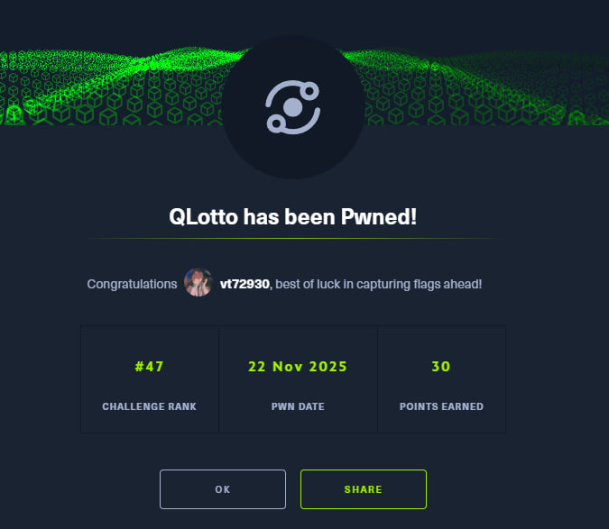

[English](#english) · [Русский](#русский)

---

## English

**Name -** QLotto

**Category -** Quantum

**Difficulty -** Easy

**Link -** https://app.hackthebox.com/challenges/qlotto

### Summary

The challenge description sets the scene: "They call it QLotto — a dazzling new quantum lottery table provided by Qubitrix... If you can predict their draws, you can beat the system." We are provided with a `server.py` file. The core task is to bypass a restrictive input check on the quantum circuit indices and then manipulate the quantum state to create a predictable correlation between the "house card" and our draws. By using negative indexing and specific quantum gates, we can rig the lottery.

---

### Recon (how I inspected the format)

Let's look at `server.py`. We immediately see a validation logic:

```python
if any(p == 0 for p in params):
    print("[Dealer] Hey, don't tamper with the house card — that's forbidden.")
    return None
```

The Dealer forbids using index `0` (the first qubit), attempting to prevent us from touching the lottery qubit. However, Python (and Qiskit when working with register lists) supports **negative indexing**.
*   Index `-1` refers to the last element (Qubit 1).
*   Index `-2` refers to the second to last element (Qubit 0).

Since `-2 != 0`, this index passes the check `if p == 0`, but it effectively allows us to manipulate the forbidden lottery qubit.

---

### Strategy

1.  **Initial State**: Qubit 0 is in superposition $|+\rangle$, Qubit 1 is in $|0\rangle$.
2.  **Our Goal**: Entangle them such that if Qubit 1 outputs `0`, Qubit 0 outputs `1`, and vice versa (complete anti-correlation).
    *   If they match, the server's protection ("Trying to mirror...") triggers.
    *   If they aren't entangled, we can't predict the random number.
3.  **Action Plan**:
    *   `H:-2` — Apply Hadamard to Qubit 0 (index -2). Since it started in $|+\rangle$, it collapses to state $|0\rangle$. Now we have state $|00\rangle$.
    *   `RXX:90,-1,-2` — Apply the Ising (RXX) gate at 90 degrees to both qubits. This creates an entangled state like $\frac{|00\rangle - i|11\rangle}{\sqrt{2}}$. Currently, the qubits are fully correlated (00 or 11).
    *   `H:-1;Z:-1;H:-1` — This sequence creates an **X** (NOT) gate on Qubit 1. We flip Qubit 1. The state becomes $\frac{|01\rangle - i|10\rangle}{\sqrt{2}}$.
    
    Now, if we measure Qubit 1 and get bit $b$, Qubit 0 is guaranteed to be $1-b$.

So, the injection payload is:

```
H:-2;RXX:90,-1,-2;H:-1;Z:-1;H:-1
```

**Calculating the winning numbers:**
The numbers are generated from 6 bits. Since every bit of our "lotto" number is the inversion of the "testing" number bit, the sum of their raw 6-bit values is always 63 ($111111_2$).

When the Dealer shows you their numbers (`Your draws are: [...]`), I used this script to calculate the answer:

**Formula for each number:**
`target = (63 - (draw - 1)) % 42 + 1`

**Python script for quick calculation:**
```python
# Put the dealer's numbers here
dealer_draws = [10, 25, 42, 5, 18, 30] 
my_bets = [((63 - (n - 1)) % 42 + 1) for n in dealer_draws]
print(",".join(map(str, my_bets)))
```

---

### Result and proofs

I connected to the server, sent the quantum moves, calculated the bets based on the dealer's output, and won the jackpot.

```
┌──(vt729830㉿vt72983)-[~/5/2/test/test2]
└─$ nc 1.1.1.1 365

        ╔═════════════════════════════════╗
        ║ ⚛ Welcome to the QLotto table ⚛ ║
        ╠═════════════════════════════════╣
        ║ Minimum bet :  100,000 credits  ║
        ║ Provider    :  Qubitrix™        ║
        ╚═════════════════════════════════╝

[Dealer] Place your quantum moves : H:-2;RXX:90,-1,-2;H:-1;Z:-1;H:-1
[Dealer] Your draws are: [21, 13, 21, 28, 12, 30]
[Dealer] Place your six bets on the table : 2,10,2,37,11,35
The table erupts in chaos — you've cracked the QLotto!
[Dealer] Your jackpot: HTB{**************}
```

And just like that, we got another easy-peasy flag.



---

## Русский

[Перейти к английской версии](#english)

**Название -** QLotto

**Категория -** Quantum

**Сложность -** Easy

**Ссылка -** https://app.hackthebox.com/challenges/qlotto

---

## Краткое описание

В описании говорится: «Они называют это QLotto — ослепительный новый стол квантовой лотереи от Qubitrix... Если вы сможете предсказать их тиражи, вы сможете обыграть систему». Нам предоставлен файл `server.py`. Основная задача — обойти ограничение на ввод индексов квантовой схемы, а затем манипулировать состоянием кубитов, чтобы создать предсказуемую корреляцию между "картой заведения" и нашими числами. Используя отрицательную индексацию и специфические квантовые вентили, мы можем подстроить лотерею.

---

## Разведка (как я смотрел формат)

И так посмотрим на файл `server.py`. Там вы видим логику проверки:

```python
if any(p == 0 for p in params):
    print("[Dealer] Hey, don't tamper with the house card — that's forbidden.")
    return None
```

Дилер запрещает использовать индекс `0` (первый кубит), чтобы мы не могли трогать кубит лотереи. Однако в Python (и в Qiskit при работе со списками регистров) поддерживается **отрицательная индексация**.
*   Индекс `-1` обращается к последнему элементу (Кубит 1).
*   Индекс `-2` обращается к предпоследнему элементу (Кубит 0).

Поскольку `-2 != 0`, этот индекс проходит проверку, но позволяет нам манипулировать кубитом лотереи.

---

## Стратегия

1.  **Начальное состояние**: Кубит 0 находится в суперпозиции $|+\rangle$, Кубит 1 в $|0\rangle$.
2.  **Наша цель**: Запутать их так, чтобы если Кубит 1 выдал `0`, Кубит 0 выдал `1`, и наоборот (полная анти-корреляция).
    *   Если они будут совпадать, сработает защита "Trying to mirror...".
    *   Если они не будут запутаны, мы не угадаем случайное число.
3.  **Схема действий**:
    *   `H:-2` — Применяем Адамара к Кубиту 0 (индекс -2). Поскольку он был в $|+\rangle$, он перейдет в состояние $|0\rangle$. Теперь у нас состояние $|00\rangle$.
    *   `RXX:90,-1,-2` — Применяем гейт Изинга (RXX) на 90 градусов к обоим кубитам. Это создает запутанное состояние вида $\frac{|00\rangle - i|11\rangle}{\sqrt{2}}$. Сейчас кубиты полностью коррелируют (00 или 11).
    *   `H:-1;Z:-1;H:-1` — Эта последовательность создает гейт **X** (NOT) на Кубите 1. Мы переворачиваем Кубит 1. Состояние становится $\frac{|01\rangle - i|10\rangle}{\sqrt{2}}$.
    
    Теперь, если мы измеряем Кубит 1 и получаем бит $b$, Кубит 0 гарантированно будет $1-b$.

И так для начала я введу пейлоад:

```
H:-2;RXX:90,-1,-2;H:-1;Z:-1;H:-1
```

**Расчет выигрышных чисел:**
Числа генерируются из 6 бит. Так как каждый бит нашего "lotto" числа является инверсией бита "testing" числа, сумма их исходных 6-битных значений всегда равна 63 ($111111_2$).

Когда Дилер покажет вам свои числа (`Your draws are: [...]`), используйте этот скрипт или формулу, чтобы получить ответ:

**Формула для каждого числа:**
`target = (63 - (draw - 1)) % 42 + 1`

**Python-код для быстрого расчета:**
```python
# Сюда вставляем числа дилера
dealer_draws = [10, 25, 42, 5, 18, 30] 
my_bets = [((63 - (n - 1)) % 42 + 1) for n in dealer_draws]
print(",".join(map(str, my_bets)))
```

---

## Результат

Проверяем на практике: подключаемся, отправляем, считаем ответ и забираем джекпот.

```
┌──(vt729830㉿vt72983)-[~/5/2/test/test2]
└─$ nc 1.1.1.1 365

        ╔═════════════════════════════════╗
        ║ ⚛ Welcome to the QLotto table ⚛ ║
        ╠═════════════════════════════════╣
        ║ Minimum bet :  100,000 credits  ║
        ║ Provider    :  Qubitrix™        ║
        ╚═════════════════════════════════╝

[Dealer] Place your quantum moves : H:-2;RXX:90,-1,-2;H:-1;Z:-1;H:-1
[Dealer] Your draws are: [21, 13, 21, 28, 12, 30]
[Dealer] Place your six bets on the table : 2,10,2,37,11,35
The table erupts in chaos — you've cracked the QLotto!
[Dealer] Your jackpot: HTB{**************}
```

Вот мы и получили еще один изичный флаг.


