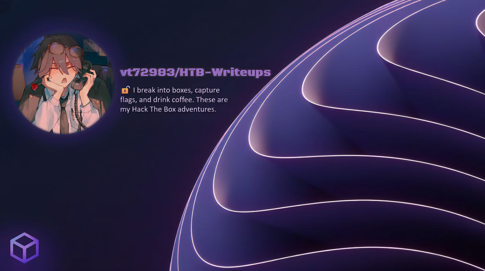

[**🇬🇧 English Version**](#-english-version) | [**🇷🇺 Русская версия**](#-русская-версия)

---

## 🇬🇧 English Version

# 🧠 HTB Writeups

Welcome to my repository with solutions for Hack The Box challenges!  
Here I publish detailed write-ups for CTF challenges of various categories—from **pwn** and **crypto** to **quantum** and **misc**.  
Each solution is accompanied by analysis, a step-by-step explanation, scripts, and results.

---

## 📜 Solved Challenges

<strong>⚙️ Reversing</strong> (8)

| Name | Difficulty | Solution |
|------|------------|----------|
| **Exatlon** | Easy | [📖 Read](https://github.com/vt72983/HTB-Writeups/blob/main/Exatlon/readme.md#english) |
| **Hubbub** | Easy | [📖 Read](https://github.com/vt72983/HTB-Writeups/blob/main/Hubbub/README.md#english) |
| **Bypass** | Easy | [📖 Read](https://github.com/vt72983/HTB-Writeups/blob/main/Bypass/README.md#english) |
| **BinCrypt Breaker** | Medium | [📖 Read](https://github.com/vt72983/HTB-Writeups/blob/main/BinCrypt%20Breaker/README.md#english) |
| **Rega's Town** | Medium | [📖 Read](https://github.com/vt72983/HTB-Writeups/blob/main/Rega's%20Town/README.md#english) |
| **Wayback** | Medium | [📖 Read](https://github.com/vt72983/HTB-Writeups/blob/main/Wayback/README.md#english) |
| **Virtually Mad** | Medium | [📖 Read](https://github.com/vt72983/HTB-Writeups/blob/main/Virtually%20Mad/README.md#english) |
| **Maze** | Medium | [📖 Read](https://github.com/vt72983/HTB-Writeups/blob/main/Maze/README.md#english) |
| **Hexecution** | hard | [📖 Read](https://github.com/vt72983/HTB-Writeups/blob/main/Hexecution/README.md#english) |

<strong>🧩 Quantum</strong> (4)

| Name | Difficulty | Solution |
|------|------------|----------|
| **Flagportation** | Very Easy | [📖 Read](https://github.com/vt72983/HTB-Writeups/blob/main/Flagportation/README.md#english) |
| **Global Hyperlink Zone**| Very Easy | [📖 Read](https://github.com/vt72983/HTB-Writeups/blob/main/Global-Hyperlink-Zone/README.md#english) |
| **Phase Madness** | Easy | [📖 Read](https://github.com/vt72983/HTB-Writeups/blob/main/Phase%20Madness/README.md#english) |
| **QLotto** | Easy | [📖 Read](https://github.com/vt72983/HTB-Writeups/blob/main/QLotto/README.md#english) |

<strong>🔐 Crypto</strong> (2)

| Name | Difficulty | Solution |
|------|------------|----------|
| **Rhome** | Easy | [📖 Read](https://github.com/vt72983/HTB-Writeups/blob/main/Rhome/README.md#english) |
| **Wonky AES** | Insane | [📖 Read](https://github.com/vt72983/HTB-Writeups/blob/main/Wonky%20AES/README.md#english) |

<strong>🌐 Web</strong> (1)

| Name | Difficulty | Solution |
|------|------------|----------|
| **Magical Palindrome** | Very Easy | [📖 Read](https://github.com/vt72983/HTB-Writeups/tree/main/Magical%20Palindrome/README.md#english) |

<strong>🎮 GamePwn</strong> (1)

| Name | Difficulty | Solution |
|------|------------|----------|
| **Nostalgia** | Medium | [📖 Read](https://github.com/vt72983/HTB-Writeups/blob/main/Nostalgia/README.md#english) |

<strong>🧠 AI - ML</strong> (1)

| Name | Difficulty | Solution |
|------|------------|----------|
| **Prometheon** | Medium | [📖 Read](https://github.com/vt72983/HTB-Writeups/blob/main/Prometheon/readme.md#english) |

<strong>👽 Misc</strong> (1)

| Name | Difficulty | Solution |
|------|------------|----------|
| **Not Posixtive** | Easy | [📖 Read](https://github.com/vt72983/HTB-Writeups/blob/main/Not%20Posixtive/README.md#english) |

 

---

## 🚧 Future Plans

💡 In the future, new solutions for other HackTheBox categories will appear here:  
- 🔐 **Crypto** — cryptography and non-standard ciphers
- 🧑‍💻 **Pwn** — binary exploitation
- 🌐 **Web** — server and front-end vulnerabilities
- ⚙️ **Misc / Reversing** — various non-standard tasks

Stay tuned—I am gradually adding new write-ups and automating data collection (the repository will grow).

---

## 📬 Contacts

If you want to discuss solutions, suggest an idea, or collaborate:

- 💻 GitHub: [@vt72983](https://github.com/vt72983)
- 🧩 HTB: [vt729830](https://app.hackthebox.com/users/1501105)
- ✉️ Email: *vt72983@bugcrowdninja.com*

---

> ⭐ Don't forget to star the repository if you liked the write-ups—it motivates me to do more and better!

---
---

## 🇷🇺 Русская версия

# 🧠 HTB Writeups

Добро пожаловать в мой репозиторий с решениями задач Hack The Box!  
Здесь я публикую подробные разборы (write-ups) по CTF-челленджам разных категорий — от **pwn** и **crypto** до **quantum** и **misc**.  
Каждое решение сопровождается анализом, пошаговым объяснением, скриптами и результатами.

---

## 📜 Решённые задачи

<strong>⚙️ Reversing</strong> (8)

| Название | Сложность | Решение |
|----------|-----------|---------|
| **Exatlon** | Easy | [📖 Читать](https://github.com/vt72983/HTB-Writeups/blob/main/Exatlon/readme.md#русский) |
| **Hubbub** | Easy | [📖 Читать](https://github.com/vt72983/HTB-Writeups/blob/main/Hubbub/README.md#русский) |
| **Bypass** | Easy | [📖 Читать](https://github.com/vt72983/HTB-Writeups/blob/main/Bypass/README.md#русский) |
| **BinCrypt Breaker** | Medium | [📖 Читать](https://github.com/vt72983/HTB-Writeups/blob/main/BinCrypt%20Breaker/README.md#русский) |
| **Rega's Town** | Medium | [📖 Читать](https://github.com/vt72983/HTB-Writeups/blob/main/Rega's%20Town/README.md#русский) |
| **Wayback** | Medium | [📖 Читать](https://github.com/vt72983/HTB-Writeups/blob/main/Wayback/README.md#русский) |
| **Virtually Mad** | Medium | [📖 Читать](https://github.com/vt72983/HTB-Writeups/blob/main/Virtually%20Mad/README.md#русский) |
| **Maze** | Medium | [📖 Читать](https://github.com/vt72983/HTB-Writeups/blob/main/Maze/README.md#русский) |
| **Hexecution** | hard | [📖 Читать](https://github.com/vt72983/HTB-Writeups/blob/main/Hexecution/README.md#русский) |

<strong>🧩 Quantum</strong> (4)

| Название | Сложность | Решение |
|----------|-----------|---------|
| **Flagportation** | Very Easy | [📖 Читать](https://github.com/vt72983/HTB-Writeups/blob/main/Flagportation/README.md#русский) |
| **Global Hyperlink Zone**| Very Easy | [📖 Читать](https://github.com/vt72983/HTB-Writeups/blob/main/Global-Hyperlink-Zone/README.md#русский) |
| **Phase Madness** | Easy | [📖 Читать](https://github.com/vt72983/HTB-Writeups/blob/main/Phase%20Madness/README.md#русский) |
| **QLotto** | Easy | [📖 Читать](https://github.com/vt72983/HTB-Writeups/blob/main/QLotto/README.md#русский) |

<strong>🔐 Crypto</strong> (2)

| Название | Сложность | Решение |
|----------|-----------|---------|
| **Rhome** | Easy | [📖 Читать](https://github.com/vt72983/HTB-Writeups/blob/main/Rhome/README.md#русский) |
| **Wonky AES** | Insane | [📖 Читать](https://github.com/vt72983/HTB-Writeups/blob/main/Wonky%20AES/README.md#русский) |

<strong>🌐 Web</strong> (1)

| Название | Сложность | Решение |
|----------|-----------|---------|
| **Magical Palindrome** | Very Easy | [📖 Читать](https://github.com/vt72983/HTB-Writeups/tree/main/Magical%20Palindrome/README.md#русский) |

<strong>🎮 GamePwn</strong> (1)

| Название | Сложность | Решение |
|----------|-----------|---------|
| **Nostalgia** | Medium | [📖 Читать](https://github.com/vt72983/HTB-Writeups/blob/main/Nostalgia/README.md#русский) |

<strong>🧠 AI - ML</strong> (1)

| Название | Сложность | Решение |
|----------|-----------|---------|
| **Prometheon** | Medium | [📖 Читать](https://github.com/vt72983/HTB-Writeups/blob/main/Prometheon/readme.md#русский) |

<strong>👽 Misc</strong> (1)

| Name | Difficulty | Solution |
|------|------------|----------|
| **Not Posixtive** | Easy | [📖 Читать](https://github.com/vt72983/HTB-Writeups/blob/main/Not%20Posixtive/README.md#русский) |

 

---

## 🚧 В планах

💡 В будущем здесь появятся новые решения по другим категориям HackTheBox:  
- 🔐 **Crypto** — криптография и нестандартные шифры  
- 🧑‍💻 **Pwn** — эксплуатация бинарей  
- 🌐 **Web** — уязвимости серверов и фронтенда  
- ⚙️ **Misc / Reversing** — различные нестандартные задачи  

Следите за обновлениями — я постепенно добавляю новые write-ups и автоматизирую сбор данных (репозиторий будет расти).

---

## 📬 Контакты

Если хочешь обсудить решения, предложить идею или коллаборацию:

- 💻 GitHub: [@vt72983](https://github.com/vt72983)
- 🧩 HTB: [vt729830](https://app.hackthebox.com/users/1501105)
- ✉️ Email: *vt72983@bugcrowdninja.com*

---

> ⭐ Не забудь поставить звёздочку репозиторию, если тебе понравились write-ups — это мотивирует делать больше и лучше
