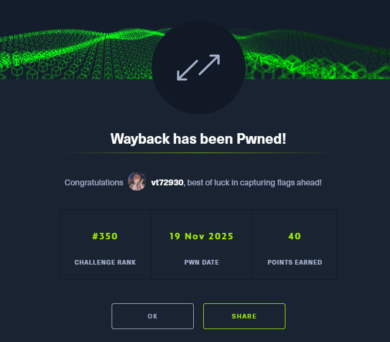

[English](#english) · [Русский](#русский)

---

## English

**Name -** Wayback

**Category -** Reversing

**Difficulty -** Medium

**Link -** https://app.hackthebox.com/challenges/Wayback

### Summary

The challenge presents us with an encrypted message and a binary named `V1` used to generate the password. The description tells us a specific story: a password was generated between December 10th and 11th, 2013, it is 20 characters long, and uses a specific charset. By reversing `V1`, we find it uses a time-based seed for `srand`. Since the seed is based on time, and we know the timeframe, we can brute-force the seed, generate the password, and decrypt the Bitcoin wallet.

---

### Recon

We are given a `decrypt.py` script which confirms the encryption is AES-CBC. It requires a key (the password).
We also have `V1`, a 17KB binary.

Analyzing `V1` in IDA, we find the `generate_password` function. It initializes the Random Number Generator (RNG) using the current time:

```c
timer = time(0);
v6 = localtime(&timer);
srand(
  100000000 * (v6->tm_mon + 1)          // Month
+ 1410065408 * (v6->tm_year + 1900)     // Year * Constant (Overflows, but that's part of the seed)
+ 10000 * v6->tm_hour                   // Hour
+ ... );
```

Since `rand()` in C is a Pseudo-Random Number Generator (PRNG), if we supply the same `seed` to `srand()`, the sequence of numbers generated by `rand()` will be identical.

The seed depends only on the date and time (down to the second).
The alphabet used is: `abcdefghijklmnopqrstuvwxyzABCDEFGHIJKLMNOPQRSTUVWXYZ!@#$%^&*_+0123456789` (Length 72).

**Critical Detail:** The binary uses `glibc`'s `rand`.
`LOAD:0000000000000A4C dw 2 ; rand@ @GLIBC_2.2.5`.

---

### The Strategy

We need to:
1.  Replicate the seed generation formula.
2.  Iterate through every second of December 10th and 11th, 2013.
3.  Generate a 20-character password for each second.
4.  Attempt to decrypt the flag.

### Attempts and Code

**Attempt 1: Python**
I tried writing a Python script using `ctypes` to call the system's `libc`. While this works conceptually, iterating through seconds in Python is *waaaay* too slow for this task.

**Attempt 2: C (The Fast Way)**
I rewrote the solver in C using OpenSSL for speed. However, initially, I ignored the description and tried to brute-force 2023-2025 with various lengths.
Result: Garbage output or false positives.

**Attempt 3: Reading the Manual (and the Correct C Code)**
I re-read the description:
*   **Year:** 2013.
*   **Month:** December (12).
*   **Days:** 10th and 11th.
*   **Length:** Exactly 20 characters.

This drastically reduces the search space to just ~172,800 possibilities (seconds in 2 days).

Here is the final, working C solver:

```c
#include <stdio.h>
#include <stdlib.h>
#include <string.h>
#include <ctype.h>
#include <openssl/aes.h>
#include <openssl/evp.h>

const char *HEX_CIPHERTEXT = "ad24426047b0ffb03b679773664838462a6f00bdcaf0589dd1748e9ed5c568601edc87d974894f9dd9b98cc35535145c494eb0af84c8f78d440a033c91c7de62d506d8cabdc2a10138b95139bbe60e89";
const char charset[] = "abcdefghijklmnopqrstuvwxyzABCDEFGHIJKLMNOPQRSTUVWXYZ!@#$%^&*_+0123456789";
unsigned char enc_data[256];
int enc_data_len = 0;

void hex2bin(const char* hex, unsigned char* bin, int* len) {
    size_t slen = strlen(hex);
    for (size_t i = 0; i < slen; i += 2) {
        sscanf(hex + i, "%2hhx", bin + (i / 2));
    }
    *len = slen / 2;
}
int is_readable_text(unsigned char *str, int len) {
    int printable = 0;
    for (int i = 0; i < len; i++) {
        if (isprint(str[i]) || str[i] == '\n' || str[i] == '\r' || str[i] == '\t') {
            printable++;
        }
    }
    return (printable > (len * 0.95));
}
int try_decrypt(const char *password, unsigned char *ciphertext_input, int cipher_len, unsigned char *output, int *out_len) {
    unsigned char key[32];
    memset(key, 0, 32);
    int pass_len = strlen(password);
    if (pass_len > 32) pass_len = 32;
    memcpy(key, password, pass_len);
    unsigned char iv[16];
    memcpy(iv, ciphertext_input, 16);
    unsigned char *actual_cipher = ciphertext_input + 16;
    int actual_cipher_len = cipher_len - 16;
    EVP_CIPHER_CTX *ctx = EVP_CIPHER_CTX_new();
    EVP_DecryptInit_ex(ctx, EVP_aes_256_cbc(), NULL, key, iv);
    int len;
    if(1 != EVP_DecryptUpdate(ctx, output, &len, actual_cipher, actual_cipher_len)) {
        EVP_CIPHER_CTX_free(ctx);
        return 0;
    }
    *out_len = len;
    if(1 != EVP_DecryptFinal_ex(ctx, output + len, &len)) {
        EVP_CIPHER_CTX_free(ctx);
        return 0;
    }
    *out_len += len;
    output[*out_len] = '\0';
    EVP_CIPHER_CTX_free(ctx);
    return 1;
}

int main() {
    hex2bin(HEX_CIPHERTEXT, enc_data, &enc_data_len);
    long long MAGIC = 1410065408; 
    unsigned char decrypted[256];
    char password[32];
    int decrypted_len;
    int year = 2013;
    int month = 12;
    printf("Starting crack for Michael Tanz (Dec 10-11, 2013)...\n");
    unsigned int term_year = (unsigned int)(year) * MAGIC; 
    unsigned int term_mon = 100000000 * month;
    for (int day = 10; day <= 11; day++) {
        unsigned int term_day = 1000000 * day;
        for (int hour = 0; hour < 24; hour++) {
            unsigned int term_hour = 10000 * hour;
            for (int min = 0; min < 60; min++) {
                unsigned int term_min = 100 * min;
                for (int sec = 0; sec < 60; sec++) {
                    unsigned int seed = 
                        term_mon +
                        term_year +
                        term_hour +
                        sec +
                        term_min +
                        term_day;
                    srand(seed);
                    for(int i=0; i<20; ++i) {
                        password[i] = charset[rand() % 72];
                    }
                    password[20] = '\0';
                    if (try_decrypt(password, enc_data, enc_data_len, decrypted, &decrypted_len)) {
                        if (is_readable_text(decrypted, decrypted_len)) {
                            printf("\nOur beloved bitcoins. We are rich!\n");
                            printf("Date: 2013-12-%02d %02d:%02d:%02d\n", day, hour, min, sec);
                            printf("Seed: %u\n", seed);
                            printf("Password: %s\n", password);
                            printf("Decrypted Message: %s\n", decrypted);
                            return 0;
                        }
                    }
                }
            }
        }
        printf("Checked Dec %d, 2013...\n", day);
    }
    printf("Password not found.\n");
    return 0;
}
```

**Compile and Run:**
```bash
gcc solve.c -o solve -lssl -lcrypto
./solve
```

**Output:**
```
┌──(vt729830㉿vt72983)-[~/5/2]
└─$ ./solve
Starting crack for Michael Tanz (Dec 10-11, 2013)...
Checked Dec 10, 2013 (Filtered garbage results)...

Our beloved bitcoins. We are rich!
Date: 2013-12-11 13:01:25
Seed: 699413773
Password: ******************
Decrypted Message: I found 30 Bitcoins! , HTB{**************}
```

And just like that, we recovered the wallet. Another nice flag :)



---

## Русский

[Перейти к английской версии](#english)

**Название -** Wayback

**Категория -** Reversing

**Сложность -** Medium

**Ссылка -** https://app.hackthebox.com/challenges/Wayback

---

## Краткое описание

И так, приступим. У нас имеется зашифрованное сообщение, скрипт для расшифровки и бинарник `V1`. В описании задачи нам рассказывают историю: пароль был сгенерирован между 10 и 11 декабря 2013 года, длина 20 символов, используются только буквы, цифры и символы. Реверс `V1` показывает, что он использует время для инициализации генератора случайных чисел (`srand`). Это значит, мы можем перебрать все секунды в указанном диапазоне, сгенерировать пароль и попробовать расшифровать данные.

---

## Разведка

У нас есть `decrypt.py`, который подтверждает, что используется AES-CBC.
И файл `V1` на 17 кб. Внутри находим функцию `generate_password`, которая использует текущее время:

```c
timer = time(0);
v6 = localtime(&timer);
srand(
  100000000 * (v6->tm_mon + 1)          // Месяц
+ 1410065408 * (v6->tm_year + 1900)     // Год * Константу
+ 10000 * v6->tm_hour                   // Часы
+ ... );
```

Так как `rand()` в языке C — это псевдослучайный генератор, если мы подадим на вход (`srand`) тот же самый `seed`, то последовательность вызовов `rand()` будет идентичной. Алфавит генерации также известен (72 символа).

Важно: бинарник использует `glibc` (видно по `rand@ @GLIBC_2.2.5`), поэтому лучше всего писать решение на C, чтобы использовать ту же математику рандома.

---

## Стратегия и Попытки

**Попытка 1: Python**
Я попробовал написать скрипт на Python, подгружая `libc` через `ctypes`. Но перебор секунд на Python — это очееееееень долго.

**Попытка 2: C (Быстро, но глупо)**
Переписал код на C с использованием OpenSSL. Но я не прочитал описание внимательно и запустил брутфорс по 2023-2025 годам с разной длиной пароля.
Результат: куча мусора и ложные срабатывания.

**Попытка 3: Читаем условие (и финальный код)**
Я глянул в описание... И да, я чуток зря не читал его XD.
*   **Год:** 2013.
*   **Даты:** 10 и 11 декабря.
*   **Длина:** Ровно 20 символов.

Это сужает поиск с миллионов вариантов до всего лишь ~172,800 (секунды в двух сутках).

Вот финальный код решения:

```c
#include <stdio.h>
#include <stdlib.h>
#include <string.h>
#include <ctype.h>
#include <openssl/aes.h>
#include <openssl/evp.h>

const char *HEX_CIPHERTEXT = "ad24426047b0ffb03b679773664838462a6f00bdcaf0589dd1748e9ed5c568601edc87d974894f9dd9b98cc35535145c494eb0af84c8f78d440a033c91c7de62d506d8cabdc2a10138b95139bbe60e89";
const char charset[] = "abcdefghijklmnopqrstuvwxyzABCDEFGHIJKLMNOPQRSTUVWXYZ!@#$%^&*_+0123456789";
unsigned char enc_data[256];
int enc_data_len = 0;

void hex2bin(const char* hex, unsigned char* bin, int* len) {
    size_t slen = strlen(hex);
    for (size_t i = 0; i < slen; i += 2) {
        sscanf(hex + i, "%2hhx", bin + (i / 2));
    }
    *len = slen / 2;
}
int is_readable_text(unsigned char *str, int len) {
    int printable = 0;
    for (int i = 0; i < len; i++) {
        if (isprint(str[i]) || str[i] == '\n' || str[i] == '\r' || str[i] == '\t') {
            printable++;
        }
    }
    return (printable > (len * 0.95));
}
int try_decrypt(const char *password, unsigned char *ciphertext_input, int cipher_len, unsigned char *output, int *out_len) {
    unsigned char key[32];
    memset(key, 0, 32);
    int pass_len = strlen(password);
    if (pass_len > 32) pass_len = 32;
    memcpy(key, password, pass_len);
    unsigned char iv[16];
    memcpy(iv, ciphertext_input, 16); 
    unsigned char *actual_cipher = ciphertext_input + 16;
    int actual_cipher_len = cipher_len - 16;
    EVP_CIPHER_CTX *ctx = EVP_CIPHER_CTX_new();
    EVP_DecryptInit_ex(ctx, EVP_aes_256_cbc(), NULL, key, iv);
    int len;
    if(1 != EVP_DecryptUpdate(ctx, output, &len, actual_cipher, actual_cipher_len)) {
        EVP_CIPHER_CTX_free(ctx);
        return 0;
    }
    *out_len = len;
    if(1 != EVP_DecryptFinal_ex(ctx, output + len, &len)) {
        EVP_CIPHER_CTX_free(ctx);
        return 0;
    }
    *out_len += len;
    output[*out_len] = '\0';
    EVP_CIPHER_CTX_free(ctx);
    return 1;
}

int main() {
    hex2bin(HEX_CIPHERTEXT, enc_data, &enc_data_len);
    long long MAGIC = 1410065408;
    unsigned char decrypted[256];
    char password[32];
    int decrypted_len;
    int year = 2013;
    int month = 12; 
    printf("Starting crack for Michael Tanz (Dec 10-11, 2013)...\n");
    unsigned int term_year = (unsigned int)(year) * MAGIC; 
    unsigned int term_mon = 100000000 * month;
    for (int day = 10; day <= 11; day++) {
        unsigned int term_day = 1000000 * day;
        for (int hour = 0; hour < 24; hour++) {
            unsigned int term_hour = 10000 * hour;
            for (int min = 0; min < 60; min++) {
                unsigned int term_min = 100 * min;
                for (int sec = 0; sec < 60; sec++) {
                    unsigned int seed = 
                        term_mon +
                        term_year +
                        term_hour +
                        sec +
                        term_min +
                        term_day;
                    srand(seed);
                    for(int i=0; i<20; ++i) {
                        password[i] = charset[rand() % 72];
                    }
                    password[20] = '\0';
                    if (try_decrypt(password, enc_data, enc_data_len, decrypted, &decrypted_len)) {
                        if (is_readable_text(decrypted, decrypted_len)) {
                            printf("\nНаши биткоины любимые. Мы богаты!\n");
                            printf("Date: 2013-12-%02d %02d:%02d:%02d\n", day, hour, min, sec);
                            printf("Seed: %u\n", seed);
                            printf("Password: %s\n", password);
                            printf("Decrypted Message: %s\n", decrypted);
                            return 0;
                        }
                    }
                }
            }
        }
        printf("Checked Dec %d, 2013...\n", day);
    }
    printf("Password not found.\n");
    return 0;
}
```

**Компиляция и запуск:**
```bash
gcc solve.c -o solve -lssl -lcrypto
./solve
```

**Результат:**
```
┌──(vt729830㉿vt72983)-[~/5/2]
└─$ ./solve
Starting crack for Michael Tanz (Dec 10-11, 2013)...
Checked Dec 10, 2013 (Filtered garbage results)...

Наши биткоины любимые. Мы богаты!
Date: 2013-12-11 13:01:25
Seed: 699413773
Password: ******************
Decrypted Message: I found 30 Bitcoins! , HTB{**************}
```

И получилось щикарно. Еще наш флажочек :)


