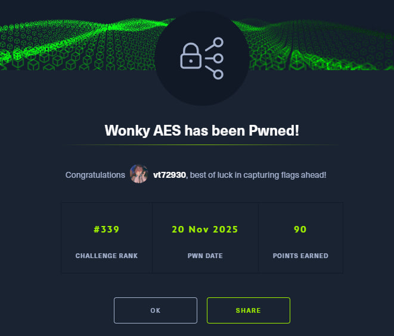

[English](#english) · [Русский](#русский)

---

## English

**Name -** Wonky AES

**Category -** Crypto

**Difficulty -** Insane

**Link -** https://app.hackthebox.com/challenges/Wonky%20AES

### Summary

The challenge description says, "I've got an AES encryptor but unfortunately the functionality seems to be a tad bit wonky. Surely that won't affect its security, right?" We are given the source code for an AES encryption service that introduces a specific fault. The challenge is a classic Differential Fault Analysis (DFA) attack on AES-128. The service generates a random key for each session and allows us to encrypt random plaintext. For each encryption, it provides both the correct ciphertext and a faulty one. The fault is injected in the 9th (penultimate) round, just before the `MixColumns` operation. The solution involves collecting a large number of correct/faulty ciphertext pairs, using them to mathematically deduce the last round key ($K_{10}$), reversing the AES key schedule to find the original master key, and finally decrypting the flag.

---

### Recon (how I inspected the format)

I was given a `src` directory containing the C source code for the challenge:
*   `aes.c`, `aes.h`: A standard AES implementation.
*   `enc_fault.c`: The main program logic.
*   `Makefile`: To build the binary.

A deep dive into the code revealed the following:
1.  A new random key is generated on every run using `/dev/urandom`.
2.  We can request the encryption of random plaintext.
    *   It returns the **correct ciphertext** ($C$).
    *   It returns a **faulty ciphertext** ($C'$).
3.  The fault is introduced in the 9th round before the `MixColumns` step (the `CipherFault` function in the code).

**The Vulnerability (DFA Attack)**
In AES, if a single-byte fault is injected into the state during the 9th round before `MixColumns`, this error will propagate to exactly 4 bytes in the final ciphertext. By comparing the correct ciphertext ($C$) and the faulty one ($C'$), it's possible to mathematically recover the **last round key ($K_{10}$)**.

Knowing $K_{10}$, we can reverse the Key Expansion algorithm to obtain the original master key used to encrypt the flag.

Since the key is randomly generated for each connection, we can't just collect data, close the program, and analyze it later. **We must keep the connection open** while we find the key.

---

### Strategy

My strategy evolved into a fully automated, single-session attack:
1.  Write a Python script using `pwntools` to connect to the server.
2.  The script will collect a large number of (Correct, Faulty) ciphertext pairs. Initial tests with 30-40 pairs failed, so I scaled it up to 1000 pairs to ensure enough unique data to eliminate false positives.
3.  The script will keep the connection alive after collecting the data.
4.  Implement a DFA solver directly in the Python script to process the collected traces in memory.
5.  The solver will deduce the 16-byte Round 10 key ($K_{10}$).
6.  Implement the reverse AES key schedule to derive the master key from $K_{10}$.
7.  Request the encrypted flag from the server.
8.  Use the recovered master key to decrypt the flag and print it.

---

### Script and Patching Evolution (how I iterated and fixed bugs)

This is where the fun begins.

**Attempt 1: The Two-Terminal Approach**

My first idea was a semi-manual approach:
1.  Script 1 (`1.py`) connects, collects about 35 traces, saves them to `trace.txt`, gets the encrypted flag, and then pauses, waiting for me.
2.  Script 2 (`2.py`, my DFA solver) runs in a separate terminal, reads `trace.txt`, and calculates the key.
3.  I would then copy the key from terminal 2 and paste it into terminal 1 to get the flag.

I wrote the scripts and ran them. The collector worked fine. The solver... not so much.

```
┌──(vt729830㉿vt72983)-[~/5/2/crypto_wonky_aes]
└─$ python3 2.py
[*] Reading trace.txt...
[*] Loaded 35 lines. Starting analysis...
----------------------------------------
Byte 1: Multiple candidates [50, 254]. Taking the first one.
Byte 5: Multiple candidates [40, 57, 66, 45]. Taking the first one.
Byte 8: Multiple candidates [145, 121]. Taking the first one.
Byte 11: Multiple candidates [53, 149]. Taking the first one.
Round 10 Key: 5b32c126d72833a291292f354624e340
----------------------------------------
Copy this key and paste it into the first window!
```
The solver couldn't uniquely determine several key bytes. Pasting this ambiguous key into the first script gave me garbage:

```
[*] Recovered Master Key: b20d556fe726dbbfb3a0c9a7803ce4b6
[+] FLAG: \x00<W\x028(ދ U<F놸|B\x03`\x01
```
That's not the flag. The problem was clear: 35 traces were not enough to narrow down the candidates to a single possibility for each byte.

**The Turning Point: More Data & Full Automation**

I needed way more data. I estimated that around 1000 traces should be sufficient. The two-terminal approach was also clunky. I decided to combine everything into a single, powerful script that would:
1.  Connect to the server.
2.  Collect 1000 traces.
3.  Run the DFA analysis in-memory.
4.  Reverse the key schedule.
5.  Get and decrypt the flag.

This removed all manual steps and potential errors. I refactored my code into one final solver script.

```python
from pwn import *
from Crypto.Cipher import AES
from Crypto.Util.number import long_to_bytes
import binascii

# AES constants for key schedule reversal
sbox = [0x63, 0x7c, 0x77, 0x7b, 0xf2, 0x6b, 0x6f, 0xc5, 0x30, 0x01, 0x67, 0x2b, 0xfe, 0xd7, 0xab, 0x76, 0xca, 0x82, 0xc9, 0x7d, 0xfa, 0x59, 0x47, 0xf0, 0xad, 0xd4, 0xa2, 0xaf, 0x9c, 0xa4, 0x72, 0xc0, 0xb7, 0xfd, 0x93, 0x26, 0x36, 0x3f, 0xf7, 0xcc, 0x34, 0xa5, 0xe5, 0xf1, 0x71, 0xd8, 0x31, 0x15, 0x04, 0xc7, 0x23, 0xc3, 0x18, 0x96, 0x05, 0x9a, 0x07, 0x12, 0x80, 0xe2, 0xeb, 0x27, 0xb2, 0x75, 0x09, 0x83, 0x2c, 0x1a, 0x1b, 0x6e, 0x5a, 0xa0, 0x52, 0x3b, 0xd6, 0xb3, 0x29, 0xe3, 0x2f, 0x84, 0x53, 0xd1, 0x00, 0xed, 0x20, 0xfc, 0xb1, 0x5b, 0x6a, 0xcb, 0xbe, 0x39, 0x4a, 0x4c, 0x58, 0xcf, 0xd0, 0xef, 0xaa, 0xfb, 0x43, 0x4d, 0x33, 0x85, 0x45, 0xf9, 0x02, 0x7f, 0x50, 0x3c, 0x9f, 0xa8, 0x51, 0xa3, 0x40, 0x8f, 0x92, 0x9d, 0x38, 0xf5, 0xbc, 0xb6, 0xda, 0x21, 0x10, 0xff, 0xf3, 0xd2, 0xcd, 0x0c, 0x13, 0xec, 0x5f, 0x97, 0x44, 0x17, 0xc4, 0xa7, 0x7e, 0x3d, 0x64, 0x5d, 0x19, 0x73, 0x60, 0x81, 0x4f, 0xdc, 0x22, 0x2a, 0x90, 0x88, 0x46, 0xee, 0xb8, 0x14, 0xde, 0x5e, 0x0b, 0xdb, 0xe0, 0x32, 0x3a, 0x0a, 0x49, 0x06, 0x24, 0x5c, 0xc2, 0xd3, 0xac, 0x62, 0x91, 0x95, 0xe4, 0x79, 0xe7, 0xc8, 0x37, 0x6d, 0x8d, 0xd5, 0x4e, 0xa9, 0x6c, 0x56, 0xf4, 0xea, 0x65, 0x7a, 0xae, 0x08, 0xba, 0x78, 0x25, 0x2e, 0x1c, 0xa6, 0xb4, 0xc6, 0xe8, 0xdd, 0x74, 0x1f, 0x4b, 0xbd, 0x8b, 0x8a, 0x70, 0x3e, 0xb5, 0x66, 0x48, 0x03, 0xf6, 0x0e, 0x61, 0x35, 0x57, 0xb9, 0x86, 0xc1, 0x1d, 0x9e, 0xe1, 0xf8, 0x98, 0x11, 0x69, 0xd9, 0x8e, 0x94, 0x9b, 0x1e, 0x87, 0xe9, 0xce, 0x55, 0x28, 0xdf, 0x8c, 0xa1, 0x89, 0x0d, 0xbf, 0xe6, 0x42, 0x68, 0x41, 0x99, 0x2d, 0x0f, 0xb0, 0x54, 0xbb, 0x16]
rsbox = [0x52, 0x09, 0x6a, 0xd5, 0x30, 0x36, 0xa5, 0x38, 0xbf, 0x40, 0xa3, 0x9e, 0x81, 0xf3, 0xd7, 0xfb, 0x7c, 0xe3, 0x39, 0x82, 0x9b, 0x2f, 0xff, 0x87, 0x34, 0x8e, 0x43, 0x44, 0xc4, 0xde, 0xe9, 0xcb, 0x54, 0x7b, 0x94, 0x32, 0xa6, 0xc2, 0x23, 0x3d, 0xee, 0x4c, 0x95, 0x0b, 0x42, 0xfa, 0xc3, 0x4e, 0x08, 0x2e, 0xa1, 0x66, 0x28, 0xd9, 0x24, 0xb2, 0x76, 0x5b, 0xa2, 0x49, 0x6d, 0x8b, 0xd1, 0x25, 0x72, 0xf8, 0xf6, 0x64, 0x86, 0x68, 0x98, 0x16, 0xd4, 0xa4, 0x5c, 0xcc, 0x5d, 0x65, 0xb6, 0x92, 0x6c, 0x70, 0x48, 0x50, 0xfd, 0xed, 0xb9, 0xda, 0x5e, 0x15, 0x46, 0x57, 0xa7, 0x8d, 0x9d, 0x84, 0x90, 0xd8, 0xab, 0x00, 0x8c, 0xbc, 0xd3, 0x0a, 0xf7, 0xe4, 0x58, 0x05, 0xb8, 0xb3, 0x45, 0x06, 0xd0, 0x2c, 0x1e, 0x8f, 0xca, 0x3f, 0x0f, 0x02, 0xc1, 0xaf, 0xbd, 0x03, 0x01, 0x13, 0x8a, 0x6b, 0x3a, 0x91, 0x11, 0x41, 0x4f, 0x67, 0xdc, 0xea, 0x97, 0xf2, 0xcf, 0xce, 0xf0, 0xb4, 0xe6, 0x73, 0x96, 0xac, 0x74, 0x22, 0xe7, 0xad, 0x35, 0x85, 0xe2, 0xf9, 0x37, 0xe8, 0x1c, 0x75, 0xdf, 0x6e, 0x47, 0xf1, 0x1a, 0x71, 0x1d, 0x29, 0xc5, 0x89, 0x6f, 0xb7, 0x62, 0x0e, 0xaa, 0x18, 0xbe, 0x1b, 0xfc, 0x56, 0x3e, 0x4b, 0xc6, 0xd2, 0x79, 0x20, 0x9a, 0xdb, 0xc0, 0xfe, 0x78, 0xcd, 0x5a, 0xf4, 0x1f, 0xdd, 0xa8, 0x33, 0x88, 0x07, 0xc7, 0x31, 0xb1, 0x12, 0x10, 0x59, 0x27, 0x80, 0xec, 0x5f, 0x60, 0x51, 0x7f, 0xa9, 0x19, 0xb5, 0x4a, 0x0d, 0x2d, 0xe5, 0x7a, 0x9f, 0x93, 0xc9, 0x9c, 0xef, 0xa0, 0xe0, 0x3b, 0x4d, 0xae, 0x2a, 0xf5, 0xb0, 0xc8, 0xeb, 0xbb, 0x3c, 0x83, 0x53, 0x99, 0x61, 0x17, 0x2b, 0x04, 0x7e, 0xba, 0x77, 0xd6, 0x26, 0xe1, 0x69, 0x14, 0x63, 0x55, 0x21, 0x0c, 0x7d]
Rcon = [0x8d, 0x01, 0x02, 0x04, 0x08, 0x10, 0x20, 0x40, 0x80, 0x1b, 0x36]

def gmul2(x): return ((x << 1) ^ 0x1b) & 0xFF if (x & 0x80) else x << 1
def gmul3(x): return gmul2(x) ^ x

def recover_round10_key(traces):
    groups = [[0, 13, 10, 7], [4, 1, 14, 11], [8, 5, 2, 15], [12, 9, 6, 3]]
    key_candidates = [set(range(256)) for _ in range(16)]
    for C, D in traces:
        diff = [c ^ d for c, d in zip(C, D)]
        active_indices = [i for i, x in enumerate(diff) if x != 0]
        if not active_indices: continue

        target_group = None
        for g in groups:
            if all(idx in g for idx in active_indices):
                target_group = g
                break
        if target_group is None: continue
        group_candidates = [set() for _ in range(4)]
        for f in range(1, 256):
            mc_patterns = [
                [gmul2(f), f, f, gmul3(f)], [gmul3(f), gmul2(f), f, f],
                [f, gmul3(f), gmul2(f), f], [f, f, gmul3(f), gmul2(f)]
            ]
            for pattern in mc_patterns:
                row_k_matches = [set() for _ in range(4)]
                possible = True
                for i in range(4):
                    idx = target_group[i]
                    for k in range(256):
                        if (rsbox[C[idx] ^ k] ^ rsbox[D[idx] ^ k]) == pattern[i]:
                            row_k_matches[i].add(k)
                    if not row_k_matches[i]:
                        possible = False
                        break
                if possible:
                    for i in range(4): group_candidates[i].update(row_k_matches[i])      
        for i in range(4):
            if group_candidates[i]:
                key_candidates[target_group[i]].intersection_update(group_candidates[i])
    final_key = []
    for i in range(16):
        cands = list(key_candidates[i])
        if len(cands) != 1:
            print(f"[!] Error at byte {i}: Candidates {cands}")
            return None
        final_key.append(cands[0])
    return bytes(final_key)

def rev_key_schedule(k10):
    words = [0] * 44
    for i in range(4): words[40+i] = int.from_bytes(k10[i*4:(i+1)*4], 'big')
    for i in range(9, -1, -1):
        k0, k1, k2, k3 = words[(i+1)*4 : (i+2)*4]
        pk3 = k3 ^ k2
        pk2 = k2 ^ k1
        pk1 = k1 ^ k0
        rot = ((pk3 << 8) & 0xFFFFFFFF) | (pk3 >> 24)
        sub = (sbox[(rot >> 24) & 0xFF] << 24) | (sbox[(rot >> 16) & 0xFF] << 16) | \
              (sbox[(rot >> 8) & 0xFF] << 8) | sbox[rot & 0xFF]
        xor_part = sub ^ (Rcon[i + 1] << 24)
        pk0 = k0 ^ xor_part
        words[i*4:i*4+4] = [pk0, pk1, pk2, pk3]
    return b"".join(long_to_bytes(w, 4) for w in words[:4])

def main(): 
    HOST = '1.1.1.1' # The IP was changed
    PORT = 365 # The PORT was changed
    io = remote(HOST, PORT)

    print("[*] Collecting data (1000 iterations)...")
    traces = []
    for i in range(1000):
        if i % 10 == 0: print(f"    Trace {i}/1000...")
        io.recvuntil(b"(y/n): ")
        io.sendline(b"y")
        io.recvuntil(b"Correct encryption: ")
        c = bytes.fromhex(io.recvline().strip().decode())
        io.recvuntil(b"Faulty encryption:  ")
        f = bytes.fromhex(io.recvline().strip().decode())
        if c != f: traces.append((c, f))
    print(f"[*] Collected {len(traces)} valid traces. Cracking the key...")
    k10 = recover_round10_key(traces)
    if not k10:
        print("[-] Failed to recover the key unambiguously. Try running again.")
        io.close()
        return
    print(f"[+] Round 10 Key: {binascii.hexlify(k10).decode()}")
    master_key = rev_key_schedule(k10)
    print(f"[+] Master Key:   {binascii.hexlify(master_key).decode()}")
    io.recvuntil(b"(y/n): ")
    io.sendline(b"n")
    io.recvuntil(b"Flag encrypted: ")
    flag_enc = bytes.fromhex(io.recvline().strip().decode())
    cipher = AES.new(master_key, AES.MODE_ECB)
    flag = cipher.decrypt(flag_enc)
    print(f"\nFLAG: {flag.decode(errors='ignore')}")
    io.close()

if __name__ == "__main__":
    main()
```
Now we just have to wait... for ages XD (I suggest brewing some tea and buying some syrniki). 

Good things come to those who wait)))

P.S. this will definitely take a while...

---

### Result and proofs

```
    Trace 970/1000...
    Trace 980/1000...
    Trace 990/1000...
[*] Collected 998 valid traces. Cracking the key...
[+] Round 10 Key: 96465a6cce567c137f80680786b9ef9a
[+] Master Key:   09280a764fe75c3a488986319d8a6ad0

[!!!] FLAG: HTB{*************}
[*] Closed connection to 1.1.1.1 port 365
```

By the way, there's our flag. Easy peasy.

I also appreciated the inside joke in the flag:
*   **PQ** = Post-Quantum Cryptography. The whole world is currently preparing to transition to new algorithms (like Kyber, Dilithium, etc.) that quantum computers can't break. Everyone is obsessed with their mathematical security.
*   **DFA** = Differential Fault Analysis. This is the very attack I just performed. It doesn't target the math, but the physical implementation (by inducing failures).

The joke is that even the most advanced post-quantum algorithms, developed by the world's best mathematicians to protect against future supercomputers, can be broken by the same good old DFA attack if the developer forgets to add fault protection))



---

## Русский

[Go to English version](#english)

**Название -** Wonky AES

**Категория -** Crypto

**Сложность -** Insane

**Ссылка -** https://app.hackthebox.com/challenges/Wonky%20AES

---

## Краткое описание

Описание челенджа гласит: «I've got an AES encryptor but unfortunately the functionality seems to be a tad bit wonky. Surely that won't affect its security, right?» Нам дан исходный код сервиса шифрования AES, который вносит определённый сбой. Челендж представляет собой классическую атаку с использованием дифференциального анализа сбоев (Differential Fault Analysis, DFA) на AES-128. Сервис генерирует случайный ключ для каждой сессии и позволяет шифровать случайный открытый текст. Для каждого шифрования он предоставляет как правильный шифротекст, так и шифротекст со сбоем. Сбой вносится в 9-м (предпоследнем) раунде, непосредственно перед операцией `MixColumns`. Решение заключается в сборе большого количества пар правильных/сбойных шифротекстов, использовании их для математического вывода ключа последнего раунда ($K_{10}$), обращении алгоритма расширения ключа AES для нахождения исходного мастер-ключа и, наконец, расшифровке флага.

---

## Разведка (как я смотрел формат)

Нам дали директорию `src` с исходным кодом на C:
*   `aes.c`, `aes.h`: Стандартная реализация AES.
*   `enc_fault.c`: Основная логика программы.
*   `Makefile`: Для сборки бинарного файла.

Глубокое изучение кода выявило следующее:
1.  При каждом запуске генерируется случайный ключ с помощью `/dev/urandom`.
2.  Мы можем попросить зашифровать случайный открытый текст.
    *   Он выдает **верный шифротекст** ($C$).
    *   Он выдает **шифротекст со сбоем** ($C'$).
3.  Сбой вносится в 9-м раунде перед операцией `MixColumns` (функция `CipherFault` в коде).

**В чем уязвимость? (DFA Attack)**
В AES, если внести ошибку в 1 байт в состояние на 9-м раунде перед `MixColumns`, эта ошибка распространится ровно на 4 байта в итоговом шифротексте. Сравнивая правильный ($C$) и сломанный ($C'$) шифротексты, можно математически восстановить **Ключ последнего раунда ($K_{10}$)**.

Зная $K_{10}$, можно обратить алгоритм расширения ключа (Key Expansion) и получить исходный мастер-ключ, которым зашифрован флаг.

Так как ключ генерируется случайно при каждом запуске, нельзя просто собрать данные, закрыть программу и анализировать их потом. **Нужно держать соединение открытым**, пока мы ищем ключ.

---

## Стратегия

Моя стратегия превратилась в полностью автоматизированную атаку в рамках одной сессии:
1.  Написать Python-скрипт на `pwntools` для подключения к серверу.
2.  Скрипт соберёт большое количество пар (Correct, Faulty). Первые тесты с 30-40 парами провалились, поэтому я увеличил их число до 1000, чтобы гарантированно исключить ложные срабатывания.
3.  Скрипт будет поддерживать соединение активным после сбора данных.
4.  Реализовать DFA-решатель прямо в Python-скрипте для обработки собранных трасс в памяти.
5.  Решатель определит 16-байтовый ключ 10-го раунда ($K_{10}$).
6.  Реализовать обратный алгоритм расширения ключа AES для получения мастер-ключа из $K_{10}$.
7.  Запросить у сервера зашифрованный флаг.
8.  Использовать восстановленный мастер-ключ для расшифровки флага и вывода его на экран.

---

## Изменения скриптов и патчинга (как я думал и исправлял ошибки)

А вот тут начинается самое интересное.

**Попытка 1: Подход с двумя терминалами**

Моя первая идея была полуручной:
1.  Скрипт 1 (`1.py`) подключается, собирает около 35 трасс, сохраняет их в `trace.txt`, получает зашифрованный флаг и встает на паузу, ожидая меня.
2.  Скрипт 2 (`2.py`, мой DFA-решатель) запускается в отдельном терминале, читает `trace.txt` и вычисляет ключ.
3.  Затем я копирую ключ из второго терминала и вставляю в первый, чтобы получить флаг.

Я написал скрипты и запустил их. Сборщик отработал отлично. А вот решатель... не очень.

```
┌──(vt729830㉿vt72983)-[~/5/2/crypto_wonky_aes]
└─$ python3 2.py
[*] Чтение trace.txt...
[*] Загружено 35 строк. Начинаем анализ...
----------------------------------------
Байт 1: Несколько кандидатов [50, 254]. Беру первый.
Байт 5: Несколько кандидатов [40, 57, 66, 45]. Беру первый.
Байт 8: Несколько кандидатов [145, 121]. Беру первый.
Байт 11: Несколько кандидатов [53, 149]. Беру первый.
Round 10 Key: 5b32c126d72833a291292f354624e340
----------------------------------------
Скопируй этот ключ и вставь в первое окно!
```
Решатель не смог однозначно определить несколько байтов ключа. Вставка этого неоднозначного ключа в первый скрипт дала мусор:

```
[*] Recovered Master Key: b20d556fe726dbbfb3a0c9a7803ce4b6
[+] FLAG: \x00<W\x028(ދ U<F놸|B\x03`\x01
```
Это не флаг. Проблема была ясна: 35 трасс было недостаточно, чтобы сузить кандидатов до единственной возможности для каждого байта.

**Переломный момент: Больше данных и полная автоматизация**

Мне нужно было гораздо больше данных. Я прикинул, что около 1000 трасс должно хватить. Подход с двумя терминалами тоже был неудобен. Я решил объединить всё в один мощный скрипт, который будет:
1.  Подключаться к серверу.
2.  Собирать 1000 трасс.
3.  Запускать DFA-анализ в памяти.
4.  Обращать алгоритм расширения ключа.
5.  Получать и расшифровывать флаг.

Это устранило все ручные шаги и потенциальные ошибки. Я переписал код в один финальный скрипт-решатель.

```python
from pwn import *
from Crypto.Cipher import AES
from Crypto.Util.number import long_to_bytes
import binascii

# Константы AES для обращения алгоритма расширения ключа
sbox = [0x63, 0x7c, 0x77, 0x7b, 0xf2, 0x6b, 0x6f, 0xc5, 0x30, 0x01, 0x67, 0x2b, 0xfe, 0xd7, 0xab, 0x76, 0xca, 0x82, 0xc9, 0x7d, 0xfa, 0x59, 0x47, 0xf0, 0xad, 0xd4, 0xa2, 0xaf, 0x9c, 0xa4, 0x72, 0xc0, 0xb7, 0xfd, 0x93, 0x26, 0x36, 0x3f, 0xf7, 0xcc, 0x34, 0xa5, 0xe5, 0xf1, 0x71, 0xd8, 0x31, 0x15, 0x04, 0xc7, 0x23, 0xc3, 0x18, 0x96, 0x05, 0x9a, 0x07, 0x12, 0x80, 0xe2, 0xeb, 0x27, 0xb2, 0x75, 0x09, 0x83, 0x2c, 0x1a, 0x1b, 0x6e, 0x5a, 0xa0, 0x52, 0x3b, 0xd6, 0xb3, 0x29, 0xe3, 0x2f, 0x84, 0x53, 0xd1, 0x00, 0xed, 0x20, 0xfc, 0xb1, 0x5b, 0x6a, 0xcb, 0xbe, 0x39, 0x4a, 0x4c, 0x58, 0xcf, 0xd0, 0xef, 0xaa, 0xfb, 0x43, 0x4d, 0x33, 0x85, 0x45, 0xf9, 0x02, 0x7f, 0x50, 0x3c, 0x9f, 0xa8, 0x51, 0xa3, 0x40, 0x8f, 0x92, 0x9d, 0x38, 0xf5, 0xbc, 0xb6, 0xda, 0x21, 0x10, 0xff, 0xf3, 0xd2, 0xcd, 0x0c, 0x13, 0xec, 0x5f, 0x97, 0x44, 0x17, 0xc4, 0xa7, 0x7e, 0x3d, 0x64, 0x5d, 0x19, 0x73, 0x60, 0x81, 0x4f, 0xdc, 0x22, 0x2a, 0x90, 0x88, 0x46, 0xee, 0xb8, 0x14, 0xde, 0x5e, 0x0b, 0xdb, 0xe0, 0x32, 0x3a, 0x0a, 0x49, 0x06, 0x24, 0x5c, 0xc2, 0xd3, 0xac, 0x62, 0x91, 0x95, 0xe4, 0x79, 0xe7, 0xc8, 0x37, 0x6d, 0x8d, 0xd5, 0x4e, 0xa9, 0x6c, 0x56, 0xf4, 0xea, 0x65, 0x7a, 0xae, 0x08, 0xba, 0x78, 0x25, 0x2e, 0x1c, 0xa6, 0xb4, 0xc6, 0xe8, 0xdd, 0x74, 0x1f, 0x4b, 0xbd, 0x8b, 0x8a, 0x70, 0x3e, 0xb5, 0x66, 0x48, 0x03, 0xf6, 0x0e, 0x61, 0x35, 0x57, 0xb9, 0x86, 0xc1, 0x1d, 0x9e, 0xe1, 0xf8, 0x98, 0x11, 0x69, 0xd9, 0x8e, 0x94, 0x9b, 0x1e, 0x87, 0xe9, 0xce, 0x55, 0x28, 0xdf, 0x8c, 0xa1, 0x89, 0x0d, 0xbf, 0xe6, 0x42, 0x68, 0x41, 0x99, 0x2d, 0x0f, 0xb0, 0x54, 0xbb, 0x16]
rsbox = [0x52, 0x09, 0x6a, 0xd5, 0x30, 0x36, 0xa5, 0x38, 0xbf, 0x40, 0xa3, 0x9e, 0x81, 0xf3, 0xd7, 0xfb, 0x7c, 0xe3, 0x39, 0x82, 0x9b, 0x2f, 0xff, 0x87, 0x34, 0x8e, 0x43, 0x44, 0xc4, 0xde, 0xe9, 0xcb, 0x54, 0x7b, 0x94, 0x32, 0xa6, 0xc2, 0x23, 0x3d, 0xee, 0x4c, 0x95, 0x0b, 0x42, 0xfa, 0xc3, 0x4e, 0x08, 0x2e, 0xa1, 0x66, 0x28, 0xd9, 0x24, 0xb2, 0x76, 0x5b, 0xa2, 0x49, 0x6d, 0x8b, 0xd1, 0x25, 0x72, 0xf8, 0xf6, 0x64, 0x86, 0x68, 0x98, 0x16, 0xd4, 0xa4, 0x5c, 0xcc, 0x5d, 0x65, 0xb6, 0x92, 0x6c, 0x70, 0x48, 0x50, 0xfd, 0xed, 0xb9, 0xda, 0x5e, 0x15, 0x46, 0x57, 0xa7, 0x8d, 0x9d, 0x84, 0x90, 0xd8, 0xab, 0x00, 0x8c, 0xbc, 0xd3, 0x0a, 0xf7, 0xe4, 0x58, 0x05, 0xb8, 0xb3, 0x45, 0x06, 0xd0, 0x2c, 0x1e, 0x8f, 0xca, 0x3f, 0x0f, 0x02, 0xc1, 0xaf, 0xbd, 0x03, 0x01, 0x13, 0x8a, 0x6b, 0x3a, 0x91, 0x11, 0x41, 0x4f, 0x67, 0xdc, 0xea, 0x97, 0xf2, 0xcf, 0xce, 0xf0, 0xb4, 0xe6, 0x73, 0x96, 0xac, 0x74, 0x22, 0xxe7, 0xad, 0x35, 0x85, 0xe2, 0xf9, 0x37, 0xe8, 0x1c, 0x75, 0xdf, 0x6e, 0x47, 0xf1, 0x1a, 0x71, 0x1d, 0x29, 0xc5, 0x89, 0x6f, 0xb7, 0x62, 0x0e, 0xaa, 0x18, 0xbe, 0x1b, 0xfc, 0x56, 0x3e, 0x4b, 0xc6, 0xd2, 0x79, 0x20, 0x9a, 0xdb, 0xc0, 0xfe, 0x78, 0xcd, 0x5a, 0xf4, 0x1f, 0xdd, 0xa8, 0x33, 0x88, 0x07, 0xc7, 0x31, 0xb1, 0x12, 0x10, 0x59, 0x27, 0x80, 0xec, 0x5f, 0x60, 0x51, 0x7f, 0xa9, 0x19, 0xb5, 0x4a, 0x0d, 0x2d, 0xe5, 0x7a, 0x9f, 0x93, 0xc9, 0x9c, 0xef, 0xa0, 0xe0, 0x3b, 0x4d, 0xae, 0x2a, 0xf5, 0xb0, 0xc8, 0xeb, 0xbb, 0x3c, 0x83, 0x53, 0x99, 0x61, 0x17, 0x2b, 0x04, 0x7e, 0xba, 0x77, 0xd6, 0x26, 0xe1, 0x69, 0x14, 0x63, 0x55, 0x21, 0x0c, 0x7d]
Rcon = [0x8d, 0x01, 0x02, 0x04, 0x08, 0x10, 0x20, 0x40, 0x80, 0x1b, 0x36]

def gmul2(x): return ((x << 1) ^ 0x1b) & 0xFF if (x & 0x80) else x << 1
def gmul3(x): return gmul2(x) ^ x

def recover_round10_key(traces):
    groups = [[0, 13, 10, 7], [4, 1, 14, 11], [8, 5, 2, 15], [12, 9, 6, 3]]
    key_candidates = [set(range(256)) for _ in range(16)]
    for C, D in traces:
        diff = [c ^ d for c, d in zip(C, D)]
        active_indices = [i for i, x in enumerate(diff) if x != 0]
        if not active_indices: continue

        target_group = None
        for g in groups:
            if all(idx in g for idx in active_indices):
                target_group = g
                break
        if target_group is None: continue
        group_candidates = [set() for _ in range(4)]
        for f in range(1, 256):
            mc_patterns = [
                [gmul2(f), f, f, gmul3(f)], [gmul3(f), gmul2(f), f, f],
                [f, gmul3(f), gmul2(f), f], [f, f, gmul3(f), gmul2(f)]
            ]
            for pattern in mc_patterns:
                row_k_matches = [set() for _ in range(4)]
                possible = True
                for i in range(4):
                    idx = target_group[i]
                    for k in range(256):
                        if (rsbox[C[idx] ^ k] ^ rsbox[D[idx] ^ k]) == pattern[i]:
                            row_k_matches[i].add(k)
                    if not row_k_matches[i]:
                        possible = False
                        break
                if possible:
                    for i in range(4): group_candidates[i].update(row_k_matches[i])      
        for i in range(4):
            if group_candidates[i]:
                key_candidates[target_group[i]].intersection_update(group_candidates[i])
    final_key = []
    for i in range(16):
        cands = list(key_candidates[i])
        if len(cands) != 1:
            print(f"[!] Ошибка в байте {i}: Кандидаты {cands}")
            return None
        final_key.append(cands[0])
    return bytes(final_key)

def rev_key_schedule(k10):
    words = [0] * 44
    for i in range(4): words[40+i] = int.from_bytes(k10[i*4:(i+1)*4], 'big')
    for i in range(9, -1, -1):
        k0, k1, k2, k3 = words[(i+1)*4 : (i+2)*4]
        pk3 = k3 ^ k2
        pk2 = k2 ^ k1
        pk1 = k1 ^ k0
        rot = ((pk3 << 8) & 0xFFFFFFFF) | (pk3 >> 24)
        sub = (sbox[(rot >> 24) & 0xFF] << 24) | (sbox[(rot >> 16) & 0xFF] << 16) | \
              (sbox[(rot >> 8) & 0xFF] << 8) | sbox[rot & 0xFF]
        xor_part = sub ^ (Rcon[i + 1] << 24)
        pk0 = k0 ^ xor_part
        words[i*4:i*4+4] = [pk0, pk1, pk2, pk3]
    return b"".join(long_to_bytes(w, 4) for w in words[:4])

def main(): 
    HOST = '1.1.1.1' # IP был изменен
    PORT = 365 # PORT был изменен
    io = remote(HOST, PORT)

    print("[*] Сбор данных (1000 итераций)...")
    traces = []
    for i in range(1000):
        if i % 10 == 0: print(f"    Трасса {i}/1000...")
        io.recvuntil(b"(y/n): ")
        io.sendline(b"y")
        io.recvuntil(b"Correct encryption: ")
        c = bytes.fromhex(io.recvline().strip().decode())
        io.recvuntil(b"Faulty encryption:  ")
        f = bytes.fromhex(io.recvline().strip().decode())
        if c != f: traces.append((c, f))
    print(f"[*] Собрано {len(traces)} валидных трейсов. Взлом ключа...")
    k10 = recover_round10_key(traces)
    if not k10:
        print("[-] Не удалось восстановить ключ однозначно. Попробуй перезапустить.")
        io.close()
        return
    print(f"[+] Round 10 Key: {binascii.hexlify(k10).decode()}")
    master_key = rev_key_schedule(k10)
    print(f"[+] Master Key:   {binascii.hexlify(master_key).decode()}")
    io.recvuntil(b"(y/n): ")
    io.sendline(b"n")
    io.recvuntil(b"Flag encrypted: ")
    flag_enc = bytes.fromhex(io.recvline().strip().decode())
    cipher = AES.new(master_key, AES.MODE_ECB)
    flag = cipher.decrypt(flag_enc)
    print(f"\nФЛАГ: {flag.decode(errors='ignore')}")
    io.close()

if __name__ == "__main__":
    main()
```
А теперь ждем годами XD (предлагаю заварить чайку и купить сырники). 

Тише едешь, дальше будешь)))

P.S. некоторое время это точно займет...

---

## Результат

```
    Трасса 970/1000...
    Трасса 980/1000...
    Трасса 990/1000...
[*] Собрано 998 валидных трейсов. Взлом ключа...
[+] Round 10 Key: 96465a6cce567c137f80680786b9ef9a
[+] Master Key:   09280a764fe75c3a488986319d8a6ad0

[!!!] ФЛАГ: HTB{*************}
[*] Closed connection to 1.1.1.1 port 365
```

Кстати, а вот и наш флаг. Изи.

И еще мне зашел внутренний юмор в флаге:
*   **PQ** = Post-Quantum (Постквантовая криптография). Сейчас весь мир готовится к переходу на новые алгоритмы (Kyber, Dilithium и т.д.), которые квантовые компьютеры не смогут взломать. Все трясутся над их математической стойкостью.
*   **DFA** = Differential Fault Analysis. Это та самая атака, которую я только что провел. Она бьет не по математике, а по "железу" (внедрение сбоев).

Шутка в том, что даже самые навороченные постквантовые алгоритмы, которые разрабатывают лучшие математики мира для защиты от суперкомпьютеров будущего, ломаются этой же старой доброй атакой DFA, если разработчик забыл добавить защиту от сбоев))


